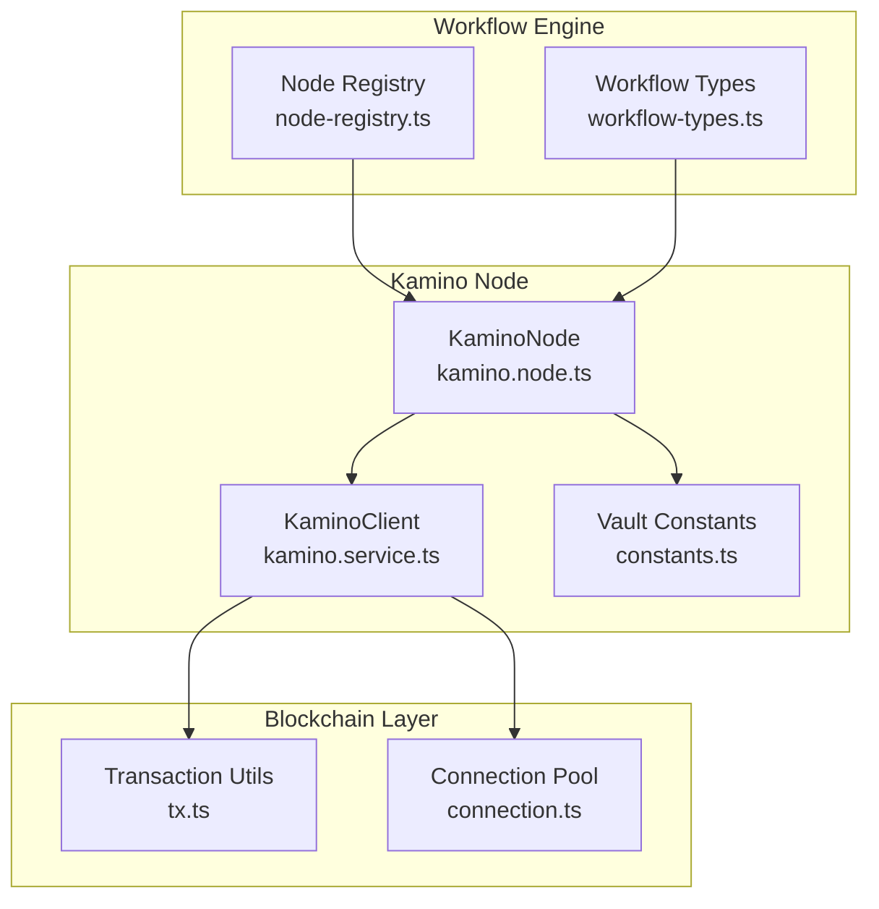
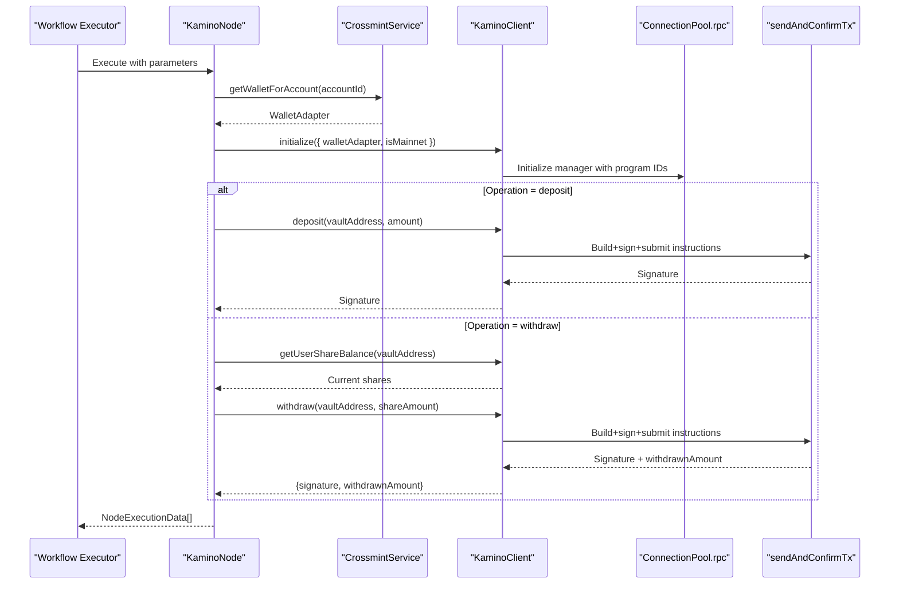
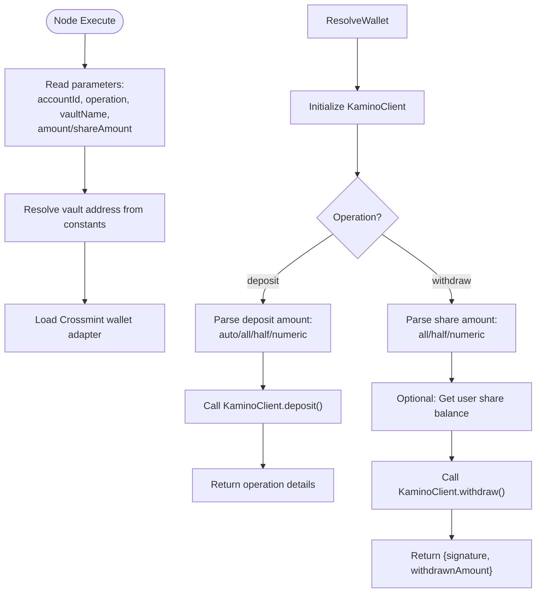
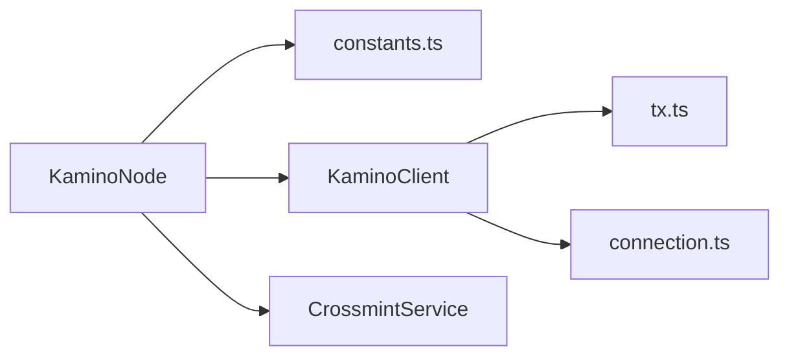

# Kamino Node

<cite>
**Referenced Files in This Document**
- [kamino.node.ts](file://src/web3/nodes/kamino.node.ts)
- [kamino.service.ts](file://src/web3/services/kamino.service.ts)
- [constants.ts](file://src/web3/constants.ts)
- [tx.ts](file://src/web3/utils/tx.ts)
- [connection.ts](file://src/web3/utils/connection.ts)
- [node-registry.ts](file://src/web3/nodes/node-registry.ts)
- [workflow-types.ts](file://src/web3/workflow-types.ts)
- [NODES_REFERENCE.md](file://docs/NODES_REFERENCE.md)
</cite>

## Table of Contents
1. [Introduction](#introduction)
2. [Project Structure](#project-structure)
3. [Core Components](#core-components)
4. [Architecture Overview](#architecture-overview)
5. [Detailed Component Analysis](#detailed-component-analysis)
6. [Dependency Analysis](#dependency-analysis)
7. [Performance Considerations](#performance-considerations)
8. [Troubleshooting Guide](#troubleshooting-guide)
9. [Conclusion](#conclusion)
10. [Appendices](#appendices)

## Introduction
This document explains the Kamino lending protocol node implementation within the backend workflow system. It covers vault operations (deposit and withdrawal), amount parsing logic, integration with Crossmint custodial wallets, and how the node participates in automated workflows. It also outlines configuration parameters, operational examples, monitoring approaches, and troubleshooting guidance for common issues.

## Project Structure
The Kamino node is part of a modular workflow engine where each node implements a specific financial action (e.g., swap, transfer, lending). The Kamino node orchestrates interactions with the Kamino lending infrastructure via a dedicated client service and a shared connection pool.



**Diagram sources**
- [node-registry.ts:23-47](file://src/web3/nodes/node-registry.ts#L23-L47)
- [kamino.node.ts:69-269](file://src/web3/nodes/kamino.node.ts#L69-L269)
- [kamino.service.ts:33-271](file://src/web3/services/kamino.service.ts#L33-L271)
- [constants.ts:1-14](file://src/web3/constants.ts#L1-L14)
- [tx.ts:41-101](file://src/web3/utils/tx.ts#L41-L101)
- [connection.ts:22-59](file://src/web3/utils/connection.ts#L22-L59)

**Section sources**
- [node-registry.ts:1-47](file://src/web3/nodes/node-registry.ts#L1-L47)
- [workflow-types.ts:1-91](file://src/web3/workflow-types.ts#L1-L91)

## Core Components
- KaminoNode: The workflow node that accepts parameters (account ID, operation, vault name, amount/share amount) and executes deposit/withdraw actions against Kamino vaults using a Crossmint wallet adapter.
- KaminoClient: The service that initializes a connection to the Kamino program, queries vaults, constructs transactions, and signs/submit them via the shared connection pool.
- Constants: Provides vault addresses keyed by vault names for quick lookup.
- Transaction Utilities: Encapsulate transaction building, signing, and submission with lookup table compression and error logging.
- Connection Pool: Singleton RPC and WebSocket connections used across blockchain operations.

Key capabilities:
- Deposit to a specified vault with flexible amount parsing ("auto", "all", "half", or fixed).
- Withdraw from a vault using share amounts ("all", "half", or fixed).
- Retrieve vault overview and filter vaults by TVL threshold.
- Integrate with Crossmint custodial wallets for seamless signing.

**Section sources**
- [kamino.node.ts:69-269](file://src/web3/nodes/kamino.node.ts#L69-L269)
- [kamino.service.ts:33-271](file://src/web3/services/kamino.service.ts#L33-L271)
- [constants.ts:1-14](file://src/web3/constants.ts#L1-L14)
- [tx.ts:41-101](file://src/web3/utils/tx.ts#L41-L101)
- [connection.ts:22-59](file://src/web3/utils/connection.ts#L22-L59)

## Architecture Overview
The Kamino node sits in the workflow pipeline and delegates blockchain interactions to the KaminoClient. The client uses a shared connection pool and transaction utilities to build and submit transactions efficiently.



**Diagram sources**
- [kamino.node.ts:132-268](file://src/web3/nodes/kamino.node.ts#L132-L268)
- [kamino.service.ts:60-93](file://src/web3/services/kamino.service.ts#L60-L93)
- [kamino.service.ts:156-171](file://src/web3/services/kamino.service.ts#L156-L171)
- [kamino.service.ts:194-254](file://src/web3/services/kamino.service.ts#L194-L254)
- [tx.ts:41-101](file://src/web3/utils/tx.ts#L41-L101)
- [connection.ts:22-59](file://src/web3/utils/connection.ts#L22-L59)

## Detailed Component Analysis

### KaminoNode: Deposit and Withdraw Operations
- Parameters:
  - accountId: Crossmint account identifier.
  - operation: "deposit" or "withdraw".
  - vaultName: Name of the target vault (must match constants).
  - amount: For deposit, supports "auto", "all", "half", or numeric.
  - shareAmount: For withdraw, supports "all", "half", or numeric.
- Vault resolution: Uses KAMINO_VAULT to map vaultName to address.
- Amount parsing:
  - "auto" or empty amount uses previous node output (outputAmount or amount).
  - "all" or "half" scales the previous output amount.
  - Numeric values are parsed directly.
- Execution:
  - Deposit: Calls KaminoClient.deposit with Decimal amount.
  - Withdraw: Optionally queries current share balance, then calls KaminoClient.withdraw returning raw withdrawn amount and signature.



**Diagram sources**
- [kamino.node.ts:132-268](file://src/web3/nodes/kamino.node.ts#L132-L268)
- [kamino.node.ts:13-25](file://src/web3/nodes/kamino.node.ts#L13-L25)
- [kamino.node.ts:33-43](file://src/web3/nodes/kamino.node.ts#L33-L43)
- [kamino.node.ts:50-67](file://src/web3/nodes/kamino.node.ts#L50-L67)

**Section sources**
- [kamino.node.ts:69-269](file://src/web3/nodes/kamino.node.ts#L69-L269)

### KaminoClient: Vault Interaction and Transactions
- Initialization:
  - Accepts Crossmint wallet adapter or legacy keypair path.
  - Selects program IDs based on isMainnet flag.
  - Creates a KaminoManager with a recentSlotDurationMs window.
- Vault discovery:
  - getAllVaults(), getAllVaultsForToken().
  - getVaultsAboveValue(minUSD) filters by TVL using a placeholder token price.
  - getVaultOverview(vaultAddress, tokenPrice) returns detailed stats.
- Deposit:
  - Builds deposit instructions and optional stake-in-farm instructions.
  - Submits via sendAndConfirmTx with lookup tables.
- Withdraw:
  - Queries token mint decimals and calculates withdrawn amount post-balance delta.
  - Unstake-from-farm + withdraw + post-withdraw instructions.
  - Returns signature and human-readable withdrawn amount.

```mermaid
classDiagram
class KaminoClient {
-wallet
-walletAddress
-manager
-kvaultProgramId
-isMainnet
+initialize(config) KaminoClient
+getAllVaults() KaminoVault[]
+getAllVaultsForToken(mint) KaminoVault[]
+getVaultsAboveValue(minUSD) VaultInfo[]
+getVaultOverview(vaultAddress, price) any
+deposit(vaultAddress, amount) Signature
+withdraw(vaultAddress, shareAmount) {signature, withdrawnAmount}
+getUserShareBalance(vaultAddress) Decimal
}
class ConnectionPool {
+rpc
+wsRpc
+legacyConnection
}
class TxUtils {
+sendAndConfirmTx(pool, payer, ixs, signers, luts, desc) Signature
}
KaminoClient --> ConnectionPool : "uses"
KaminoClient --> TxUtils : "uses"
```

**Diagram sources**
- [kamino.service.ts:33-93](file://src/web3/services/kamino.service.ts#L33-L93)
- [kamino.service.ts:98-151](file://src/web3/services/kamino.service.ts#L98-L151)
- [kamino.service.ts:156-171](file://src/web3/services/kamino.service.ts#L156-L171)
- [kamino.service.ts:194-254](file://src/web3/services/kamino.service.ts#L194-L254)
- [connection.ts:14-18](file://src/web3/utils/connection.ts#L14-L18)
- [tx.ts:41-101](file://src/web3/utils/tx.ts#L41-L101)

**Section sources**
- [kamino.service.ts:33-271](file://src/web3/services/kamino.service.ts#L33-L271)

### Vault Selection and Yield Optimization Strategies
- Vault selection:
  - Use getVaultsAboveValue(minUSD) to filter by TVL threshold.
  - Use getVaultOverview(vaultAddress, tokenPrice) to inspect metrics.
- Yield optimization:
  - Combine with swap/transfer nodes to rebalance across vaults.
  - Use Pyth price feed and limit order nodes to capture favorable rates.
- Risk management:
  - Monitor vault health and fees via overview data.
  - Use conditional checks (e.g., balance thresholds) before deposit/withdraw.

Note: The current implementation uses a placeholder token price for TVL calculations. Production deployments should integrate live oracle prices.

**Section sources**
- [kamino.service.ts:112-151](file://src/web3/services/kamino.service.ts#L112-L151)
- [NODES_REFERENCE.md:142-163](file://docs/NODES_REFERENCE.md#L142-L163)

### Configuration Parameters
- Node-level parameters (as defined in the node description):
  - accountId: Crossmint account identifier.
  - operation: "deposit" or "withdraw".
  - vaultName: Vault name (must exist in constants).
  - amount: Deposit amount with support for "auto", "all", "half", or numeric.
  - shareAmount: Withdraw share amount with support for "all", "half", or numeric.
- Constants:
  - KAMINO_VAULT: Maps vault names to addresses for USDC and SOL vaults.
- Program IDs and network:
  - Program IDs are selected based on isMainnet flag during client initialization.

Practical guidance:
- Use "auto" for amount/shareAmount to chain outputs from upstream nodes (e.g., swap results).
- Use "all"/"half" when you want to act on the full or partial available balance from the previous step.
- Ensure vaultName matches exactly with constants to avoid resolution errors.

**Section sources**
- [kamino.node.ts:81-130](file://src/web3/nodes/kamino.node.ts#L81-L130)
- [constants.ts:1-14](file://src/web3/constants.ts#L1-L14)
- [kamino.service.ts:81-90](file://src/web3/services/kamino.service.ts#L81-L90)

### Practical Examples

- Example 1: Automated deposit after swap
  - Chain a swap node to produce outputAmount, then connect a kamino node with amount="auto" to deposit the proceeds into a chosen vault.
  - Parameters: operation="deposit", vaultName="<valid vault>", amount="auto".

- Example 2: Partial withdrawal using shares
  - Connect a kamino node with operation="withdraw", vaultName="<vault>", shareAmount="half" to withdraw half of current staked shares.

- Example 3: Vault discovery and selection
  - Use the client methods to list vaults and filter by TVL, then select a vaultName for deployment.

- Example 4: Monitoring vault performance
  - Periodically call getVaultOverview to track metrics and adjust allocation accordingly.

**Section sources**
- [kamino.node.ts:132-268](file://src/web3/nodes/kamino.node.ts#L132-L268)
- [kamino.service.ts:98-151](file://src/web3/services/kamino.service.ts#L98-L151)

## Dependency Analysis
The Kamino node depends on:
- CrossmintService for wallet retrieval.
- KaminoClient for program interactions.
- Constants for vault address resolution.
- Transaction utilities and connection pool for blockchain operations.



**Diagram sources**
- [kamino.node.ts:137-168](file://src/web3/nodes/kamino.node.ts#L137-L168)
- [kamino.service.ts:60-93](file://src/web3/services/kamino.service.ts#L60-L93)
- [constants.ts:1-14](file://src/web3/constants.ts#L1-L14)
- [tx.ts:41-101](file://src/web3/utils/tx.ts#L41-L101)
- [connection.ts:22-59](file://src/web3/utils/connection.ts#L22-L59)

**Section sources**
- [node-registry.ts:23-47](file://src/web3/nodes/node-registry.ts#L23-L47)
- [workflow-types.ts:48-56](file://src/web3/workflow-types.ts#L48-L56)

## Performance Considerations
- Transaction batching: The client composes multiple instruction sets (deposit, stake, unstake, withdraw, post-withdraw) and submits them in a single transaction to reduce latency and cost.
- Lookup table compression: Transactions are compressed using address lookup tables to minimize size and increase success probability under tight compute limits.
- Recent slot window: The client uses a recentSlotDurationMs window to ensure timely execution while avoiding stale states.
- Connection reuse: A singleton connection pool minimizes overhead and improves throughput across multiple operations.

[No sources needed since this section provides general guidance]

## Troubleshooting Guide
Common issues and resolutions:
- Vault name not found:
  - Symptom: Error indicating the vault name is not present in constants.
  - Resolution: Verify the vaultName against KAMINO_VAULT entries and ensure exact casing.

- Missing previous node output for "auto"/"all"/"half":
  - Symptom: Error stating "Cannot use 'all' or 'half' without input from previous node."
  - Resolution: Connect a preceding node that emits outputAmount or amount.

- Transaction failure:
  - Symptom: sendAndConfirmTx throws with logs.
  - Resolution: Inspect transaction logs printed by the utility to identify failing instruction(s). Retry with adjusted parameters or slippage.

- Incorrect withdrawn amount:
  - Symptom: Discrepancy between expected and returned withdrawnAmount.
  - Resolution: Confirm token mint decimals and ensure balances are queried before/after the transaction to compute deltas accurately.

- Crossmint wallet unavailable:
  - Symptom: Error indicating CrossmintService not available in execution context.
  - Resolution: Ensure the workflow executor injects the service and the accountId is valid.

**Section sources**
- [kamino.node.ts:22-25](file://src/web3/nodes/kamino.node.ts#L22-L25)
- [kamino.node.ts:188-190](file://src/web3/nodes/kamino.node.ts#L188-L190)
- [tx.ts:70-98](file://src/web3/utils/tx.ts#L70-L98)
- [kamino.service.ts:236-244](file://src/web3/services/kamino.service.ts#L236-L244)
- [kamino.node.ts:139-141](file://src/web3/nodes/kamino.node.ts#L139-L141)

## Conclusion
The Kamino node provides a robust, configurable pathway to interact with Kamino vaults within automated workflows. By leveraging Crossmint wallets, standardized amount parsing, and efficient transaction construction, it enables reliable deposit and withdrawal operations. Integrating with other nodes (swap, price feeds, transfers) allows building sophisticated yield strategies with monitoring and risk controls.

[No sources needed since this section summarizes without analyzing specific files]

## Appendices

### Appendix A: Node Parameter Reference
- accountId: Crossmint account identifier.
- operation: "deposit" or "withdraw".
- vaultName: One of the supported vault names.
- amount: "auto", "all", "half", or numeric for deposit.
- shareAmount: "all", "half", or numeric for withdraw.

**Section sources**
- [NODES_REFERENCE.md:154-162](file://docs/NODES_REFERENCE.md#L154-L162)