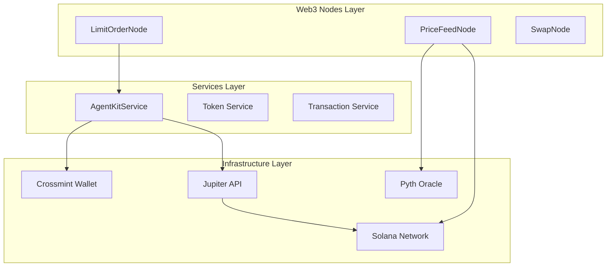
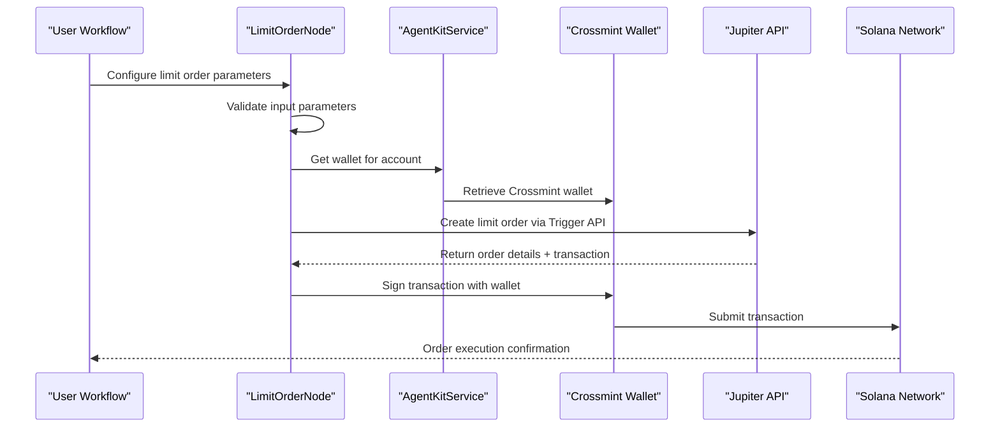
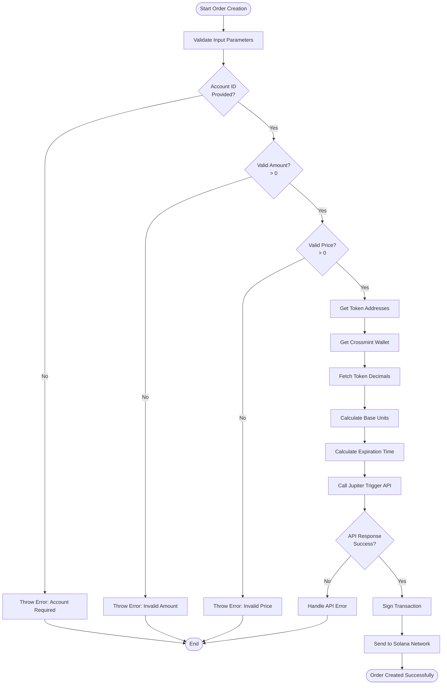
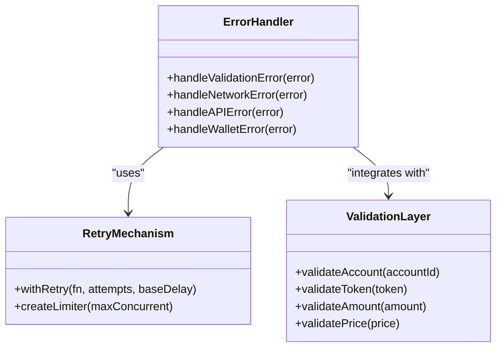
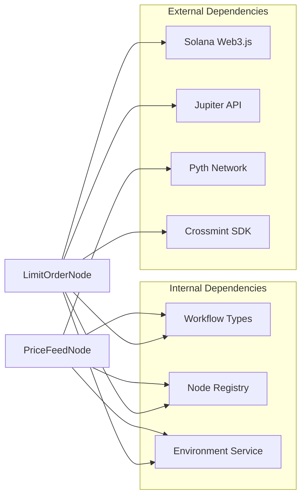

# Limit Order Node (Jupiter)

<cite>
**Referenced Files in This Document**
- [limit-order.node.ts](file://src/web3/nodes/limit-order.node.ts)
- [price-monitor.service.ts](file://src/web3/services/price-monitor.service.ts)
- [price-monitor.ts](file://src/web3/utils/price-monitor.ts)
- [agent-kit.service.ts](file://src/web3/services/agent-kit.service.ts)
- [constants.ts](file://src/web3/constants.ts)
- [node-registry.ts](file://src/web3/nodes/node-registry.ts)
- [workflow-types.ts](file://src/web3/workflow-types.ts)
- [web3.module.ts](file://src/web3/web3.module.ts)
- [env.service.ts](file://src/web3/services/env.service.ts)
- [env.ts](file://src/web3/utils/env.ts)
</cite>

## Table of Contents
1. [Introduction](#introduction)
2. [Project Structure](#project-structure)
3. [Core Components](#core-components)
4. [Architecture Overview](#architecture-overview)
5. [Detailed Component Analysis](#detailed-component-analysis)
6. [Dependency Analysis](#dependency-analysis)
7. [Performance Considerations](#performance-considerations)
8. [Troubleshooting Guide](#troubleshooting-guide)
9. [Conclusion](#conclusion)

## Introduction

The Jupiter Limit Order Node is a sophisticated trading component that enables automated limit order placement on the Jupiter exchange infrastructure. This implementation leverages Crossmint's custodial wallet system to create, manage, and execute limit orders on Solana's decentralized exchange ecosystem. The system provides comprehensive order lifecycle management, real-time price monitoring, and robust error handling mechanisms.

The node integrates seamlessly with Jupiter's Trigger API to create limit orders that execute automatically when market conditions reach predefined thresholds. It supports multiple token pairs, configurable expiration times, and provides detailed execution tracking with comprehensive logging capabilities.

## Project Structure

The Jupiter Limit Order implementation follows a modular architecture within the broader Web3 ecosystem:

**Diagram sources**
- [limit-order.node.ts:80-303](file://src/web3/nodes/limit-order.node.ts#L80-L303)
- [agent-kit.service.ts:55-163](file://src/web3/services/agent-kit.service.ts#L55-L163)

**Section sources**
- [limit-order.node.ts:1-303](file://src/web3/nodes/limit-order.node.ts#L1-L303)
- [node-registry.ts:23-47](file://src/web3/nodes/node-registry.ts#L23-L47)

## Core Components

### LimitOrderNode Class

The core implementation centers around the `LimitOrderNode` class, which implements the `INodeType` interface. This class orchestrates the complete limit order lifecycle from creation to execution.

**Key Features:**
- **Crossmint Integration**: Utilizes Crossmint's custodial wallet system for secure transaction signing
- **Jupiter API Integration**: Leverages Jupiter's Trigger API for limit order placement
- **Real-time Validation**: Implements comprehensive input validation and error handling
- **Configurable Parameters**: Supports flexible configuration for tokens, amounts, and expiration

**Configuration Parameters:**
- `accountId`: Crossmint account identifier for wallet access
- `inputToken`: Token to sell (e.g., USDC, SOL)
- `outputToken`: Token to buy (e.g., SOL, USDC)
- `inputAmount`: Human-readable amount of input token
- `targetPrice`: Execution threshold price (output/input)
- `expiryHours`: Order validity period in hours

**Section sources**
- [limit-order.node.ts:80-135](file://src/web3/nodes/limit-order.node.ts#L80-L135)

### Price Monitoring System

The implementation includes two complementary price monitoring systems:

1. **PriceFeedNode**: Standalone trigger node for price condition monitoring
2. **Utility Functions**: Reusable price monitoring utilities for integration

Both systems utilize Pyth's oracle network for reliable price feeds and support multiple condition types (above, below, equal).

**Section sources**
- [price-monitor.service.ts:28-105](file://src/web3/services/price-monitor.service.ts#L28-L105)
- [price-monitor.ts:29-119](file://src/web3/utils/price-monitor.ts#L29-L119)

### AgentKit Service Integration

The `AgentKitService` provides unified access to Solana infrastructure and Crossmint wallet integration. It manages rate limiting, retry mechanisms, and RPC connectivity for all Web3 operations.

**Section sources**
- [agent-kit.service.ts:55-84](file://src/web3/services/agent-kit.service.ts#L55-L84)

## Architecture Overview

The Jupiter Limit Order system implements a distributed architecture with clear separation of concerns:

**Diagram sources**
- [limit-order.node.ts:137-301](file://src/web3/nodes/limit-order.node.ts#L137-L301)
- [agent-kit.service.ts:74-77](file://src/web3/services/agent-kit.service.ts#L74-L77)

The architecture ensures fault tolerance through retry mechanisms, rate limiting, and comprehensive error handling. The system maintains separation between price monitoring, order placement, and execution phases.

## Detailed Component Analysis

### Limit Order Creation Process

The limit order creation process involves several critical steps:

**Diagram sources**
- [limit-order.node.ts:147-267](file://src/web3/nodes/limit-order.node.ts#L147-L267)

**Section sources**
- [limit-order.node.ts:137-267](file://src/web3/nodes/limit-order.node.ts#L137-L267)

### Price Monitoring Implementation

The price monitoring system provides three distinct approaches:

1. **Event-driven Monitoring**: Real-time WebSocket connections for immediate price updates
2. **One-time Retrieval**: Single-shot price queries for static monitoring
3. **Conditional Monitoring**: Price checks with custom tolerance levels

**Section sources**
- [price-monitor.service.ts:142-190](file://src/web3/services/price-monitor.service.ts#L142-L190)
- [price-monitor.ts:156-204](file://src/web3/utils/price-monitor.ts#L156-L204)

### Error Handling and Retry Mechanisms

The system implements comprehensive error handling through multiple layers:

**Diagram sources**
- [limit-order.node.ts:26-45](file://src/web3/nodes/limit-order.node.ts#L26-L45)
- [limit-order.node.ts:162-171](file://src/web3/nodes/limit-order.node.ts#L162-L171)

**Section sources**
- [limit-order.node.ts:26-45](file://src/web3/nodes/limit-order.node.ts#L26-L45)

## Dependency Analysis

The Jupiter Limit Order implementation has well-defined dependencies that ensure modularity and maintainability:

**Diagram sources**
- [limit-order.node.ts:1-6](file://src/web3/nodes/limit-order.node.ts#L1-L6)
- [node-registry.ts:23-47](file://src/web3/nodes/node-registry.ts#L23-L47)

**Section sources**
- [node-registry.ts:1-47](file://src/web3/nodes/node-registry.ts#L1-L47)
- [web3.module.ts:1-13](file://src/web3/web3.module.ts#L1-L13)

## Performance Considerations

### Rate Limiting and Concurrency Control

The implementation includes sophisticated rate limiting mechanisms to prevent API saturation:

- **External API Limiter**: Limits concurrent requests to 5 per second
- **Retry Backoff**: Exponential backoff with jitter for failed requests
- **Connection Pooling**: Efficient resource utilization for multiple concurrent operations

### Memory Management

The system implements efficient memory management through:

- **Token Decimal Caching**: Reduces repeated network calls for token metadata
- **Connection Reuse**: Maintains persistent connections to minimize overhead
- **Garbage Collection**: Proper cleanup of temporary objects and promises

### Network Optimization

Performance optimizations include:

- **Batch Operations**: Combines multiple operations where possible
- **Lazy Loading**: Loads modules only when needed
- **Compression**: Uses compressed transactions for reduced bandwidth

## Troubleshooting Guide

### Common Order Placement Failures

**Issue: Account ID Required**
- **Cause**: Missing or invalid Crossmint account configuration
- **Solution**: Verify account exists in Crossmint system and credentials are properly configured
- **Prevention**: Implement account validation before order placement

**Issue: Unknown Token Error**
- **Cause**: Token not supported or incorrect token ticker
- **Solution**: Check `TOKEN_ADDRESS` constants for supported tokens
- **Prevention**: Validate tokens against supported list before execution

**Issue: API Response Error**
- **Cause**: Jupiter API timeout or invalid request parameters
- **Solution**: Review request payload and retry with exponential backoff
- **Prevention**: Implement proper input validation and error handling

### Price Monitoring Issues

**Issue: Price Drift**
- **Cause**: Market volatility exceeding configured tolerance
- **Solution**: Adjust tolerance levels or use tighter monitoring intervals
- **Prevention**: Monitor market conditions and adjust parameters accordingly

**Issue: Connection Drops**
- **Cause**: Network instability or WebSocket disconnections
- **Solution**: Implement automatic reconnection with exponential backoff
- **Prevention**: Use heartbeat mechanisms and connection health checks

### Execution Delays

**Issue: Transaction Confirmation Delays**
- **Cause**: Network congestion or insufficient fees
- **Solution**: Increase compute unit price or wait for network improvement
- **Prevention**: Monitor network conditions and adjust fees proactively

**Section sources**
- [limit-order.node.ts:286-298](file://src/web3/nodes/limit-order.node.ts#L286-L298)
- [price-monitor.service.ts:95-104](file://src/web3/services/price-monitor.service.ts#L95-L104)

## Conclusion

The Jupiter Limit Order Node provides a robust, production-ready solution for automated limit order placement on Solana's decentralized exchange ecosystem. The implementation demonstrates excellent architectural principles with clear separation of concerns, comprehensive error handling, and scalable performance characteristics.

Key strengths of the implementation include:

- **Security**: Integration with Crossmint's custodial wallet system ensures secure transaction signing
- **Reliability**: Comprehensive error handling and retry mechanisms ensure system resilience
- **Flexibility**: Configurable parameters support diverse trading strategies
- **Performance**: Optimized for high-throughput operations with rate limiting and caching
- **Maintainability**: Modular architecture with clear dependency management

The system successfully bridges the gap between traditional centralized exchange limit orders and decentralized finance protocols, enabling sophisticated trading strategies while maintaining security and reliability standards appropriate for production environments.

Future enhancements could include advanced order types, portfolio management integration, and enhanced analytics capabilities, building upon the solid foundation established by this implementation.