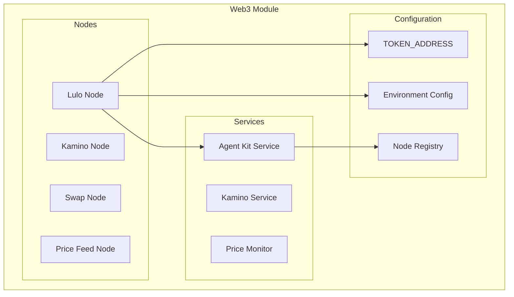
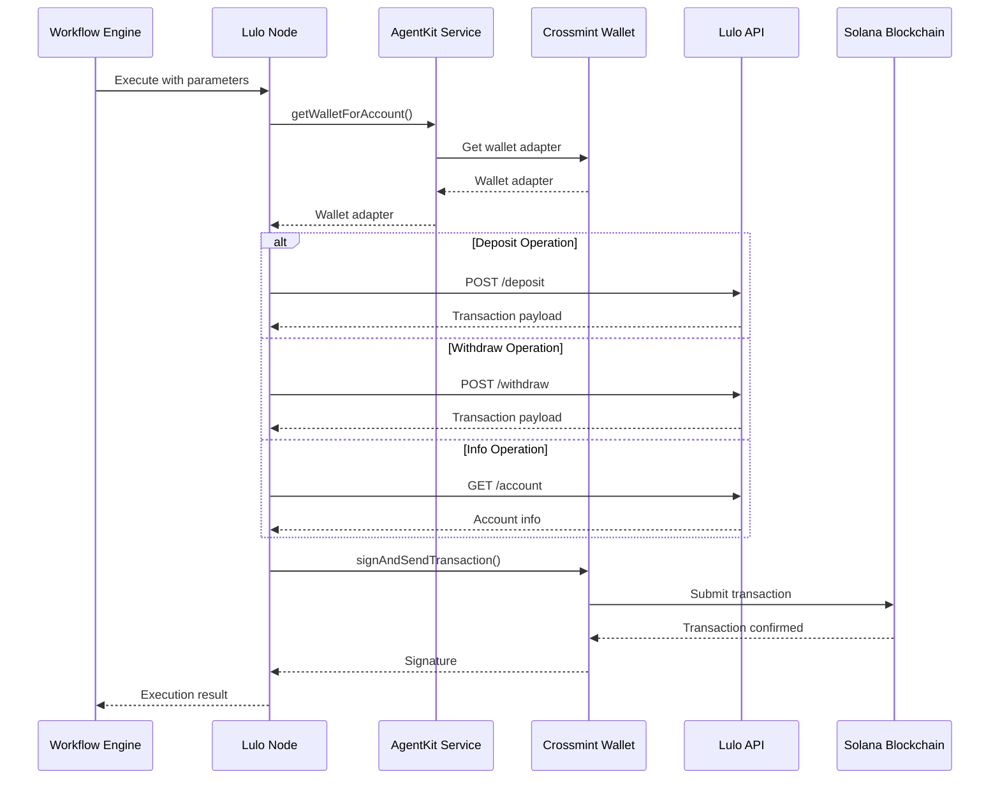
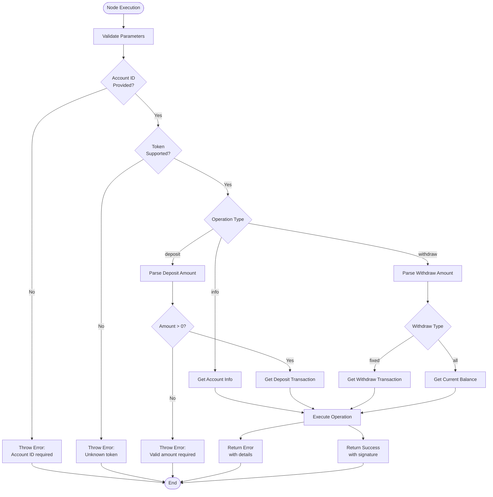

# Lulo Node

<cite>
**Referenced Files in This Document**
- [lulo.node.ts](file://src/web3/nodes/lulo.node.ts)
- [agent-kit.service.ts](file://src/web3/services/agent-kit.service.ts)
- [configuration.ts](file://src/config/configuration.ts)
- [constants.ts](file://src/web3/constants.ts)
- [node-registry.ts](file://src/web3/nodes/node-registry.ts)
- [workflow-types.ts](file://src/web3/workflow-types.ts)
- [README.md](file://README.md)
</cite>

## Table of Contents
1. [Introduction](#introduction)
2. [Project Structure](#project-structure)
3. [Core Components](#core-components)
4. [Architecture Overview](#architecture-overview)
5. [Detailed Component Analysis](#detailed-component-analysis)
6. [Dependency Analysis](#dependency-analysis)
7. [Performance Considerations](#performance-considerations)
8. [Troubleshooting Guide](#troubleshooting-guide)
9. [Conclusion](#conclusion)

## Introduction
The Lulo Node is a Solana-based lending protocol node that enables automated yield farming and liquidity provision through the Lulo Finance platform. Built as part of a comprehensive DeFi workflow automation platform, this node integrates with Crossmint custodial wallets to execute lending operations programmatically. The implementation provides a unified interface for depositing, withdrawing, and monitoring lending positions while leveraging external APIs for transaction construction and execution.

The node operates within a broader ecosystem that includes multiple DeFi protocols (Jupiter, Kamino, Drift, Sanctum) and provides seamless integration with the platform's workflow engine. It supports real-time price feeds via Pyth Network, automated transaction signing through Crossmint wallets, and comprehensive error handling with retry mechanisms.

## Project Structure
The Lulo Node is organized within the Web3 module structure alongside other DeFi protocol integrations. The implementation follows a modular architecture that separates concerns between node logic, service orchestration, and configuration management.



**Diagram sources**
- [lulo.node.ts:1-360](file://src/web3/nodes/lulo.node.ts#L1-L360)
- [agent-kit.service.ts:1-163](file://src/web3/services/agent-kit.service.ts#L1-L163)
- [constants.ts:16-27](file://src/web3/constants.ts#L16-L27)
- [node-registry.ts:23-47](file://src/web3/nodes/node-registry.ts#L23-L47)

**Section sources**
- [README.md:171-200](file://README.md#L171-L200)
- [node-registry.ts:1-47](file://src/web3/nodes/node-registry.ts#L1-L47)

## Core Components
The Lulo Node implementation consists of several key components that work together to provide comprehensive lending functionality:

### LuloNode Class
The primary node implementation that handles all lending operations including deposit, withdrawal, and account information retrieval. It implements the INodeType interface and provides robust error handling with retry mechanisms.

### AgentKitService Integration
The node integrates with the AgentKitService to manage Crossmint custodial wallet adapters, enabling secure transaction signing without exposing private keys. This service provides wallet abstraction and manages external API rate limiting.

### Configuration Management
The implementation utilizes centralized configuration through environment variables and token address mappings. The TOKEN_ADDRESS constant provides standardized token identification across the platform.

### Workflow Integration
The node participates in the platform's workflow execution system, supporting parameterized operations with flexible amount parsing and automatic amount derivation from previous workflow nodes.

**Section sources**
- [lulo.node.ts:90-137](file://src/web3/nodes/lulo.node.ts#L90-L137)
- [agent-kit.service.ts:55-84](file://src/web3/services/agent-kit.service.ts#L55-L84)
- [constants.ts:16-27](file://src/web3/constants.ts#L16-L27)

## Architecture Overview
The Lulo Node architecture follows a layered approach that separates concerns between node logic, service orchestration, and external protocol integration.



**Diagram sources**
- [lulo.node.ts:139-243](file://src/web3/nodes/lulo.node.ts#L139-L243)
- [agent-kit.service.ts:74-77](file://src/web3/services/agent-kit.service.ts#L74-L77)

The architecture emphasizes security through wallet abstraction, reliability through retry mechanisms, and extensibility through the node registration system.

## Detailed Component Analysis

### LuloNode Implementation
The LuloNode class serves as the central orchestrator for all lending operations, implementing sophisticated parameter parsing and error handling mechanisms.

#### Core Operations
The node supports three primary operations:
- **Deposit**: Lends specified amounts to Lulo Finance protocols
- **Withdraw**: Retrieves lent funds with support for partial withdrawals
- **Info**: Retrieves account balance and deposit information

#### Parameter Processing
The node implements intelligent parameter parsing that supports multiple input formats:
- Automatic amount derivation from previous workflow nodes
- Percentage-based withdrawals ("all", "half")
- Fixed numeric amounts
- Flexible token specification through standardized token addresses

#### Error Handling and Retry Logic
The implementation includes comprehensive error handling with exponential backoff retry mechanisms for external API calls. The retry system prevents temporary network failures from causing workflow interruptions.



**Diagram sources**
- [lulo.node.ts:139-243](file://src/web3/nodes/lulo.node.ts#L139-L243)
- [lulo.node.ts:248-267](file://src/web3/nodes/lulo.node.ts#L248-L267)

**Section sources**
- [lulo.node.ts:139-243](file://src/web3/nodes/lulo.node.ts#L139-L243)
- [lulo.node.ts:248-267](file://src/web3/nodes/lulo.node.ts#L248-L267)

### AgentKitService Integration
The AgentKitService provides essential wallet management capabilities that enable secure transaction execution without exposing private keys.

#### Wallet Management
The service maintains Crossmint wallet adapters for different accounts, providing a unified interface for transaction signing across all DeFi protocol integrations. This abstraction layer ensures compliance with security best practices by avoiding private key storage.

#### Rate Limiting and Retry
The service implements sophisticated rate limiting mechanisms to prevent API throttling and includes comprehensive retry logic with exponential backoff for external service calls. This ensures reliable operation even under varying network conditions.

#### Jupiter Swap Integration
Beyond Lulo operations, the AgentKitService provides integrated swap functionality through Jupiter Aggregator, enabling complex DeFi workflows that combine multiple operations seamlessly.

**Section sources**
- [agent-kit.service.ts:55-84](file://src/web3/services/agent-kit.service.ts#L55-L84)
- [agent-kit.service.ts:99-161](file://src/web3/services/agent-kit.service.ts#L99-L161)

### Configuration and Constants
The implementation leverages centralized configuration management to ensure consistency across all DeFi protocol integrations.

#### Token Address Management
The TOKEN_ADDRESS constant provides standardized token identification across the platform, supporting major Solana tokens including USDC, SOL, and various Liquid Staking Tokens. This standardization enables consistent parameter handling across different protocol nodes.

#### Environment Configuration
The configuration system supports environment-specific settings for different DeFi protocols, including API keys for Lulo Finance, Sanctum, and Helius. This allows for flexible deployment configurations across development, staging, and production environments.

**Section sources**
- [constants.ts:16-27](file://src/web3/constants.ts#L16-L27)
- [configuration.ts:37-39](file://src/config/configuration.ts#L37-L39)

### Node Registration and Workflow Integration
The Lulo Node participates in the platform's dynamic node registration system, enabling automatic discovery and execution within workflow contexts.

#### Dynamic Registration
The node registry automatically discovers and registers all available workflow nodes, including the Lulo Node. This system eliminates manual registration overhead and ensures consistent node availability across the platform.

#### Workflow Parameters
The Lulo Node integrates seamlessly with the workflow execution engine, supporting parameterized operations with flexible input handling. The node description provides comprehensive parameter documentation for workflow designers.

**Section sources**
- [node-registry.ts:23-47](file://src/web3/nodes/node-registry.ts#L23-L47)
- [lulo.node.ts:101-137](file://src/web3/nodes/lulo.node.ts#L101-L137)

## Dependency Analysis
The Lulo Node implementation demonstrates clean architectural separation with well-defined dependencies that support maintainability and extensibility.

```mermaid
graph TB
subgraph "External Dependencies"
SolanaWeb3[@solana/web3.js]
Decimal[decimal.js]
Axios[axios]
end
subgraph "Platform Dependencies"
AgentKitService
CrossmintService
ConfigService
WorkflowTypes
end
subgraph "Lulo Node"
LuloNode
LuloAPI[Lulo Finance API]
end
LuloNode --> AgentKitService
LuloNode --> LuloAPI
LuloNode --> SolanaWeb3
LuloNode --> Decimal
AgentKitService --> CrossmintService
AgentKitService --> ConfigService
AgentKitService --> WorkflowTypes
```

**Diagram sources**
- [lulo.node.ts:1-6](file://src/web3/nodes/lulo.node.ts#L1-L6)
- [agent-kit.service.ts:1-5](file://src/web3/services/agent-kit.service.ts#L1-L5)

### External Dependencies
The implementation relies on minimal external dependencies to maintain security and reduce attack surface. Core dependencies include Solana web3 libraries for blockchain interaction and decimal.js for precise numerical calculations.

### Internal Dependencies
The node maintains loose coupling with internal services through well-defined interfaces. The AgentKitService provides wallet abstraction, while the configuration service manages environment-specific settings.

### Circular Dependency Prevention
The architecture avoids circular dependencies through clear separation of concerns. Node implementations depend on service abstractions rather than concrete implementations, enabling testability and maintainability.

**Section sources**
- [lulo.node.ts:1-6](file://src/web3/nodes/lulo.node.ts#L1-L6)
- [agent-kit.service.ts:1-5](file://src/web3/services/agent-kit.service.ts#L1-L5)

## Performance Considerations
The Lulo Node implementation incorporates several performance optimization strategies to ensure reliable operation under various load conditions.

### Rate Limiting and Concurrency Control
The implementation includes built-in rate limiting mechanisms to prevent API throttling from external services. The externalApiLimiter enforces maximum concurrent requests, while exponential backoff retry logic handles transient failures gracefully.

### Memory Management
The node implementation minimizes memory allocation during transaction processing by reusing buffers and avoiding unnecessary object creation. This is particularly important for high-frequency trading scenarios.

### Network Optimization
The integration with Crossmint wallet adapters reduces network latency by leveraging established connection pools and caching mechanisms. Transaction serialization and deserialization are optimized for minimal processing overhead.

### Error Recovery
Comprehensive error handling includes automatic retry mechanisms with exponential backoff, preventing cascading failures and ensuring system resilience under adverse conditions.

## Troubleshooting Guide

### Common Lending Operation Issues
**Account Initialization Problems**
- Verify Crossmint wallet initialization before attempting lending operations
- Check that the account has sufficient SOL for transaction fees
- Ensure the wallet adapter is properly configured for the target environment

**Transaction Failure Scenarios**
- Review transaction signatures and confirm successful blockchain submission
- Check for insufficient funds or gas fee issues
- Verify token approval requirements for lending operations

**API Integration Challenges**
- Confirm LULO_API_KEY configuration in environment variables
- Verify network connectivity to Lulo Finance endpoints
- Check for rate limiting or API quota exhaustion

### Error Handling Patterns
The Lulo Node implements comprehensive error handling with specific error codes and recovery mechanisms:

**Network-Related Errors**
- Implement exponential backoff retry logic
- Monitor API endpoint availability and health
- Handle timeout exceptions gracefully

**Blockchain-Specific Errors**
- Validate transaction serialization and deserialization
- Check for nonce conflicts and account state synchronization
- Handle insufficient funds and gas estimation failures

**Configuration Issues**
- Validate environment variable completeness
- Verify token address mappings and protocol configurations
- Check Crossmint service authentication and authorization

### Monitoring and Debugging
The implementation includes extensive logging throughout the execution pipeline, enabling detailed troubleshooting of workflow failures. Error responses include comprehensive context information for rapid issue resolution.

**Section sources**
- [lulo.node.ts:229-239](file://src/web3/nodes/lulo.node.ts#L229-L239)
- [agent-kit.service.ts:26-45](file://src/web3/services/agent-kit.service.ts#L26-L45)

## Conclusion
The Lulo Node represents a robust implementation of automated DeFi lending operations within a comprehensive workflow automation platform. Its architecture emphasizes security through wallet abstraction, reliability through comprehensive error handling, and extensibility through modular design principles.

The implementation successfully integrates multiple DeFi protocols while maintaining clean separation of concerns and comprehensive error handling. The use of Crossmint custodial wallets ensures secure transaction execution without compromising user experience, while the workflow integration enables complex automated lending strategies.

Key strengths of the implementation include:
- Secure wallet abstraction through Crossmint integration
- Comprehensive error handling with retry mechanisms
- Flexible parameter parsing supporting various input formats
- Centralized configuration management for environment-specific settings
- Seamless integration with the broader DeFi ecosystem

The Lulo Node provides a solid foundation for automated lending operations and can serve as a model for integrating other DeFi protocols within the platform's workflow automation framework.