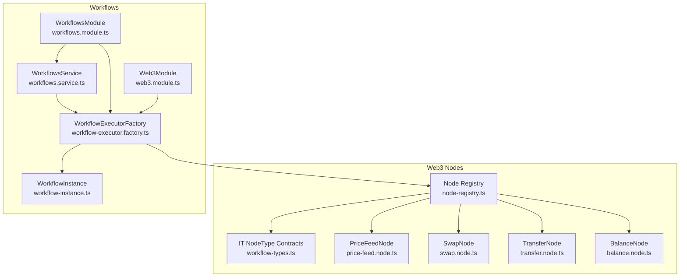
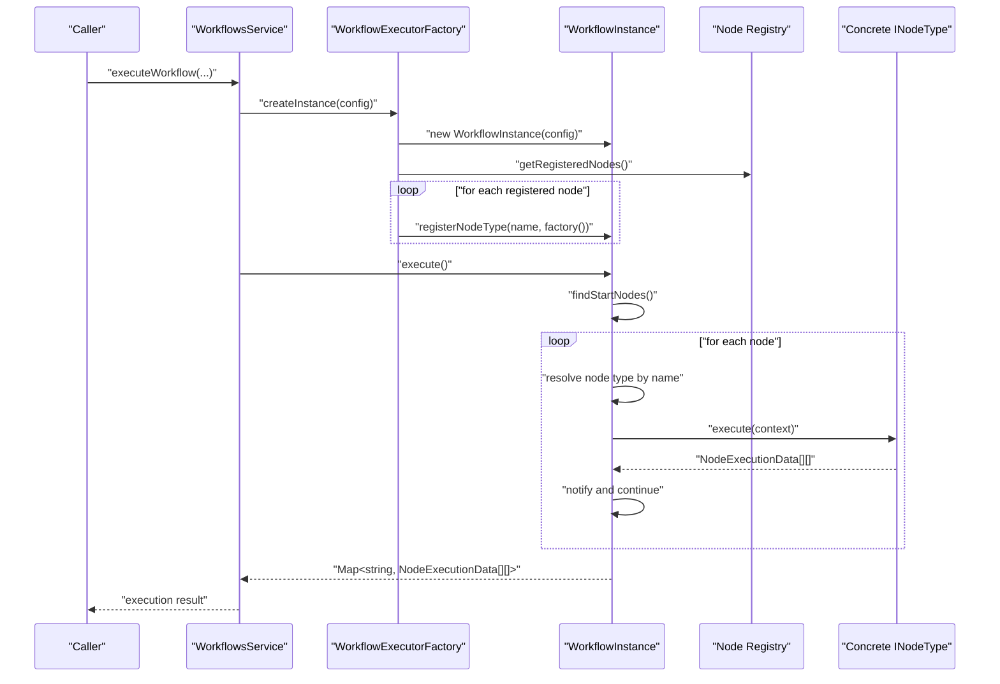
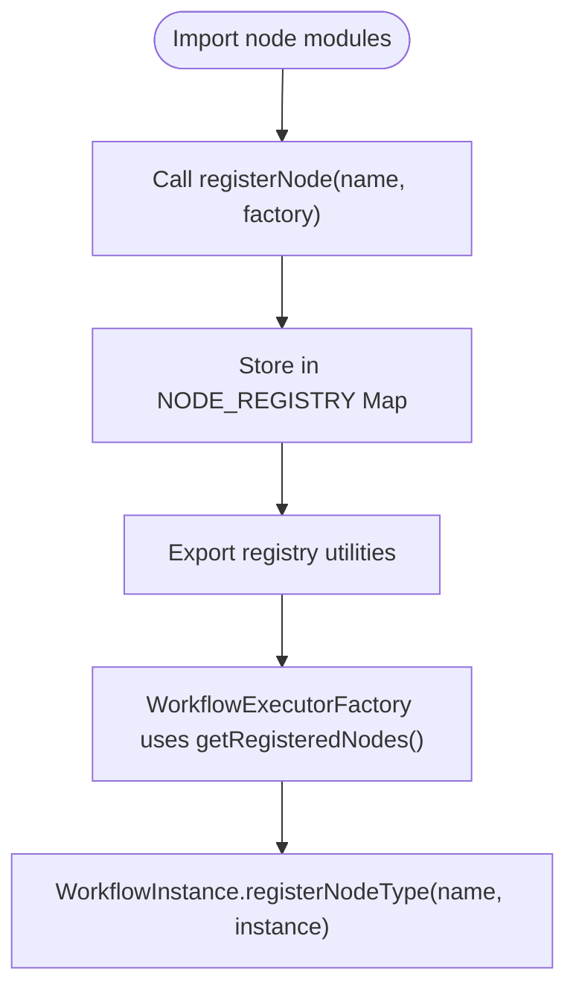
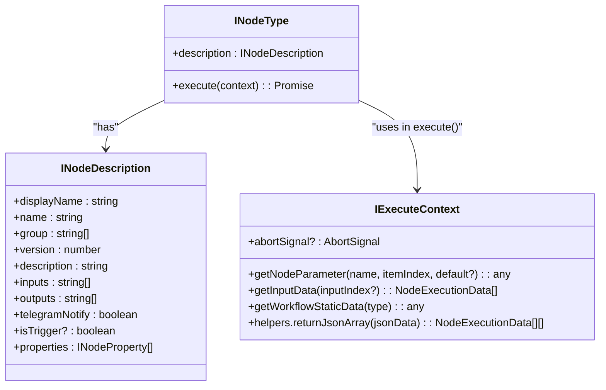
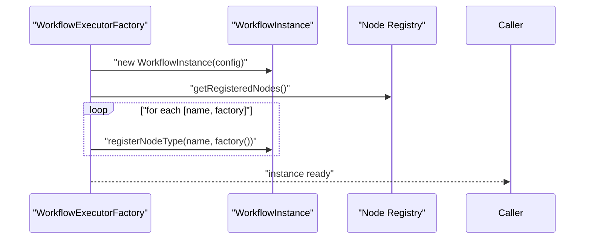
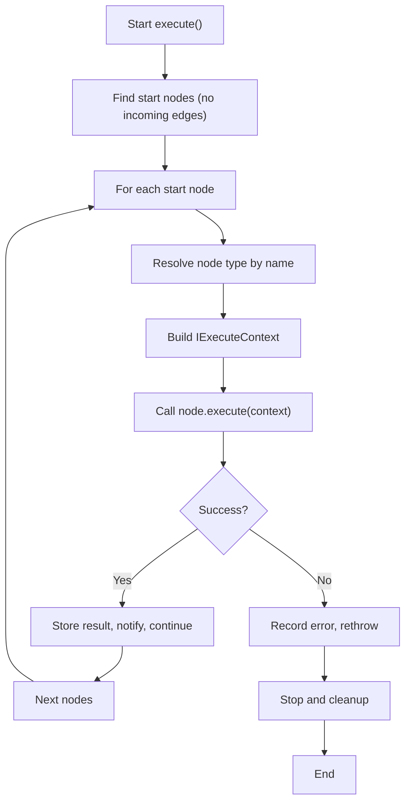
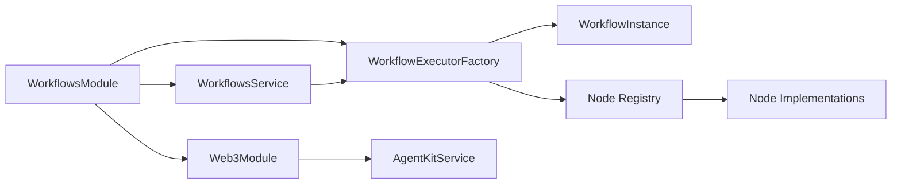

# Node Architecture and Registry System

<cite>
**Referenced Files in This Document**
- [node-registry.ts](file://src/web3/nodes/node-registry.ts)
- [workflow-types.ts](file://src/web3/workflow-types.ts)
- [workflow-executor.factory.ts](file://src/workflows/workflow-executor.factory.ts)
- [workflow-instance.ts](file://src/workflows/workflow-instance.ts)
- [workflows.service.ts](file://src/workflows/workflows.service.ts)
- [web3.module.ts](file://src/web3/web3.module.ts)
- [workflows.module.ts](file://src/workflows/workflows.module.ts)
- [price-feed.node.ts](file://src/web3/nodes/price-feed.node.ts)
- [swap.node.ts](file://src/web3/nodes/swap.node.ts)
- [transfer.node.ts](file://src/web3/nodes/transfer.node.ts)
- [balance.node.ts](file://src/web3/nodes/balance.node.ts)
</cite>

## Table of Contents
1. [Introduction](#introduction)
2. [Project Structure](#project-structure)
3. [Core Components](#core-components)
4. [Architecture Overview](#architecture-overview)
5. [Detailed Component Analysis](#detailed-component-analysis)
6. [Dependency Analysis](#dependency-analysis)
7. [Performance Considerations](#performance-considerations)
8. [Troubleshooting Guide](#troubleshooting-guide)
9. [Conclusion](#conclusion)
10. [Appendices](#appendices)

## Introduction
This document explains the centralized node registry pattern used to discover and manage all workflow node types dynamically. It covers the INodeType interface contract, the factory pattern implementation, and how new nodes integrate seamlessly into the workflow execution engine. It also documents the registration mechanism, discovery process, and the benefits of this approach for extensibility, including practical examples and best practices.

## Project Structure
The node architecture spans two primary areas:
- Web3 nodes and registry: centralized registration and node definitions
- Workflow execution: factory, instance lifecycle, and execution engine

**Diagram sources**
- [node-registry.ts:1-47](file://src/web3/nodes/node-registry.ts#L1-L47)
- [workflow-types.ts:1-91](file://src/web3/workflow-types.ts#L1-L91)
- [workflow-executor.factory.ts:1-42](file://src/workflows/workflow-executor.factory.ts#L1-L42)
- [workflow-instance.ts:1-314](file://src/workflows/workflow-instance.ts#L1-L314)
- [workflows.service.ts:1-216](file://src/workflows/workflows.service.ts#L1-L216)
- [web3.module.ts:1-13](file://src/web3/web3.module.ts#L1-L13)
- [workflows.module.ts:1-17](file://src/workflows/workflows.module.ts#L1-L17)

**Section sources**
- [node-registry.ts:1-47](file://src/web3/nodes/node-registry.ts#L1-L47)
- [workflow-types.ts:1-91](file://src/web3/workflow-types.ts#L1-L91)
- [workflow-executor.factory.ts:1-42](file://src/workflows/workflow-executor.factory.ts#L1-L42)
- [workflow-instance.ts:1-314](file://src/workflows/workflow-instance.ts#L1-L314)
- [workflows.service.ts:1-216](file://src/workflows/workflows.service.ts#L1-L216)
- [web3.module.ts:1-13](file://src/web3/web3.module.ts#L1-L13)
- [workflows.module.ts:1-17](file://src/workflows/workflows.module.ts#L1-L17)

## Core Components
- Centralized Node Registry: A global Map keyed by node type name, with lazy factory functions returning INodeType instances. Registration occurs at module initialization by importing each node and calling the registration function.
- INodeType Contract: Defines the node’s metadata (description) and the execute method that receives an execution context and returns structured outputs.
- WorkflowExecutorFactory: Creates WorkflowInstance and registers all known node types into the instance.
- WorkflowInstance: Manages execution lifecycle, resolves node types, builds execution context, and orchestrates node execution graph.
- Node Implementations: Classes that implement INodeType and encapsulate specific business logic (e.g., price monitoring, swaps, transfers, balances).

Benefits of this architecture:
- Extensibility: Adding a new node requires only implementing INodeType and registering it in the central registry.
- Decoupling: Execution engine depends only on the registry and INodeType contract, not on concrete node classes.
- Consistency: Uniform execution model, context injection, and notification handling across nodes.

**Section sources**
- [node-registry.ts:1-47](file://src/web3/nodes/node-registry.ts#L1-L47)
- [workflow-types.ts:12-31](file://src/web3/workflow-types.ts#L12-L31)
- [workflow-executor.factory.ts:36-40](file://src/workflows/workflow-executor.factory.ts#L36-L40)
- [workflow-instance.ts:84-89](file://src/workflows/workflow-instance.ts#L84-L89)

## Architecture Overview
The system follows a factory-driven discovery pattern:
- At startup, the registry imports all node modules and registers them under unique type names.
- The factory constructs a WorkflowInstance and iterates the registry to register each node type.
- During workflow execution, the instance resolves a node type by name and executes it with a prepared context.

**Diagram sources**
- [workflows.service.ts:160-169](file://src/workflows/workflows.service.ts#L160-L169)
- [workflow-executor.factory.ts:17-34](file://src/workflows/workflow-executor.factory.ts#L17-L34)
- [workflow-executor.factory.ts:36-40](file://src/workflows/workflow-executor.factory.ts#L36-L40)
- [workflow-instance.ts:162-258](file://src/workflows/workflow-instance.ts#L162-L258)
- [node-registry.ts:19-21](file://src/web3/nodes/node-registry.ts#L19-L21)

## Detailed Component Analysis

### Centralized Node Registry
- Purpose: Maintain a global registry of node types keyed by a unique name and backed by factory functions.
- Registration: New nodes are imported and registered with a stable type name; the factory returns a new instance each time it is invoked.
- Discovery: The factory retrieves the registry and registers each node into the WorkflowInstance.

**Diagram sources**
- [node-registry.ts:12-21](file://src/web3/nodes/node-registry.ts#L12-L21)
- [node-registry.ts:24-46](file://src/web3/nodes/node-registry.ts#L24-L46)
- [workflow-executor.factory.ts:36-40](file://src/workflows/workflow-executor.factory.ts#L36-L40)
- [workflow-instance.ts:84-89](file://src/workflows/workflow-instance.ts#L84-L89)

**Section sources**
- [node-registry.ts:1-47](file://src/web3/nodes/node-registry.ts#L1-L47)
- [workflow-executor.factory.ts:36-40](file://src/workflows/workflow-executor.factory.ts#L36-L40)
- [workflow-instance.ts:84-89](file://src/workflows/workflow-instance.ts#L84-L89)

### INodeType Interface Contract
- Description: Provides metadata (display name, group, version, inputs/outputs, properties) and the execute method.
- Execute Context: Supplies parameter retrieval, input data access, static data, helper utilities, and cancellation support.
- Node Definition: Used by the workflow engine to render UI and drive execution.

**Diagram sources**
- [workflow-types.ts:12-56](file://src/web3/workflow-types.ts#L12-L56)

**Section sources**
- [workflow-types.ts:12-56](file://src/web3/workflow-types.ts#L12-L56)

### Factory Pattern Implementation
- WorkflowExecutorFactory creates a WorkflowInstance and injects services, then registers all nodes from the registry.
- The factory ensures that all node types are available to the instance before execution begins.

**Diagram sources**
- [workflow-executor.factory.ts:17-34](file://src/workflows/workflow-executor.factory.ts#L17-L34)
- [workflow-executor.factory.ts:36-40](file://src/workflows/workflow-executor.factory.ts#L36-L40)
- [node-registry.ts:19-21](file://src/web3/nodes/node-registry.ts#L19-L21)

**Section sources**
- [workflow-executor.factory.ts:1-42](file://src/workflows/workflow-executor.factory.ts#L1-L42)

### WorkflowInstance Execution Engine
- Lifecycle: Tracks running state, handles start/completion/error notifications, and manages execution logs.
- Node Resolution: Resolves a node type by its type name; throws if unregistered.
- Context Construction: Builds an IExecuteContext with injected services, parameter resolution, and input data aggregation.
- Graph Traversal: Executes nodes in topological order, notifying downstream nodes after completion.

**Diagram sources**
- [workflow-instance.ts:94-151](file://src/workflows/workflow-instance.ts#L94-L151)
- [workflow-instance.ts:162-258](file://src/workflows/workflow-instance.ts#L162-L258)
- [workflow-instance.ts:260-312](file://src/workflows/workflow-instance.ts#L260-L312)

**Section sources**
- [workflow-instance.ts:1-314](file://src/workflows/workflow-instance.ts#L1-L314)

### Example Node Implementations
- PriceFeedNode: Implements INodeType with trigger semantics, monitors price conditions, and returns structured results.
- SwapNode: Implements INodeType with parameter parsing, token validation, and integration with AgentKitService for swaps.
- TransferNode: Implements INodeType with SOL and SPL token transfer logic, address validation, and transaction signing.
- BalanceNode: Implements INodeType with optional balance condition checks and decimal-aware balance computation.

These nodes demonstrate:
- Consistent use of INodeType.execute to process inputs and produce NodeExecutionData[][].
- Parameter retrieval via IExecuteContext.getNodeParameter.
- Input data aggregation via IExecuteContext.getInputData.
- Error handling with structured error payloads.

**Section sources**
- [price-feed.node.ts:5-133](file://src/web3/nodes/price-feed.node.ts#L5-L133)
- [swap.node.ts:49-209](file://src/web3/nodes/swap.node.ts#L49-L209)
- [transfer.node.ts:15-199](file://src/web3/nodes/transfer.node.ts#L15-L199)
- [balance.node.ts:15-196](file://src/web3/nodes/balance.node.ts#L15-L196)

## Dependency Analysis
- Module wiring:
  - WorkflowsModule imports TelegramModule, forward-referenced CrossmintModule, and Web3Module.
  - Web3Module exports AgentKitService and ConnectionService.
  - WorkflowsService depends on WorkflowExecutorFactory and SupabaseService.
  - WorkflowExecutorFactory depends on TelegramNotifierService, CrossmintService, and AgentKitService.
- Registry dependency:
  - WorkflowExecutorFactory imports getRegisteredNodes from node-registry.ts.
  - Node registry imports node implementations and registers them.

**Diagram sources**
- [workflows.module.ts:10-16](file://src/workflows/workflows.module.ts#L10-L16)
- [web3.module.ts:7-12](file://src/web3/web3.module.ts#L7-L12)
- [workflows.service.ts:8-12](file://src/workflows/workflows.service.ts#L8-L12)
- [workflow-executor.factory.ts:10-15](file://src/workflows/workflow-executor.factory.ts#L10-L15)

**Section sources**
- [workflows.module.ts:1-17](file://src/workflows/workflows.module.ts#L1-L17)
- [web3.module.ts:1-13](file://src/web3/web3.module.ts#L1-L13)
- [workflows.service.ts:1-216](file://src/workflows/workflows.service.ts#L1-L216)
- [workflow-executor.factory.ts:1-42](file://src/workflows/workflow-executor.factory.ts#L1-L42)

## Performance Considerations
- Lazy instantiation: Factories return new instances on demand, avoiding unnecessary memory overhead.
- Minimal coupling: The execution engine depends only on the registry and INodeType contract, enabling efficient hot-swapping of node implementations.
- Asynchronous execution: WorkflowsService starts execution asynchronously and updates persistence upon completion or failure.
- Context reuse: IExecuteContext avoids repeated parameter lookups and input data retrieval across node invocations.

[No sources needed since this section provides general guidance]

## Troubleshooting Guide
Common issues and resolutions:
- Unregistered node type: If a node type is missing from the registry, WorkflowInstance will throw an error when resolving the node. Ensure the node is imported and registered in the registry.
- Missing service injection: Nodes that require injected services (e.g., AgentKitService) must be accessed via IExecuteContext.getNodeParameter. Verify that the factory injects services into the instance.
- Parameter validation errors: Nodes validate inputs and throw descriptive errors. Review node-specific parameters and ensure they match expected types and formats.
- Execution abortion: WorkflowInstance respects AbortSignal; long-running nodes should periodically check the signal to gracefully stop.

**Section sources**
- [workflow-instance.ts:180-183](file://src/workflows/workflow-instance.ts#L180-L183)
- [workflow-instance.ts:167-169](file://src/workflows/workflow-instance.ts#L167-L169)
- [swap.node.ts:107-111](file://src/web3/nodes/swap.node.ts#L107-L111)
- [transfer.node.ts:64-68](file://src/web3/nodes/transfer.node.ts#L64-L68)
- [balance.node.ts:72-76](file://src/web3/nodes/balance.node.ts#L72-L76)

## Conclusion
The centralized node registry pattern provides a clean, extensible foundation for building a dynamic workflow system. By adhering to the INodeType contract and using the factory to register nodes, developers can add new capabilities without modifying the execution engine. The uniform execution model, robust context construction, and clear separation of concerns enable reliable, scalable automation.

[No sources needed since this section summarizes without analyzing specific files]

## Appendices

### Practical Examples

- Registering a new node type:
  - Import the node implementation and register it in the registry with a unique type name and a factory returning a new instance.
  - Ensure the node implements INodeType and exposes a description with metadata and properties.

- Implementing INodeType:
  - Define the description with display metadata, groups, inputs/outputs, and properties.
  - Implement execute to process inputs, handle errors, and return structured NodeExecutionData[][].

- Integrating with the workflow execution engine:
  - Use WorkflowExecutorFactory.createInstance to obtain a configured WorkflowInstance.
  - The factory automatically registers all nodes from the registry into the instance.
  - Trigger execution via WorkflowInstance.execute; the engine resolves nodes by type name and orchestrates execution.

Best practices:
- Keep node descriptions consistent and self-documenting.
- Validate parameters early in execute and return structured error payloads.
- Use IExecuteContext.helpers.returnJsonArray for consistent output formatting.
- Avoid heavy synchronous work inside execute; leverage asynchronous operations and respect abort signals.

**Section sources**
- [node-registry.ts:12-46](file://src/web3/nodes/node-registry.ts#L12-L46)
- [workflow-types.ts:12-31](file://src/web3/workflow-types.ts#L12-L31)
- [workflow-executor.factory.ts:17-40](file://src/workflows/workflow-executor.factory.ts#L17-L40)
- [workflow-instance.ts:84-89](file://src/workflows/workflow-instance.ts#L84-L89)
- [workflow-instance.ts:188-213](file://src/workflows/workflow-instance.ts#L188-L213)