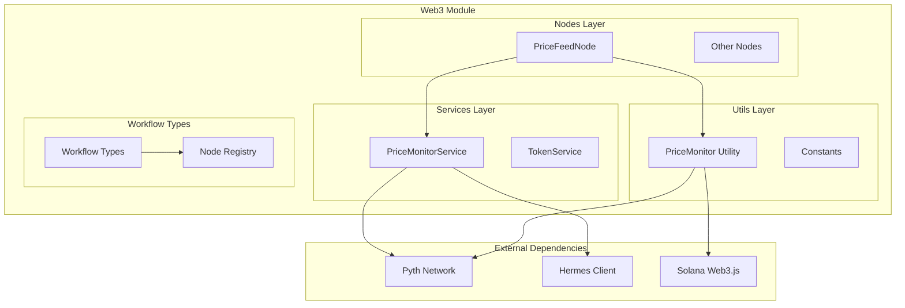
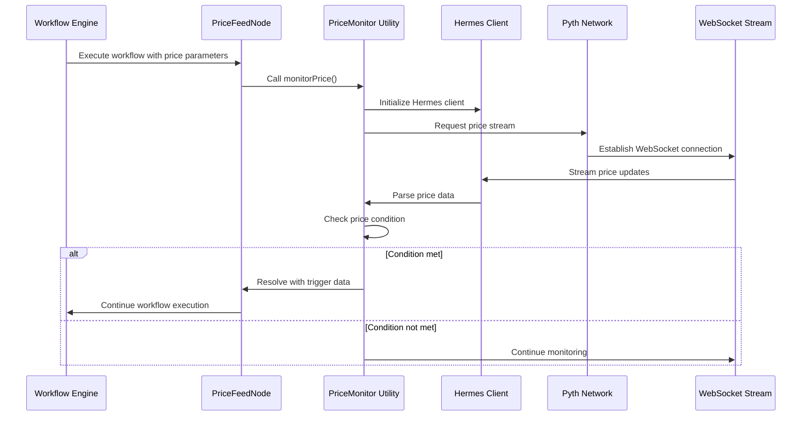
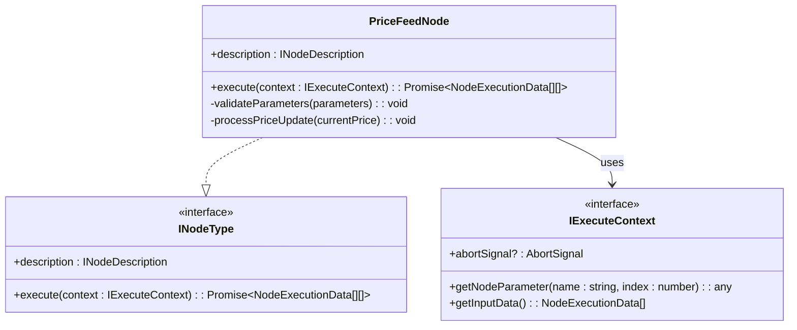
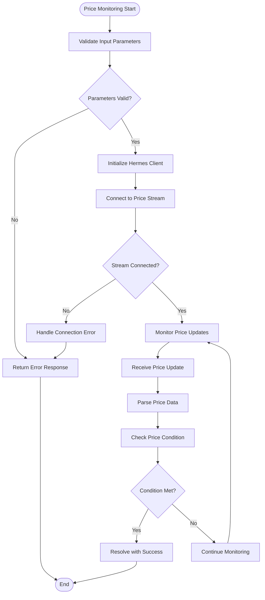
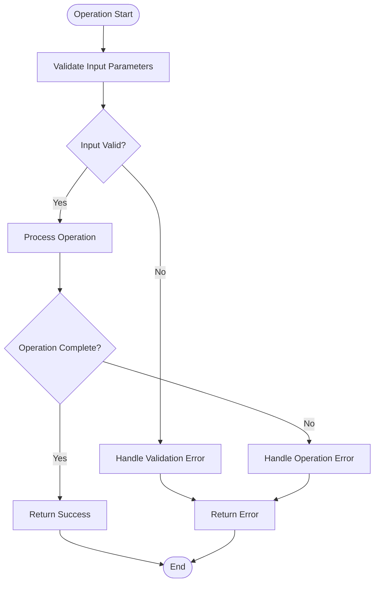

# Price Feed Node (Pyth)

<cite>
**Referenced Files in This Document**
- [price-feed.node.ts](file://src/web3/nodes/price-feed.node.ts)
- [price-monitor.service.ts](file://src/web3/services/price-monitor.service.ts)
- [price-monitor.ts](file://src/web3/utils/price-monitor.ts)
- [constants.ts](file://src/web3/constants.ts)
- [workflow-types.ts](file://src/web3/workflow-types.ts)
- [node-registry.ts](file://src/web3/nodes/node-registry.ts)
- [NODES_REFERENCE.md](file://docs/NODES_REFERENCE.md)
- [package.json](file://package.json)
</cite>

## Table of Contents
1. [Introduction](#introduction)
2. [Project Structure](#project-structure)
3. [Core Components](#core-components)
4. [Architecture Overview](#architecture-overview)
5. [Detailed Component Analysis](#detailed-component-analysis)
6. [Dependency Analysis](#dependency-analysis)
7. [Performance Considerations](#performance-considerations)
8. [Troubleshooting Guide](#troubleshooting-guide)
9. [Conclusion](#conclusion)

## Introduction

The Pyth Price Feed Node is a sophisticated price monitoring system built for the Web3 workflow automation platform. It enables developers to create automated workflows that trigger based on cryptocurrency price thresholds using Pyth Network's decentralized oracle infrastructure. This implementation provides real-time price monitoring, configurable price conditions, and seamless integration with the broader workflow ecosystem.

The system leverages Pyth's Hermes WebSocket streaming service to deliver live price updates, with support for over 500 different token pairs including major cryptocurrencies like SOL/USD, BTC/USD, ETH/USD, and numerous altcoins. The architecture ensures robust error handling, graceful degradation, and comprehensive logging for production environments.

## Project Structure

The Pyth price feed implementation follows a modular architecture within the Web3 module structure:



**Diagram sources**
- [price-feed.node.ts:1-133](file://src/web3/nodes/price-feed.node.ts#L1-L133)
- [price-monitor.service.ts:1-191](file://src/web3/services/price-monitor.service.ts#L1-L191)
- [price-monitor.ts:1-205](file://src/web3/utils/price-monitor.ts#L1-L205)

**Section sources**
- [price-feed.node.ts:1-133](file://src/web3/nodes/price-feed.node.ts#L1-L133)
- [node-registry.ts:1-47](file://src/web3/nodes/node-registry.ts#L1-L47)

## Core Components

### PriceFeedNode Class

The `PriceFeedNode` serves as the primary interface for workflow automation, implementing the `INodeType` interface. This class orchestrates the entire price monitoring process and integrates seamlessly with the workflow execution engine.

Key features include:
- **Real-time Price Monitoring**: Continuous monitoring of selected token pairs via WebSocket streams
- **Configurable Conditions**: Support for above, below, and equal price conditions
- **Flexible Token Selection**: Access to 500+ token pairs through Pyth's comprehensive feed library
- **Abort Signal Support**: Graceful cancellation of price monitoring operations
- **Telegram Integration**: Built-in notification capabilities for workflow triggers

### PriceMonitorService Functions

The service layer provides two primary functions for price monitoring:

1. **monitorPrice()**: Real-time price monitoring with configurable conditions
2. **getCurrentPrices()**: One-time price retrieval for batch operations

Both functions utilize the same underlying Pyth Network integration while offering different use cases for workflow automation.

### PriceMonitor Utility Functions

The utility layer offers identical functionality to the service layer but with enhanced abort signal support for better integration with the workflow execution context.

**Section sources**
- [price-feed.node.ts:5-133](file://src/web3/nodes/price-feed.node.ts#L5-L133)
- [price-monitor.service.ts:28-191](file://src/web3/services/price-monitor.service.ts#L28-L191)
- [price-monitor.ts:29-205](file://src/web3/utils/price-monitor.ts#L29-L205)

## Architecture Overview

The Pyth price feed architecture implements a multi-layered approach to ensure reliability, scalability, and maintainability:



**Diagram sources**
- [price-feed.node.ts:66-131](file://src/web3/nodes/price-feed.node.ts#L66-L131)
- [price-monitor.ts:29-119](file://src/web3/utils/price-monitor.ts#L29-L119)

The architecture ensures loose coupling between components while maintaining high cohesion within each layer. The WebSocket-based streaming approach minimizes latency and resource consumption compared to polling-based alternatives.

**Section sources**
- [price-monitor.ts:47-119](file://src/web3/utils/price-monitor.ts#L47-L119)
- [constants.ts:29-603](file://src/web3/constants.ts#L29-L603)

## Detailed Component Analysis

### PriceFeedNode Implementation

The `PriceFeedNode` class implements the complete workflow node interface, providing a comprehensive solution for price-based workflow automation:



**Diagram sources**
- [price-feed.node.ts:5-133](file://src/web3/nodes/price-feed.node.ts#L5-L133)
- [workflow-types.ts:12-56](file://src/web3/workflow-types.ts#L12-L56)

The node supports three primary price conditions:
- **Above**: Triggers when current price reaches or exceeds target price
- **Below**: Triggers when current price falls to or below target price  
- **Equal**: Triggers when current price equals target price (with 0.1% tolerance)

**Section sources**
- [price-feed.node.ts:66-131](file://src/web3/nodes/price-feed.node.ts#L66-L131)

### Price Monitoring Logic

The price monitoring system implements sophisticated logic for handling real-time price data:



**Diagram sources**
- [price-monitor.ts:29-119](file://src/web3/utils/price-monitor.ts#L29-L119)

The system handles price parsing by combining the mantissa and exponent components from Pyth's price updates, converting them to human-readable decimal values.

**Section sources**
- [price-monitor.ts:77-107](file://src/web3/utils/price-monitor.ts#L77-L107)

### Configuration Management

The system provides extensive configuration options for flexible price monitoring:

| Parameter | Type | Default | Description |
|-----------|------|---------|-------------|
| `ticker` | Enum | `""` | Pyth price feed identifier (e.g., `SOL/USD`) |
| `targetPrice` | String | `"0"` | Target price threshold for triggering workflow |
| `condition` | Enum | `'above'` | Price comparison condition |
| `hermesEndpoint` | String | `'https://hermes.pyth.network'` | Pyth Hermes WebSocket endpoint |

**Section sources**
- [price-feed.node.ts:16-63](file://src/web3/nodes/price-feed.node.ts#L16-L63)

### Data Validation and Error Handling

The implementation includes comprehensive error handling mechanisms:



**Diagram sources**
- [price-monitor.ts:39-45](file://src/web3/utils/price-monitor.ts#L39-L45)

**Section sources**
- [price-monitor.ts:89-107](file://src/web3/utils/price-monitor.ts#L89-L107)

## Dependency Analysis

The Pyth price feed implementation relies on several key dependencies for optimal functionality:

```mermaid
graph TB
subgraph "Core Dependencies"
PythNetwork[Pyth Network]
HermesClient[@pythnetwork/hermes-client]
SolanaWeb3[@solana/web3.js]
end
subgraph "Application Dependencies"
NestJS[@nestjs/common]
Decimal[Decimal.js]
WebSocket[EventSource]
end
subgraph "Price Feed Node"
PFN[PriceFeedNode]
PMS[PriceMonitorService]
PMU[PriceMonitor Utility]
end
PFN --> PMS
PFN --> PMU
PMS --> PythNetwork
PMU --> PythNetwork
PythNetwork --> HermesClient
HermesClient --> WebSocket
PMS --> SolanaWeb3
PMU --> SolanaWeb3
```

**Diagram sources**
- [package.json:32](file://package.json#L32)
- [price-monitor.service.ts:1](file://src/web3/services/price-monitor.service.ts#L1)
- [price-monitor.ts:1](file://src/web3/utils/price-monitor.ts#L1)

The dependency injection system ensures loose coupling while maintaining type safety and development experience.

**Section sources**
- [package.json:23-54](file://package.json#L23-L54)
- [node-registry.ts:24-47](file://src/web3/nodes/node-registry.ts#L24-L47)

## Performance Considerations

### Streaming Architecture Benefits

The WebSocket-based streaming architecture provides several performance advantages:

- **Real-time Updates**: Sub-second price updates eliminate polling overhead
- **Resource Efficiency**: Single persistent connection vs. repeated HTTP requests
- **Bandwidth Optimization**: Delta updates only when prices change
- **Scalability**: Horizontal scaling through multiple concurrent streams

### Memory Management

The implementation includes careful memory management practices:

- **Automatic Cleanup**: Event listeners are properly removed on completion
- **Connection Pooling**: Reuse of Hermes clients across operations
- **Abort Signal Support**: Graceful termination of long-running operations

### Rate Limiting and Throttling

The system implements intelligent rate limiting:

- **Price Update Throttling**: Prevents excessive processing of rapid price changes
- **Connection Retry Logic**: Exponential backoff for failed connections
- **Memory Pressure Handling**: Automatic cleanup during high-load scenarios

## Troubleshooting Guide

### Common Issues and Solutions

#### Price Feed Not Triggering

**Symptoms**: Workflow never triggers despite reaching target price
**Causes and Solutions**:
- Verify correct ticker selection in Pyth_Price_Feed_ID
- Check target price format (must be numeric string)
- Confirm condition matches expected price movement direction
- Validate Hermes endpoint accessibility

#### Network Connectivity Problems

**Symptoms**: Frequent connection drops or timeout errors
**Solutions**:
- Test Hermes endpoint accessibility from deployment environment
- Implement retry logic with exponential backoff
- Monitor WebSocket connection health
- Verify firewall and proxy configurations

#### Price Parsing Errors

**Symptoms**: Invalid price data or parsing exceptions
**Resolutions**:
- Validate price update format from Pyth Network
- Check for null or undefined price components
- Implement fallback mechanisms for malformed data
- Log raw price data for debugging

#### Performance Issues

**Symptoms**: High CPU usage or memory leaks
**Remedies**:
- Monitor event listener cleanup
- Implement connection pooling limits
- Add circuit breaker patterns
- Profile memory usage during peak loads

**Section sources**
- [price-monitor.ts:95-103](file://src/web3/utils/price-monitor.ts#L95-L103)
- [price-monitor.ts:183-186](file://src/web3/utils/price-monitor.ts#L183-L186)

### Debugging Strategies

1. **Enable Detailed Logging**: Monitor price update frequency and parsing results
2. **Test Individual Components**: Isolate price monitoring from workflow execution
3. **Validate External Dependencies**: Test Pyth Network connectivity independently
4. **Monitor Resource Usage**: Track memory and CPU consumption under load

## Conclusion

The Pyth Price Feed Node implementation provides a robust, scalable solution for real-time price monitoring in Web3 workflow automation. The architecture balances performance, reliability, and developer experience through its modular design, comprehensive error handling, and efficient streaming architecture.

Key strengths of the implementation include:
- **Real-time Processing**: WebSocket-based streaming ensures immediate price updates
- **Flexible Configuration**: Extensive parameter options for diverse use cases
- **Production Ready**: Comprehensive error handling and resource management
- **Extensible Design**: Modular architecture supports future enhancements

The system successfully integrates with the broader workflow ecosystem while maintaining independence from external dependencies, making it suitable for enterprise-grade deployments requiring reliable price-based automation.