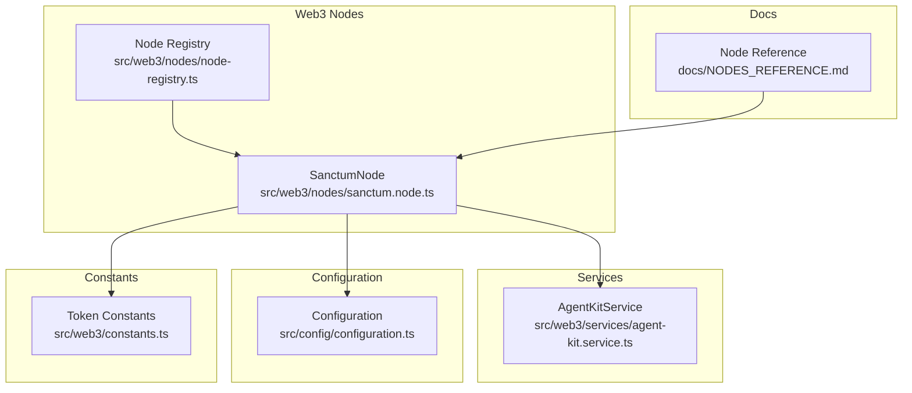
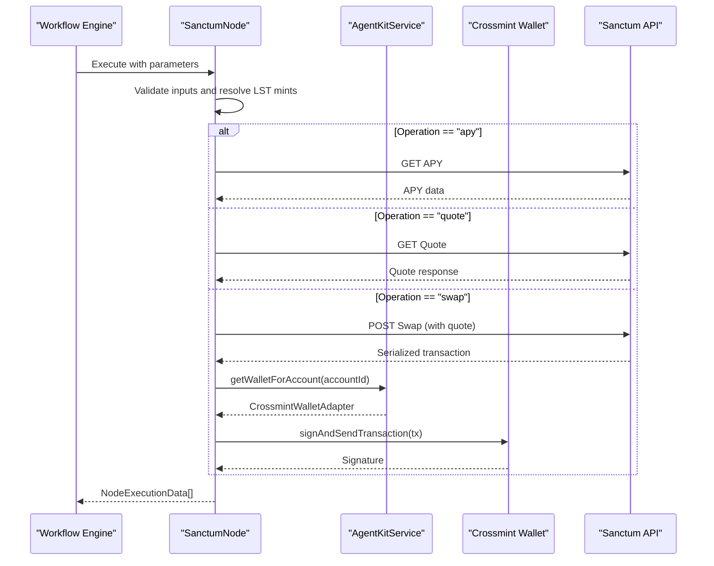
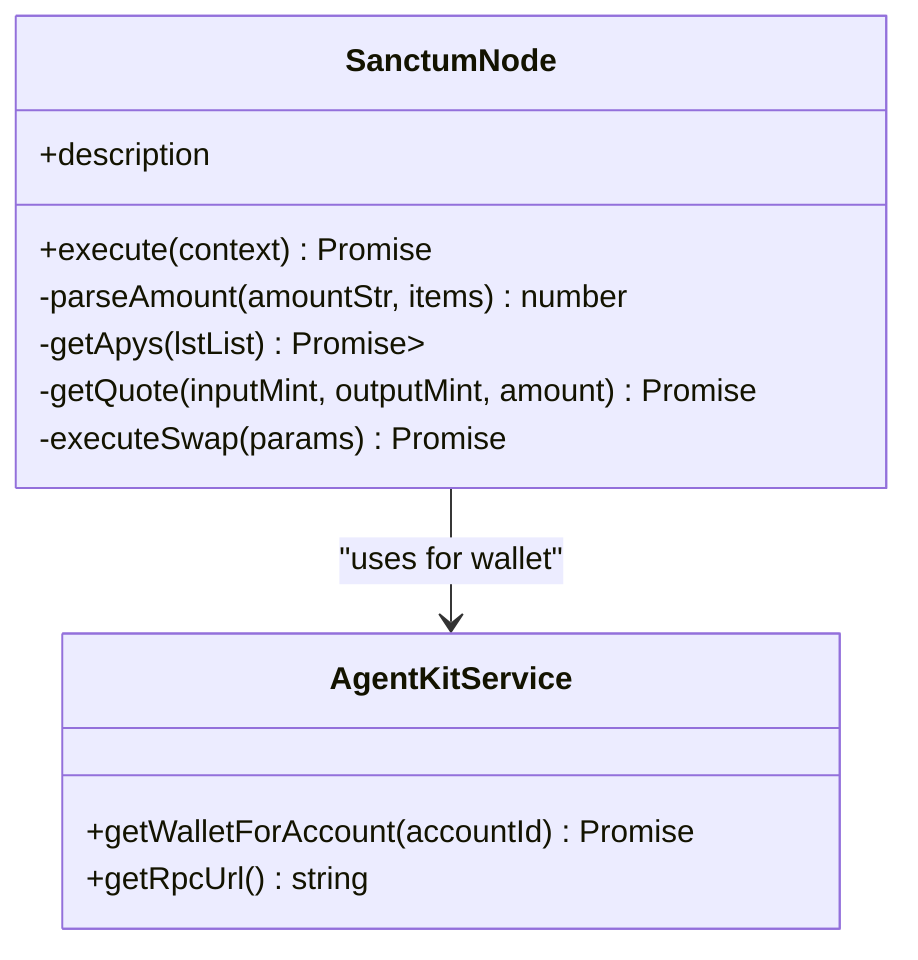
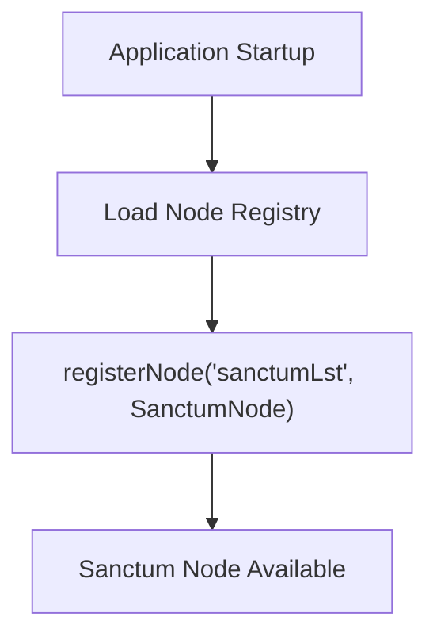
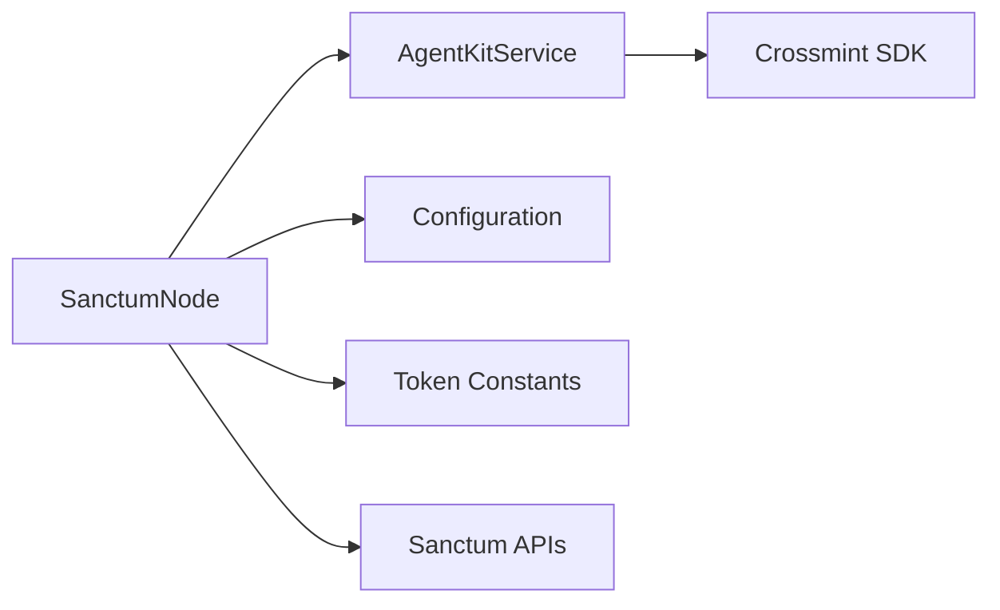

# Sanctum Node

<cite>
**Referenced Files in This Document**
- [sanctum.node.ts](file://src/web3/nodes/sanctum.node.ts)
- [node-registry.ts](file://src/web3/nodes/node-registry.ts)
- [agent-kit.service.ts](file://src/web3/services/agent-kit.service.ts)
- [constants.ts](file://src/web3/constants.ts)
- [configuration.ts](file://src/config/configuration.ts)
- [NODES_REFERENCE.md](file://docs/NODES_REFERENCE.md)
- [README.md](file://README.md)
- [workflow-types.ts](file://src/web3/workflow-types.ts)
</cite>

## Table of Contents
1. [Introduction](#introduction)
2. [Project Structure](#project-structure)
3. [Core Components](#core-components)
4. [Architecture Overview](#architecture-overview)
5. [Detailed Component Analysis](#detailed-component-analysis)
6. [Dependency Analysis](#dependency-analysis)
7. [Performance Considerations](#performance-considerations)
8. [Troubleshooting Guide](#troubleshooting-guide)
9. [Conclusion](#conclusion)
10. [Appendices](#appendices)

## Introduction
This document explains the Sanctum liquid staking node implementation, focusing on how it enables swapping Liquid Staking Tokens (LSTs), retrieving APY data, and integrating with Sanctum’s infrastructure. It covers configuration options, operational workflows, yield optimization strategies, slippage considerations, and troubleshooting guidance. The node operates within a broader workflow automation platform that orchestrates DeFi actions using Crossmint custodial wallets.

## Project Structure
The Sanctum node is part of a modular Web3 workflow engine. It integrates with:
- Node registry for discovery and registration
- Agent kit service for wallet management and transaction signing
- Configuration service for environment variables
- Constants for token metadata and LST addresses
- Workflow types for node contracts and execution contexts

**Diagram sources**
- [sanctum.node.ts:110-434](file://src/web3/nodes/sanctum.node.ts#L110-L434)
- [node-registry.ts:33-46](file://src/web3/nodes/node-registry.ts#L33-L46)
- [agent-kit.service.ts:55-163](file://src/web3/services/agent-kit.service.ts#L55-L163)
- [configuration.ts:41-43](file://src/config/configuration.ts#L41-L43)
- [constants.ts:16-27](file://src/web3/constants.ts#L16-L27)
- [NODES_REFERENCE.md:209-231](file://docs/NODES_REFERENCE.md#L209-L231)

**Section sources**
- [sanctum.node.ts:110-434](file://src/web3/nodes/sanctum.node.ts#L110-L434)
- [node-registry.ts:33-46](file://src/web3/nodes/node-registry.ts#L33-L46)
- [agent-kit.service.ts:55-163](file://src/web3/services/agent-kit.service.ts#L55-L163)
- [configuration.ts:41-43](file://src/config/configuration.ts#L41-L43)
- [constants.ts:16-27](file://src/web3/constants.ts#L16-L27)
- [NODES_REFERENCE.md:209-231](file://docs/NODES_REFERENCE.md#L209-L231)

## Core Components
- SanctumNode: Implements LST swap, quote retrieval, and APY fetching against Sanctum APIs. It uses Crossmint custodial wallets for signing and sending transactions.
- AgentKitService: Provides wallet adapters for accounts and executes swaps via Jupiter when needed; integrates with Crossmint SDK.
- Node Registry: Registers the Sanctum node so it can be discovered and executed by the workflow engine.
- Configuration: Exposes environment variables for Sanctum API key and other runtime settings.
- Constants: Defines token addresses and LST mint mappings used by the node.

Key responsibilities:
- Parse node parameters and validate inputs
- Resolve LST mint addresses
- Fetch quotes and execute swaps via Sanctum APIs
- Retrieve APY data for LST pairs
- Integrate with Crossmint wallets for transaction signing

**Section sources**
- [sanctum.node.ts:110-434](file://src/web3/nodes/sanctum.node.ts#L110-L434)
- [agent-kit.service.ts:55-163](file://src/web3/services/agent-kit.service.ts#L55-L163)
- [node-registry.ts:33-46](file://src/web3/nodes/node-registry.ts#L33-L46)
- [configuration.ts:41-43](file://src/config/configuration.ts#L41-L43)
- [constants.ts:16-27](file://src/web3/constants.ts#L16-L27)

## Architecture Overview
The Sanctum node participates in a workflow-driven system. It receives parameters from a workflow definition, resolves LST addresses, interacts with Sanctum APIs, and signs transactions using Crossmint wallets.

**Diagram sources**
- [sanctum.node.ts:173-310](file://src/web3/nodes/sanctum.node.ts#L173-L310)
- [sanctum.node.ts:359-433](file://src/web3/nodes/sanctum.node.ts#L359-L433)
- [agent-kit.service.ts:74-77](file://src/web3/services/agent-kit.service.ts#L74-L77)

## Detailed Component Analysis

### SanctumNode Implementation
The SanctumNode implements the INodeType contract and exposes three operations:
- Swap LST: Executes a swap via Sanctum API and signs the resulting transaction with a Crossmint wallet.
- Get Quote: Retrieves a quote for the requested swap pair and amount.
- Get APY: Fetches latest APY for specified LSTs.

Operational highlights:
- Parameter parsing supports “auto”, “all”, and numeric amounts.
- LST mint resolution uses a predefined mapping of tickers to SPL token addresses.
- Retry and timeout utilities protect external API calls.
- Priority fee configuration controls transaction prioritization on-chain.

**Diagram sources**
- [sanctum.node.ts:110-434](file://src/web3/nodes/sanctum.node.ts#L110-L434)
- [agent-kit.service.ts:55-163](file://src/web3/services/agent-kit.service.ts#L55-L163)

**Section sources**
- [sanctum.node.ts:110-434](file://src/web3/nodes/sanctum.node.ts#L110-L434)

### Node Registration and Discovery
The node is registered globally so the workflow engine can discover and instantiate it. Registration occurs in the node registry.

**Diagram sources**
- [node-registry.ts:33-46](file://src/web3/nodes/node-registry.ts#L33-L46)

**Section sources**
- [node-registry.ts:33-46](file://src/web3/nodes/node-registry.ts#L33-L46)

### Configuration and Environment Variables
Sanctum requires an API key for certain operations. The configuration module exposes environment variables for runtime settings.

- SANCTUM_API_KEY: Enables Sanctum node features requiring authentication.
- CROSSMINT_*: Wallet management and environment settings.
- SOLANA_RPC_URL: RPC endpoint for chain interactions.

**Section sources**
- [configuration.ts:41-43](file://src/config/configuration.ts#L41-L43)
- [README.md:82-82](file://README.md#L82-L82)

### Token and LST Address Management
The node relies on a curated mapping of LST tickers to SPL mint addresses. This ensures consistent token resolution across operations.

- LST_MINTS mapping includes SOL-based LSTs such as mSOL, bSOL, jitoSOL, jupSOL, and others.
- Token constants define widely used token addresses for broader ecosystem integrations.

**Section sources**
- [sanctum.node.ts:65-81](file://src/web3/nodes/sanctum.node.ts#L65-L81)
- [constants.ts:16-27](file://src/web3/constants.ts#L16-L27)

### Workflow Types and Execution Contracts
The node adheres to a standardized interface for workflow execution, enabling consistent parameter handling and output formatting.

- INodeType: Defines the node contract with description and execute method.
- IExecuteContext: Supplies parameter retrieval and input data access.
- NodeExecutionData: Standardized output container for workflow results.

**Section sources**
- [workflow-types.ts:12-56](file://src/web3/workflow-types.ts#L12-L56)

## Dependency Analysis
The Sanctum node depends on:
- Crossmint wallet adapters for signing and sending transactions
- Sanctum APIs for quotes and swap execution
- Configuration service for environment variables
- Token constants for LST address resolution

**Diagram sources**
- [sanctum.node.ts:177-181](file://src/web3/nodes/sanctum.node.ts#L177-L181)
- [agent-kit.service.ts:74-77](file://src/web3/services/agent-kit.service.ts#L74-L77)
- [configuration.ts:41-43](file://src/config/configuration.ts#L41-L43)
- [constants.ts:16-27](file://src/web3/constants.ts#L16-L27)

**Section sources**
- [sanctum.node.ts:177-181](file://src/web3/nodes/sanctum.node.ts#L177-L181)
- [agent-kit.service.ts:74-77](file://src/web3/services/agent-kit.service.ts#L74-L77)
- [configuration.ts:41-43](file://src/config/configuration.ts#L41-L43)
- [constants.ts:16-27](file://src/web3/constants.ts#L16-L27)

## Performance Considerations
- External API rate limiting: The node uses a concurrency limiter to prevent throttling when calling Sanctum APIs.
- Retry with exponential backoff: Reduces transient failure impact during quote and swap requests.
- Timeout handling: Prevents indefinite waits for external responses.
- Priority fee tuning: Controls transaction prioritization; higher fees increase inclusion speed but cost more.

Practical tips:
- Use “auto” amount to chain outputs from previous nodes to minimize re-query overhead.
- Batch operations where feasible to reduce repeated quote calls.
- Monitor network congestion and adjust priority fees accordingly.

[No sources needed since this section provides general guidance]

## Troubleshooting Guide
Common issues and resolutions:
- Unknown LST ticker: Ensure the input/output LST is present in the LST_MINTS mapping.
- Missing Account ID: Supply a valid Crossmint-managed account identifier for swap operations.
- API errors: Check SANCTUM_API_KEY and network connectivity; Sanctum API responses are parsed for error details.
- Transaction failures: Verify the account has sufficient SOL for fees and that the Crossmint wallet is initialized.

Operational checks:
- Validate environment variables (SANCTUM_API_KEY, CROSSMINT_*).
- Confirm RPC endpoint accessibility.
- Review node logs for detailed error messages.

**Section sources**
- [sanctum.node.ts:201-210](file://src/web3/nodes/sanctum.node.ts#L201-L210)
- [sanctum.node.ts:378-381](file://src/web3/nodes/sanctum.node.ts#L378-L381)
- [configuration.ts:41-43](file://src/config/configuration.ts#L41-L43)
- [README.md:287-306](file://README.md#L287-L306)

## Conclusion
The Sanctum node provides a robust foundation for liquid staking operations on Solana by integrating with Sanctum’s APIs and Crossmint’s custodial wallet infrastructure. It supports swapping LSTs, retrieving quotes, and fetching APY data, while offering configurable parameters for amount, priority fees, and operation selection. Proper configuration, careful parameter handling, and awareness of slippage and priority fee trade-offs enable reliable and efficient liquid staking workflows.

[No sources needed since this section summarizes without analyzing specific files]

## Appendices

### Practical Examples and Guidance
- Setting up a liquid staking workflow:
  - Use the Sanctum node with operation “swap” and specify inputLst and outputLst.
  - Provide an accountId linked to a Crossmint wallet.
  - Use amount “auto” to chain outputs from a previous node or “all” to stake entire balance.
- Monitoring LST value appreciation:
  - Use operation “apy” to retrieve latest APY for selected LSTs and compare yields across pairs.
- Redemption strategies:
  - Choose an output LST aligned with your exit strategy (e.g., SOL or jitoSOL).
  - Set priorityFee according to network conditions to optimize inclusion timing.
- Yield optimization:
  - Compare APY across LST pairs before swapping.
  - Consider slippage tolerance and transaction costs when executing swaps.
- Slippage considerations:
  - While the Sanctum node uses ExactIn mode, monitor price impact reported in quotes.
  - Adjust priorityFee to improve inclusion probability under congestion.
- Liquidity pool management:
  - Monitor liquidity depth via APY and price impact signals.
  - Prefer LST pairs with stable APY and low price impact for consistent redemptions.

**Section sources**
- [NODES_REFERENCE.md:209-231](file://docs/NODES_REFERENCE.md#L209-L231)
- [sanctum.node.ts:215-294](file://src/web3/nodes/sanctum.node.ts#L215-L294)
- [sanctum.node.ts:359-433](file://src/web3/nodes/sanctum.node.ts#L359-L433)