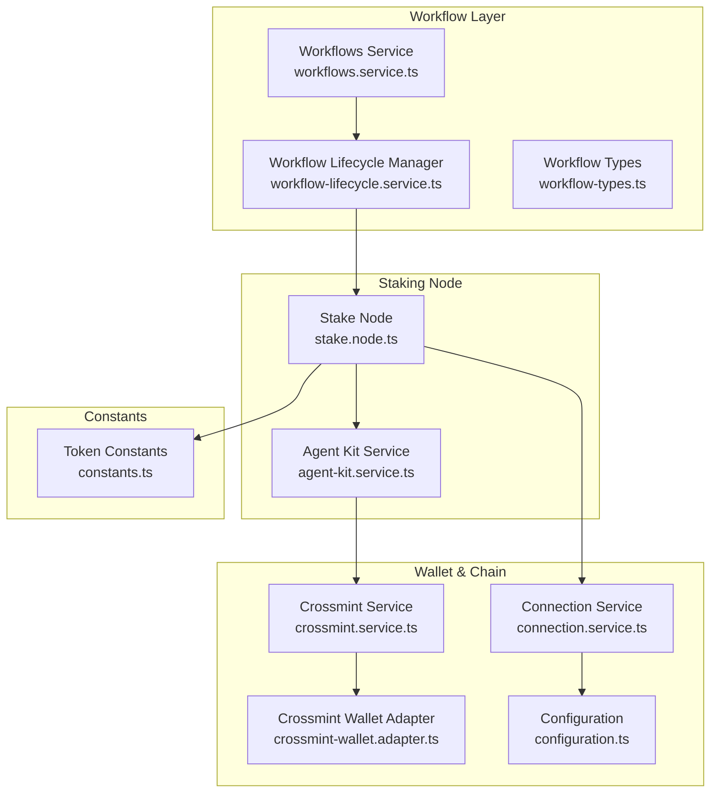
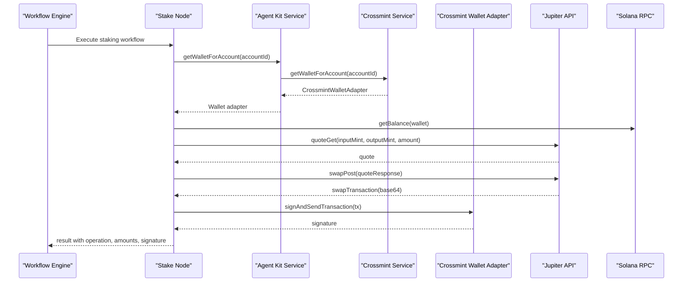
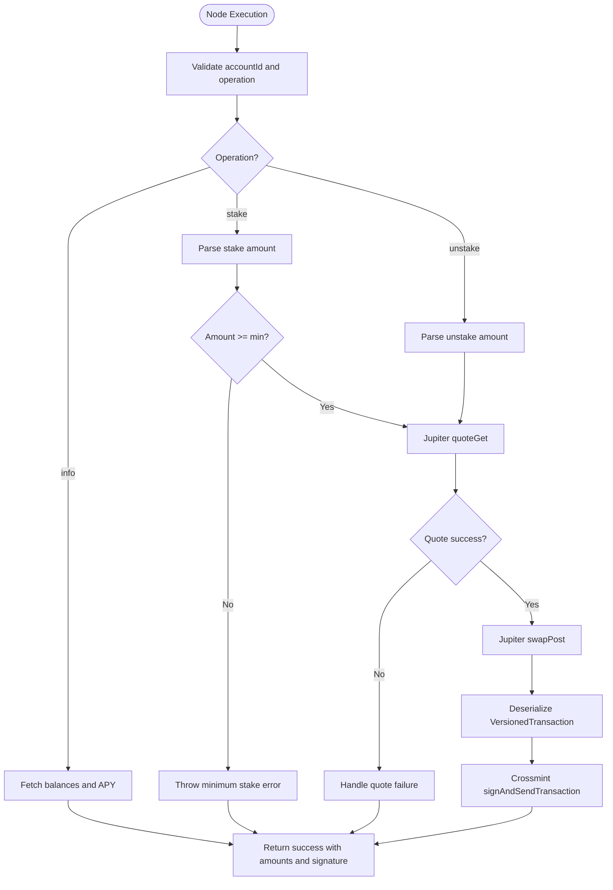
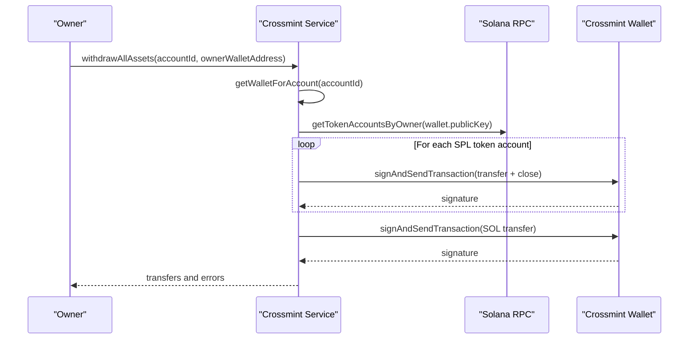
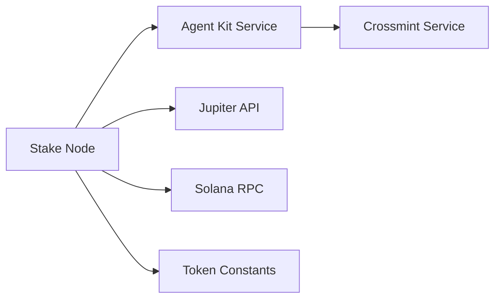

# Stake Node (SOL)

<cite>
**Referenced Files in This Document**
- [stake.node.ts](file://src/web3/nodes/stake.node.ts)
- [agent-kit.service.ts](file://src/web3/services/agent-kit.service.ts)
- [crossmint.service.ts](file://src/crossmint/crossmint.service.ts)
- [crossmint-wallet.adapter.ts](file://src/crossmint/crossmint-wallet.adapter.ts)
- [configuration.ts](file://src/config/configuration.ts)
- [connection.service.ts](file://src/web3/services/connection.service.ts)
- [constants.ts](file://src/web3/constants.ts)
- [NODES_REFERENCE.md](file://docs/NODES_REFERENCE.md)
- [workflow-lifecycle.service.ts](file://src/workflows/workflow-lifecycle.service.ts)
- [workflows.service.ts](file://src/workflows/workflows.service.ts)
- [workflow-types.ts](file://src/web3/workflow-types.ts)
</cite>

## Table of Contents
1. [Introduction](#introduction)
2. [Project Structure](#project-structure)
3. [Core Components](#core-components)
4. [Architecture Overview](#architecture-overview)
5. [Detailed Component Analysis](#detailed-component-analysis)
6. [Dependency Analysis](#dependency-analysis)
7. [Performance Considerations](#performance-considerations)
8. [Troubleshooting Guide](#troubleshooting-guide)
9. [Conclusion](#conclusion)
10. [Appendices](#appendices)

## Introduction
This document explains the SOL staking node implementation that stakes native SOL to receive jupSOL via Jupiter Staking. It covers staking operations, delegation mechanics, reward collection processes, integration with Solana's ecosystem, validator selection criteria, stake account management, configuration options, practical workflows, monitoring, unstaking procedures, security considerations, optimization strategies, and troubleshooting.

The implementation leverages:
- Crossmint托管钱包进行签名与交易广播
- Jupiter API进行报价与交换
- Solana Web3.js与@solana/kit进行链上交互
- Workflow引擎驱动自动化执行

## Project Structure
The SOL staking node is part of a broader Web3 workflow system. Key modules involved in staking include:
- Node implementation: stake.node.ts
- Agent Kit service: agent-kit.service.ts
- Crossmint wallet integration: crossmint.service.ts, crossmint-wallet.adapter.ts
- Configuration: configuration.ts, connection.service.ts
- Token constants: constants.ts
- Workflow orchestration: workflow-lifecycle.service.ts, workflows.service.ts, workflow-types.ts
- Documentation: NODES_REFERENCE.md



**Diagram sources**
- [stake.node.ts:1-297](file://src/web3/nodes/stake.node.ts#L1-L297)
- [agent-kit.service.ts:1-163](file://src/web3/services/agent-kit.service.ts#L1-L163)
- [crossmint.service.ts:1-403](file://src/crossmint/crossmint.service.ts#L1-L403)
- [crossmint-wallet.adapter.ts:1-89](file://src/crossmint/crossmint-wallet.adapter.ts#L1-L89)
- [connection.service.ts:1-73](file://src/web3/services/connection.service.ts#L1-L73)
- [configuration.ts:1-45](file://src/config/configuration.ts#L1-L45)
- [constants.ts:1-603](file://src/web3/constants.ts#L1-L603)
- [workflows.service.ts:1-216](file://src/workflows/workflows.service.ts#L1-L216)
- [workflow-lifecycle.service.ts:1-343](file://src/workflows/workflow-lifecycle.service.ts#L1-L343)
- [workflow-types.ts:1-91](file://src/web3/workflow-types.ts#L1-L91)

**Section sources**
- [stake.node.ts:1-297](file://src/web3/nodes/stake.node.ts#L1-L297)
- [agent-kit.service.ts:1-163](file://src/web3/services/agent-kit.service.ts#L1-L163)
- [crossmint.service.ts:1-403](file://src/crossmint/crossmint.service.ts#L1-L403)
- [crossmint-wallet.adapter.ts:1-89](file://src/crossmint/crossmint-wallet.adapter.ts#L1-L89)
- [connection.service.ts:1-73](file://src/web3/services/connection.service.ts#L1-L73)
- [configuration.ts:1-45](file://src/config/configuration.ts#L1-L45)
- [constants.ts:1-603](file://src/web3/constants.ts#L1-L603)
- [workflows.service.ts:1-216](file://src/workflows/workflows.service.ts#L1-L216)
- [workflow-lifecycle.service.ts:1-343](file://src/workflows/workflow-lifecycle.service.ts#L1-L343)
- [workflow-types.ts:1-91](file://src/web3/workflow-types.ts#L1-L91)
- [NODES_REFERENCE.md:233-252](file://docs/NODES_REFERENCE.md#L233-L252)

## Core Components
- Stake Node: Implements staking/unstaking/info operations using Jupiter API and Crossmint wallet.
- Agent Kit Service: Provides unified access to Crossmint wallets and executes swaps via Jupiter.
- Crossmint Service: Manages Crossmint wallet lifecycle and asset withdrawals.
- Crossmint Wallet Adapter: Wraps Crossmint wallet to conform to wallet adapter interface.
- Connection Service: Initializes and exposes Solana RPC, WebSocket, and legacy Connection.
- Configuration: Centralizes environment variables for RPC, Telegram, Crossmint, etc.
- Token Constants: Defines token addresses including jupSOL and SOL.
- Workflow Orchestration: Starts/stops workflow instances and ensures minimum SOL balance.

Key operational capabilities:
- Stake SOL to receive jupSOL
- Unstake jupSOL to receive SOL
- Retrieve staking info (balances, exchange rate, APY)
- Automatic compounding via Jupiter Staking
- No lock-up period; instant redemption capability
- Uses Crossmint custodial wallet for signatures and transactions

**Section sources**
- [stake.node.ts:16-57](file://src/web3/nodes/stake.node.ts#L16-L57)
- [agent-kit.service.ts:55-84](file://src/web3/services/agent-kit.service.ts#L55-L84)
- [crossmint.service.ts:122-154](file://src/crossmint/crossmint.service.ts#L122-L154)
- [crossmint-wallet.adapter.ts:16-30](file://src/crossmint/crossmint-wallet.adapter.ts#L16-L30)
- [connection.service.ts:22-53](file://src/web3/services/connection.service.ts#L22-L53)
- [configuration.ts:18-21](file://src/config/configuration.ts#L18-L21)
- [constants.ts:16-27](file://src/web3/constants.ts#L16-L27)
- [workflow-lifecycle.service.ts:214-229](file://src/workflows/workflow-lifecycle.service.ts#L214-L229)

## Architecture Overview
The staking workflow integrates with Jupiter Staking through a node that:
- Resolves a Crossmint custodial wallet for an account
- Queries balances and exchange rates
- Builds a swap instruction via Jupiter API
- Serializes and signs the transaction using the Crossmint wallet
- Broadcasts the transaction and returns results



**Diagram sources**
- [stake.node.ts:64-198](file://src/web3/nodes/stake.node.ts#L64-L198)
- [agent-kit.service.ts:74-161](file://src/web3/services/agent-kit.service.ts#L74-L161)
- [crossmint.service.ts:122-154](file://src/crossmint/crossmint.service.ts#L122-L154)
- [crossmint-wallet.adapter.ts:65-76](file://src/crossmint/crossmint-wallet.adapter.ts#L65-L76)

**Section sources**
- [stake.node.ts:64-198](file://src/web3/nodes/stake.node.ts#L64-L198)
- [agent-kit.service.ts:74-161](file://src/web3/services/agent-kit.service.ts#L74-L161)
- [crossmint.service.ts:122-154](file://src/crossmint/crossmint.service.ts#L122-L154)
- [crossmint-wallet.adapter.ts:65-76](file://src/crossmint/crossmint-wallet.adapter.ts#L65-L76)

## Detailed Component Analysis

### Stake Node Implementation
The Stake Node orchestrates SOL/jupSOL conversions using Jupiter Staking:
- Operation modes: stake, unstake, info
- Amount parsing supports auto, all, half, or numeric values
- Minimum stake threshold enforced
- Uses Jupiter API for quotes and swap transactions
- Crossmint wallet signs and submits transactions



**Diagram sources**
- [stake.node.ts:64-198](file://src/web3/nodes/stake.node.ts#L64-L198)

**Section sources**
- [stake.node.ts:16-57](file://src/web3/nodes/stake.node.ts#L16-L57)
- [stake.node.ts:64-198](file://src/web3/nodes/stake.node.ts#L64-L198)
- [stake.node.ts:203-220](file://src/web3/nodes/stake.node.ts#L203-L220)
- [stake.node.ts:225-238](file://src/web3/nodes/stake.node.ts#L225-L238)
- [stake.node.ts:243-295](file://src/web3/nodes/stake.node.ts#L243-L295)

### Agent Kit Service
Provides wallet access and executes swaps:
- Retrieves Crossmint wallet for an account
- Executes Jupiter swaps with retry and concurrency limits
- Returns swap results with signatures and amounts

```mermaid
classDiagram
class AgentKitService {
+getWalletForAccount(accountId) CrossmintWalletAdapter
+getRpcUrl() string
+executeSwap(accountId, inputMint, outputMint, amount, slippageBps) SwapResult
}
class CrossmintService {
+getWalletForAccount(accountId) CrossmintWalletAdapter
}
class CrossmintWalletAdapter {
+publicKey PublicKey
+address string
+signTransaction(tx) Transaction
+signAllTransactions(txs) Transaction[]
+signAndSendTransaction(tx) {signature}
}
AgentKitService --> CrossmintService : "uses"
CrossmintService --> CrossmintWalletAdapter : "returns"
```

**Diagram sources**
- [agent-kit.service.ts:56-84](file://src/web3/services/agent-kit.service.ts#L56-L84)
- [agent-kit.service.ts:99-161](file://src/web3/services/agent-kit.service.ts#L99-L161)
- [crossmint.service.ts:122-154](file://src/crossmint/crossmint.service.ts#L122-L154)
- [crossmint-wallet.adapter.ts:16-88](file://src/crossmint/crossmint-wallet.adapter.ts#L16-L88)

**Section sources**
- [agent-kit.service.ts:56-84](file://src/web3/services/agent-kit.service.ts#L56-L84)
- [agent-kit.service.ts:99-161](file://src/web3/services/agent-kit.service.ts#L99-L161)
- [crossmint.service.ts:122-154](file://src/crossmint/crossmint.service.ts#L122-L154)
- [crossmint-wallet.adapter.ts:16-88](file://src/crossmint/crossmint-wallet.adapter.ts#L16-L88)

### Crossmint Integration
Crossmint manages the custodial wallet lifecycle:
- Wallet retrieval by account locator/address
- Asset withdrawal and account deletion workflows
- Ensures funds are moved back to owner before closure



**Diagram sources**
- [crossmint.service.ts:209-344](file://src/crossmint/crossmint.service.ts#L209-L344)

**Section sources**
- [crossmint.service.ts:209-344](file://src/crossmint/crossmint.service.ts#L209-L344)

### Configuration and Environment
Environment variables control RPC endpoints, Crossmint credentials, and other integrations.

**Section sources**
- [configuration.ts:18-31](file://src/config/configuration.ts#L18-L31)
- [connection.service.ts:30-53](file://src/web3/services/connection.service.ts#L30-L53)

### Token Constants and Validator Context
Token addresses include SOL and jupSOL. While the current implementation uses Jupiter Staking (no direct validator delegation), the token constants support broader LST ecosystems.

**Section sources**
- [constants.ts:16-27](file://src/web3/constants.ts#L16-L27)

### Workflow Integration
The workflow engine starts/stops instances and ensures minimum SOL balance before launching.

**Section sources**
- [workflow-lifecycle.service.ts:214-229](file://src/workflows/workflow-lifecycle.service.ts#L214-L229)
- [workflows.service.ts:83-214](file://src/workflows/workflows.service.ts#L83-L214)
- [workflow-types.ts:82-90](file://src/web3/workflow-types.ts#L82-L90)

## Dependency Analysis
The Stake Node depends on:
- Agent Kit Service for wallet access and swap execution
- Crossmint Service for custodial wallet management
- Jupiter API for quotes and swap transactions
- Solana RPC for balance queries and transaction submission
- Token constants for mint addresses



**Diagram sources**
- [stake.node.ts:1-297](file://src/web3/nodes/stake.node.ts#L1-L297)
- [agent-kit.service.ts:1-163](file://src/web3/services/agent-kit.service.ts#L1-L163)
- [crossmint.service.ts:1-403](file://src/crossmint/crossmint.service.ts#L1-L403)
- [constants.ts:16-27](file://src/web3/constants.ts#L16-L27)

**Section sources**
- [stake.node.ts:1-297](file://src/web3/nodes/stake.node.ts#L1-L297)
- [agent-kit.service.ts:1-163](file://src/web3/services/agent-kit.service.ts#L1-L163)
- [crossmint.service.ts:1-403](file://src/crossmint/crossmint.service.ts#L1-L403)
- [constants.ts:16-27](file://src/web3/constants.ts#L16-L27)

## Performance Considerations
- Jupiter API calls are rate-limited and retried with exponential backoff to avoid failures under load.
- Transaction serialization/deserialization occurs client-side before signing.
- Balance checks and amount computations are performed locally to minimize RPC calls.
- Workflow polling interval is configurable to balance responsiveness and cost.

[No sources needed since this section provides general guidance]

## Troubleshooting Guide
Common issues and resolutions:
- Missing Crossmint wallet: Ensure the account has a configured Crossmint wallet locator/address.
- Insufficient SOL balance: The lifecycle manager enforces a minimum SOL balance before launching workflows.
- Jupiter API failures: The Agent Kit Service retries with backoff; verify network connectivity and API keys.
- Transaction failures: Review transaction logs captured during send-and-confirm to diagnose failures.
- Amount parsing errors: Use "auto", "all", "half", or explicit numeric values; minimum stake threshold applies for staking.

**Section sources**
- [crossmint.service.ts:122-154](file://src/crossmint/crossmint.service.ts#L122-L154)
- [workflow-lifecycle.service.ts:214-229](file://src/workflows/workflow-lifecycle.service.ts#L214-L229)
- [agent-kit.service.ts:26-45](file://src/web3/services/agent-kit.service.ts#L26-L45)
- [stake.node.ts:124-130](file://src/web3/nodes/stake.node.ts#L124-L130)

## Conclusion
The SOL staking node provides a robust, automated pathway to stake SOL and receive jupSOL using Jupiter Staking, Crossmint custodial wallets, and the workflow engine. It emphasizes composability, reliability, and observability through structured operations, retry mechanisms, and logging. Operators can configure workflows to stake, unstake, and monitor positions while maintaining security through Crossmint-managed keys and prudent amount controls.

[No sources needed since this section summarizes without analyzing specific files]

## Appendices

### Practical Examples

- Setting up a staking workflow:
  - Create an account with a Crossmint wallet via the Crossmint Service.
  - Configure a workflow with the Stake Node (operation: stake, amount: auto/all/numeric).
  - Start the workflow; the lifecycle manager ensures sufficient SOL balance and executes the node.

- Monitoring staking rewards:
  - Use the info operation to retrieve balances, exchange rate, and APY.
  - Track transaction signatures returned by the node for confirmations.

- Unstaking procedure:
  - Use the Stake Node with operation: unstake and amount: all to redeem jupSOL for SOL.
  - Confirm the resulting SOL balance after transaction settlement.

- Security considerations:
  - Keep Crossmint secrets secure and rotate as needed.
  - Monitor wallet balances and ensure minimum SOL remains for fees.
  - Validate amount thresholds and avoid dust transfers.

- Optimization tips:
  - Use "all" strategically to maximize utilization while preserving fee reserves.
  - Monitor Jupiter slippage and adjust as needed.
  - Batch operations within workflows to reduce overhead.

**Section sources**
- [crossmint.service.ts:163-204](file://src/crossmint/crossmint.service.ts#L163-L204)
- [stake.node.ts:91-107](file://src/web3/nodes/stake.node.ts#L91-L107)
- [stake.node.ts:112-122](file://src/web3/nodes/stake.node.ts#L112-L122)
- [workflow-lifecycle.service.ts:214-229](file://src/workflows/workflow-lifecycle.service.ts#L214-L229)
- [NODES_REFERENCE.md:233-252](file://docs/NODES_REFERENCE.md#L233-L252)