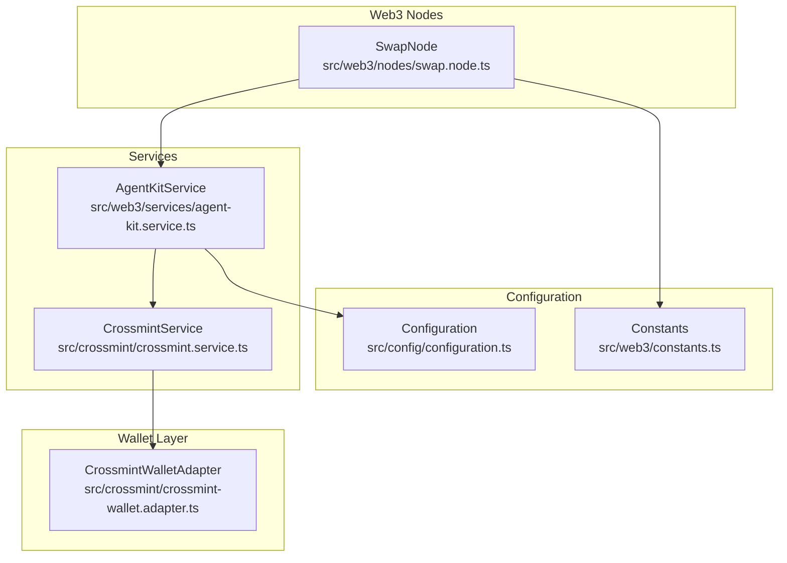
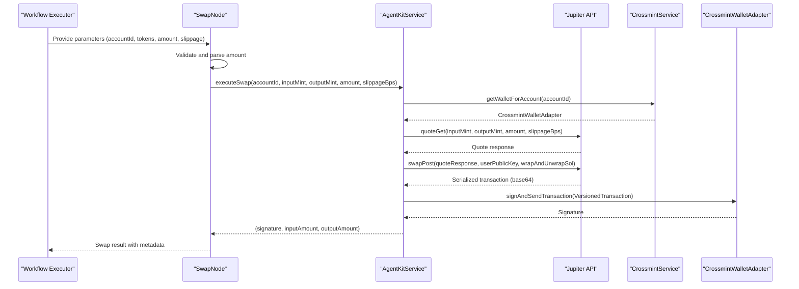
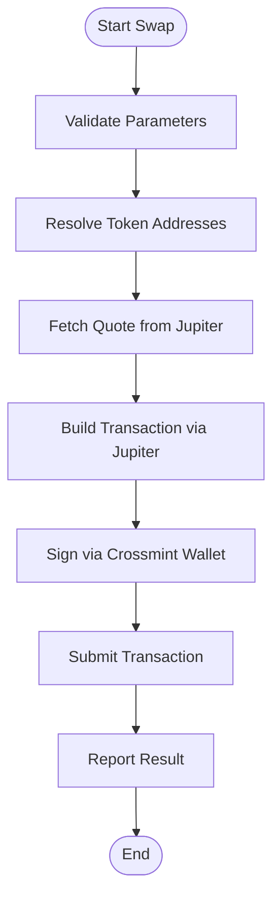
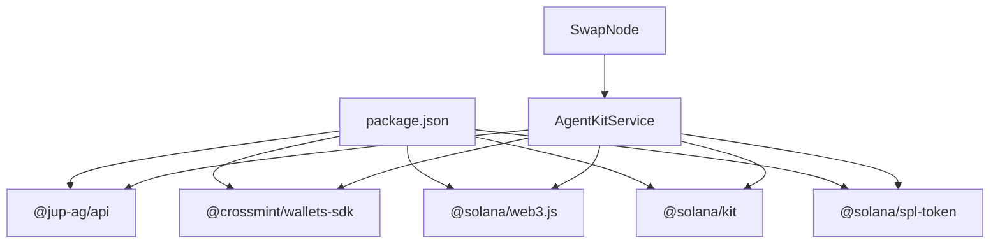

# Swap Node (Jupiter)

<cite>
**Referenced Files in This Document**
- [swap.node.ts](file://src/web3/nodes/swap.node.ts)
- [agent-kit.service.ts](file://src/web3/services/agent-kit.service.ts)
- [crossmint.service.ts](file://src/crossmint/crossmint.service.ts)
- [crossmint-wallet.adapter.ts](file://src/crossmint/crossmint-wallet.adapter.ts)
- [constants.ts](file://src/web3/constants.ts)
- [configuration.ts](file://src/config/configuration.ts)
- [workflow-types.ts](file://src/web3/workflow-types.ts)
- [package.json](file://package.json)
</cite>

## Table of Contents
1. [Introduction](#introduction)
2. [Project Structure](#project-structure)
3. [Core Components](#core-components)
4. [Architecture Overview](#architecture-overview)
5. [Detailed Component Analysis](#detailed-component-analysis)
6. [Dependency Analysis](#dependency-analysis)
7. [Performance Considerations](#performance-considerations)
8. [Troubleshooting Guide](#troubleshooting-guide)
9. [Conclusion](#conclusion)

## Introduction
This document explains the Jupiter swap node implementation used to automate token swaps on Solana via the Jupiter aggregator. It covers token swapping functionality, slippage configuration, transaction construction, integration with the Jupiter Aggregator API, liquidity routing optimization, fee calculation mechanisms, supported token pairs, minimum transaction amounts, error handling, and practical examples for configuring swap parameters and implementing conditional swap logic based on price feeds.

## Project Structure
The Jupiter swap node is part of a workflow-based automation system. The swap node orchestrates the swap process by:
- Validating user-provided parameters
- Resolving token addresses from constants
- Delegating swap execution to the AgentKit service
- Returning structured results for downstream nodes

**Diagram sources**
- [swap.node.ts:49-208](file://src/web3/nodes/swap.node.ts#L49-L208)
- [agent-kit.service.ts:56-163](file://src/web3/services/agent-kit.service.ts#L56-L163)
- [crossmint.service.ts:43-154](file://src/crossmint/crossmint.service.ts#L43-L154)
- [crossmint-wallet.adapter.ts:16-89](file://src/crossmint/crossmint-wallet.adapter.ts#L16-L89)
- [configuration.ts:18-31](file://src/config/configuration.ts#L18-L31)
- [constants.ts:16-27](file://src/web3/constants.ts#L16-L27)

**Section sources**
- [swap.node.ts:49-208](file://src/web3/nodes/swap.node.ts#L49-L208)
- [agent-kit.service.ts:56-163](file://src/web3/services/agent-kit.service.ts#L56-L163)
- [crossmint.service.ts:43-154](file://src/crossmint/crossmint.service.ts#L43-L154)
- [crossmint-wallet.adapter.ts:16-89](file://src/crossmint/crossmint-wallet.adapter.ts#L16-L89)
- [configuration.ts:18-31](file://src/config/configuration.ts#L18-L31)
- [constants.ts:16-27](file://src/web3/constants.ts#L16-L27)

## Core Components
- SwapNode: The workflow node responsible for validating parameters, parsing amounts, resolving token addresses, and invoking the AgentKit service to execute swaps.
- AgentKitService: Orchestrates Jupiter API interactions, obtains quotes, constructs transactions, and delegates signing and submission to Crossmint wallets.
- CrossmintService: Manages Crossmint托管钱包 creation and retrieval for accounts.
- CrossmintWalletAdapter: Wraps Crossmint wallet functionality to sign and send transactions.
- Constants: Defines supported token tickers and mint addresses.
- Configuration: Provides runtime configuration for RPC endpoints and Crossmint credentials.

Key responsibilities:
- Parameter validation and amount parsing
- Slippage tolerance enforcement
- Quote retrieval and transaction construction
- Crossmint wallet integration
- Robust error handling and logging

**Section sources**
- [swap.node.ts:49-208](file://src/web3/nodes/swap.node.ts#L49-L208)
- [agent-kit.service.ts:99-161](file://src/web3/services/agent-kit.service.ts#L99-L161)
- [crossmint.service.ts:122-154](file://src/crossmint/crossmint.service.ts#L122-L154)
- [crossmint-wallet.adapter.ts:16-89](file://src/crossmint/crossmint-wallet.adapter.ts#L16-L89)
- [constants.ts:16-27](file://src/web3/constants.ts#L16-L27)
- [configuration.ts:18-31](file://src/config/configuration.ts#L18-L31)

## Architecture Overview
The swap node integrates with the Jupiter aggregator and Crossmint custodial wallets to enable automated token swaps. The flow includes:
- Input validation and amount parsing
- Token address resolution
- Jupiter quote retrieval with slippage
- Transaction deserialization and signing via Crossmint
- Submission and result reporting

**Diagram sources**
- [swap.node.ts:102-174](file://src/web3/nodes/swap.node.ts#L102-L174)
- [agent-kit.service.ts:99-161](file://src/web3/services/agent-kit.service.ts#L99-L161)
- [crossmint.service.ts:122-154](file://src/crossmint/crossmint.service.ts#L122-L154)
- [crossmint-wallet.adapter.ts:65-76](file://src/crossmint/crossmint-wallet.adapter.ts#L65-L76)

## Detailed Component Analysis

### SwapNode: Parameter Parsing and Execution
Responsibilities:
- Validate required parameters (accountId, tokens, amount)
- Parse amount using "auto", "all", "half", or numeric values
- Resolve token addresses from constants
- Invoke AgentKitService to execute the swap
- Return structured results or error payloads

Important behaviors:
- Amount parsing supports dynamic inputs from previous nodes
- Token address resolution ensures only supported tokens are used
- Slippage is passed directly to the Jupiter quote endpoint
- Results include signature, input/output amounts, and metadata

Practical examples:
- Configure amount as "auto" to reuse output from a previous swap node
- Use "all" or "half" when chaining multiple swaps
- Set slippageBps to control acceptable price deviation (default 50 bps = 0.5%)

**Section sources**
- [swap.node.ts:13-47](file://src/web3/nodes/swap.node.ts#L13-L47)
- [swap.node.ts:102-174](file://src/web3/nodes/swap.node.ts#L102-L174)
- [swap.node.ts:177-203](file://src/web3/nodes/swap.node.ts#L177-L203)

### AgentKitService: Jupiter Integration and Retry Logic
Responsibilities:
- Obtain Crossmint wallet adapter for an account
- Fetch a quote from Jupiter using input/output mints, amount, and slippage
- Build a transaction via Jupiter swapPost
- Deserialize the transaction and sign via Crossmint wallet
- Return swap results with signature and amounts

Key mechanisms:
- External API limiter to avoid rate limits
- Retry with exponential backoff for transient failures
- Wrap-and-unwrap SOL flag enabled for seamless native token handling

Integration details:
- Uses @jup-ag/api client
- Leverages Crossmint wallet for signing and submission
- Returns typed results for downstream consumption

**Section sources**
- [agent-kit.service.ts:99-161](file://src/web3/services/agent-kit.service.ts#L99-L161)
- [agent-kit.service.ts:8-45](file://src/web3/services/agent-kit.service.ts#L8-L45)

### CrossmintService and CrossmintWalletAdapter: Custodial Wallet Integration
Responsibilities:
- Retrieve or create Crossmint wallets per account
- Provide a wallet adapter compatible with signing and sending transactions
- Sign transactions using Crossmint's server-side signing capability

Behavior:
- Wallet retrieval uses Supabase-backed account records
- Transactions are serialized to base64 and sent to Crossmint for signing
- Supports single and batch transaction signing

**Section sources**
- [crossmint.service.ts:122-154](file://src/crossmint/crossmint.service.ts#L122-L154)
- [crossmint-wallet.adapter.ts:35-76](file://src/crossmint/crossmint-wallet.adapter.ts#L35-L76)

### Supported Token Pairs and Minimum Transaction Amounts
Supported tokens:
- USDC, SOL, JITOSOL, mSOL, bSOL, jupSOL, INF, hSOL, stSOL

Minimum transaction amounts:
- The AgentKitService passes the requested amount directly to Jupiter
- Minimums depend on the underlying token decimals and Jupiter routing
- Use token utilities to convert human-readable amounts to atomic units when needed

**Section sources**
- [constants.ts:16-27](file://src/web3/constants.ts#L16-L27)
- [agent-kit.service.ts:119-129](file://src/web3/services/agent-kit.service.ts#L119-L129)

### Slippage Configuration and Fee Calculation
Slippage:
- Provided in basis points (1 bps = 0.01%)
- Default value is 50 bps (0.5%)
- Passed to Jupiter quoteGet to compute acceptable output thresholds

Fee calculation:
- Jupiter quote includes outAmount and fee-related fields
- The AgentKitService captures outAmount for reporting
- Additional network fees (priority fees) are managed by the underlying transaction construction pipeline

**Section sources**
- [swap.node.ts:93-98](file://src/web3/nodes/swap.node.ts#L93-L98)
- [agent-kit.service.ts:120-129](file://src/web3/services/agent-kit.service.ts#L120-L129)

### Transaction Construction and Execution
Process:
- Quote retrieval via Jupiter quoteGet
- Transaction generation via Jupiter swapPost
- Deserialization to VersionedTransaction
- Signing via CrossmintWalletAdapter.signAndSendTransaction
- Submission and signature return

**Diagram sources**
- [agent-kit.service.ts:119-152](file://src/web3/services/agent-kit.service.ts#L119-L152)
- [crossmint-wallet.adapter.ts:65-76](file://src/crossmint/crossmint-wallet.adapter.ts#L65-L76)

**Section sources**
- [agent-kit.service.ts:119-152](file://src/web3/services/agent-kit.service.ts#L119-L152)
- [crossmint-wallet.adapter.ts:65-76](file://src/crossmint/crossmint-wallet.adapter.ts#L65-L76)

### Conditional Swap Logic Based on Price Feeds
Recommended pattern:
- Use a price feed node to monitor market prices
- Compare observed rates against threshold conditions
- Conditionally set the amount parameter to "auto" or a computed value
- Chain the price feed node with the SwapNode to gate execution

Implementation tips:
- Use the price feed node to derive slippageBps dynamically
- Gate swaps when price impact exceeds a configured threshold
- Combine with retry/backoff logic for robustness

[No sources needed since this section provides general guidance]

## Dependency Analysis
External dependencies relevant to the swap node:
- @jup-ag/api: Jupiter aggregator client for quotes and transactions
- @crossmint/wallets-sdk: Crossmint wallet integration
- @solana/web3.js: Transaction serialization/deserialization
- @solana/kit: Transaction building utilities
- @solana/spl-token: Token account and mint utilities

Internal dependencies:
- SwapNode depends on AgentKitService
- AgentKitService depends on CrossmintService and configuration
- CrossmintService depends on Supabase for account storage

**Diagram sources**
- [package.json:23-53](file://package.json#L23-L53)
- [swap.node.ts:1-5](file://src/web3/nodes/swap.node.ts#L1-L5)
- [agent-kit.service.ts:1-6](file://src/web3/services/agent-kit.service.ts#L1-L6)

**Section sources**
- [package.json:23-53](file://package.json#L23-L53)
- [swap.node.ts:1-5](file://src/web3/nodes/swap.node.ts#L1-L5)
- [agent-kit.service.ts:1-6](file://src/web3/services/agent-kit.service.ts#L1-L6)

## Performance Considerations
- Rate limiting: The AgentKitService uses an external API limiter to prevent throttling from Jupiter
- Retry strategy: Exponential backoff with jitter reduces transient failure impact
- Transaction efficiency: Using VersionedTransaction and wrapAndUnwrapSol minimizes extra steps
- Amount precision: Convert human-readable amounts to atomic units using token utilities to avoid rounding errors

[No sources needed since this section provides general guidance]

## Troubleshooting Guide
Common issues and resolutions:
- Unknown token errors: Ensure token tickers match entries in constants
- Missing account or wallet: Verify account record contains a Crossmint wallet locator/address
- Slippage exceeded: Increase slippageBps or wait for more favorable market conditions
- Transaction failures: Inspect returned logs and signatures; re-run with adjusted parameters
- Rate limits: Reduce swap frequency or leverage retry/backoff patterns

Operational checks:
- Confirm environment variables for RPC and Crossmint credentials
- Validate that the account has sufficient balance for gas and token transfers
- Monitor Jupiter API availability and response times

**Section sources**
- [swap.node.ts:132-141](file://src/web3/nodes/swap.node.ts#L132-L141)
- [crossmint.service.ts:129-137](file://src/crossmint/crossmint.service.ts#L129-L137)
- [agent-kit.service.ts:8-45](file://src/web3/services/agent-kit.service.ts#L8-L45)

## Conclusion
The Jupiter swap node provides a robust, configurable mechanism for automated token swaps on Solana. By integrating with Jupiter for liquidity routing and Crossmint for custodial wallet management, it enables reliable, auditable swaps with explicit slippage controls and comprehensive error handling. Proper configuration of parameters, understanding of supported tokens, and adherence to performance and troubleshooting practices ensure smooth operation within workflow automations.