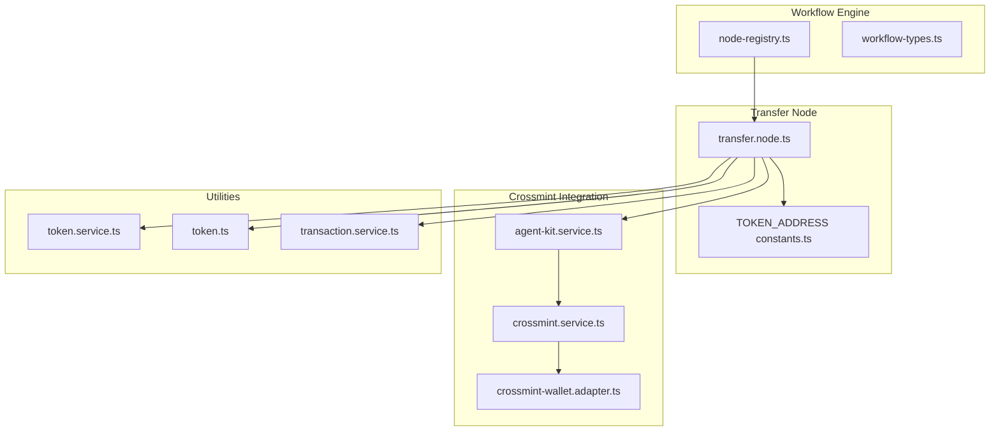
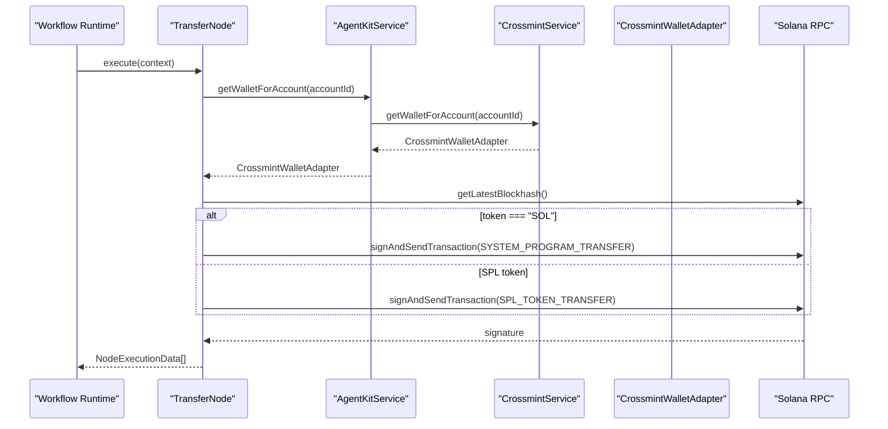
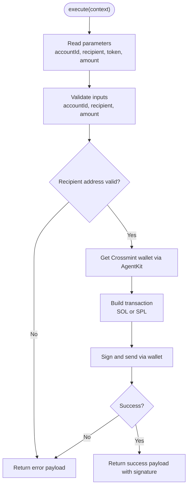
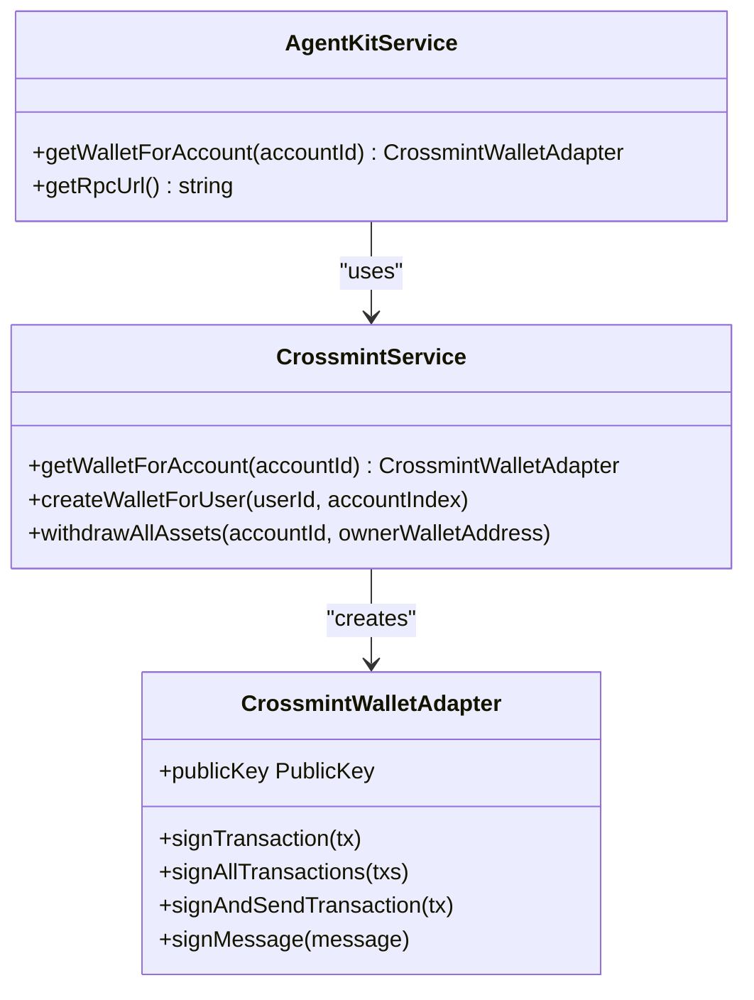
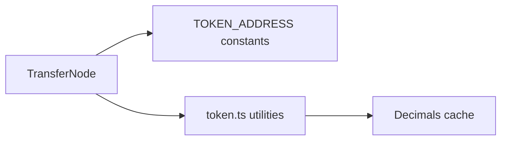
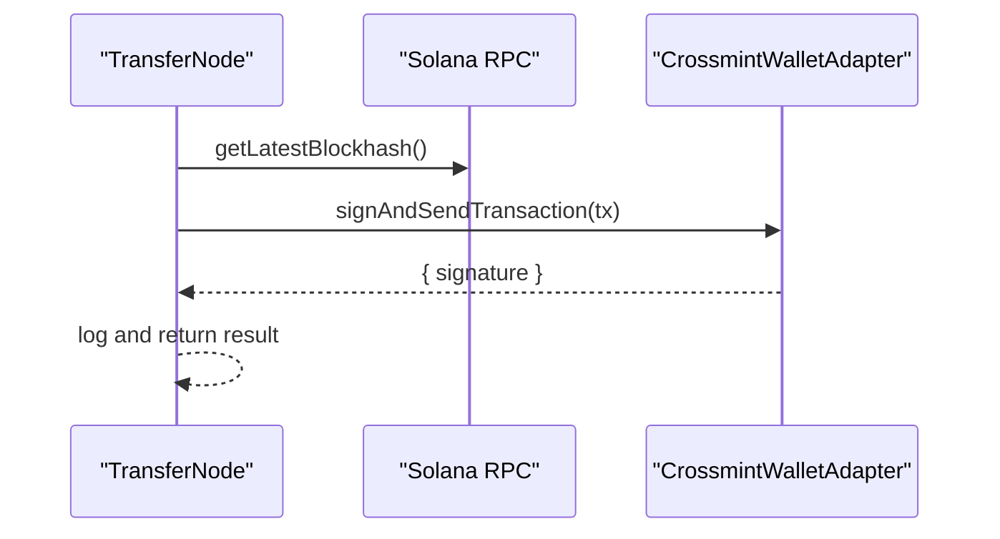
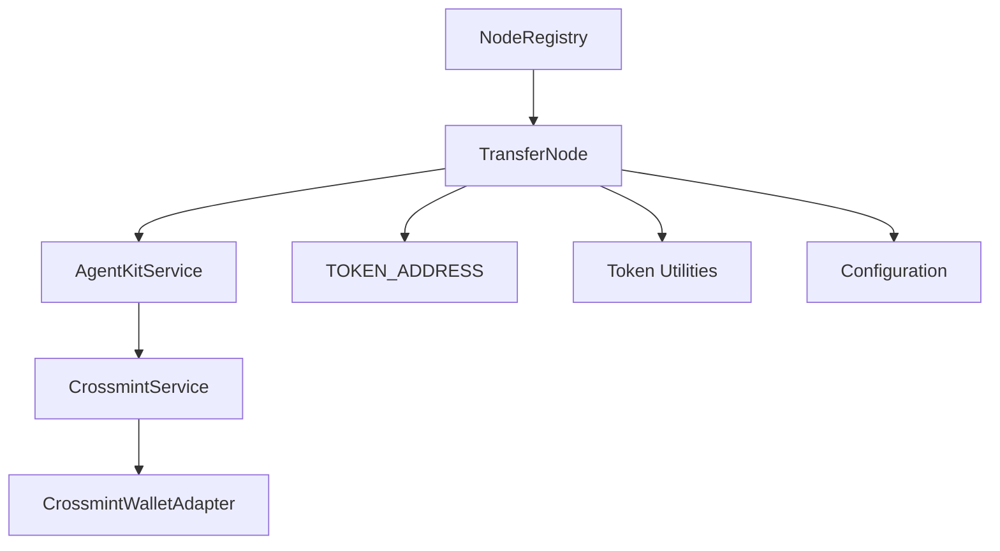

# Transfer Node

<cite>
**Referenced Files in This Document**
- [transfer.node.ts](file://src/web3/nodes/transfer.node.ts)
- [crossmint.service.ts](file://src/crossmint/crossmint.service.ts)
- [agent-kit.service.ts](file://src/web3/services/agent-kit.service.ts)
- [crossmint-wallet.adapter.ts](file://src/crossmint/crossmint-wallet.adapter.ts)
- [constants.ts](file://src/web3/constants.ts)
- [configuration.ts](file://src/config/configuration.ts)
- [node-registry.ts](file://src/web3/nodes/node-registry.ts)
- [workflow-types.ts](file://src/web3/workflow-types.ts)
- [token.service.ts](file://src/web3/services/token.service.ts)
- [transaction.service.ts](file://src/web3/services/transaction.service.ts)
- [token.ts](file://src/web3/utils/token.ts)
- [initial-1.sql](file://src/database/schema/initial-1.sql)
</cite>

## Table of Contents
1. [Introduction](#introduction)
2. [Project Structure](#project-structure)
3. [Core Components](#core-components)
4. [Architecture Overview](#architecture-overview)
5. [Detailed Component Analysis](#detailed-component-analysis)
6. [Dependency Analysis](#dependency-analysis)
7. [Performance Considerations](#performance-considerations)
8. [Troubleshooting Guide](#troubleshooting-guide)
9. [Conclusion](#conclusion)
10. [Appendices](#appendices)

## Introduction
This document explains the token transfer node implementation, focusing on SOL and SPL token transfers via Crossmint AgentKit. It covers transfer operations, address validation, transaction execution, integration with Crossmint for wallet management, supported token standards, and practical guidance for configuration, batch workflows, failure handling, security, cost optimization, and troubleshooting.

## Project Structure
The transfer node is part of a modular workflow engine. It integrates with Crossmint for custodial wallet management and uses shared token constants and utilities.

**Diagram sources**
- [node-registry.ts:1-47](file://src/web3/nodes/node-registry.ts#L1-L47)
- [workflow-types.ts:1-91](file://src/web3/workflow-types.ts#L1-L91)
- [transfer.node.ts:1-199](file://src/web3/nodes/transfer.node.ts#L1-L199)
- [constants.ts:16-27](file://src/web3/constants.ts#L16-L27)
- [crossmint.service.ts:1-403](file://src/crossmint/crossmint.service.ts#L1-L403)
- [crossmint-wallet.adapter.ts:1-89](file://src/crossmint/crossmint-wallet.adapter.ts#L1-L89)
- [agent-kit.service.ts:1-163](file://src/web3/services/agent-kit.service.ts#L1-L163)
- [token.service.ts:1-45](file://src/web3/services/token.service.ts#L1-L45)
- [token.ts:1-45](file://src/web3/utils/token.ts#L1-L45)
- [transaction.service.ts:1-158](file://src/web3/services/transaction.service.ts#L1-L158)

**Section sources**
- [node-registry.ts:23-47](file://src/web3/nodes/node-registry.ts#L23-L47)
- [workflow-types.ts:12-56](file://src/web3/workflow-types.ts#L12-L56)

## Core Components
- Transfer Node: Implements SOL and SPL token transfers using Crossmint custodial wallets, validates inputs, constructs transactions, signs and sends via AgentKit, and returns structured results.
- Crossmint Service: Manages Crossmint wallet creation, retrieval, and asset withdrawal for an account.
- AgentKit Service: Provides unified access to Crossmint wallets and RPC configuration for workflow nodes.
- Crossmint Wallet Adapter: Wraps Crossmint Solana wallet to conform to the AgentKit interface.
- Token Constants: Defines supported token tickers and mint addresses.
- Token Utilities: Provide decimal resolution, conversion, and formatting helpers.

**Section sources**
- [transfer.node.ts:15-58](file://src/web3/nodes/transfer.node.ts#L15-L58)
- [crossmint.service.ts:42-154](file://src/crossmint/crossmint.service.ts#L42-L154)
- [agent-kit.service.ts:56-84](file://src/web3/services/agent-kit.service.ts#L56-L84)
- [crossmint-wallet.adapter.ts:16-30](file://src/crossmint/crossmint-wallet.adapter.ts#L16-L30)
- [constants.ts:16-27](file://src/web3/constants.ts#L16-L27)
- [token.service.ts:7-44](file://src/web3/services/token.service.ts#L7-L44)

## Architecture Overview
The transfer node participates in a workflow graph. It retrieves a Crossmint wallet via AgentKit, builds either a SystemProgram transfer (SOL) or SPL token transfer instruction, signs and submits the transaction, and records results per item.

**Diagram sources**
- [transfer.node.ts:60-166](file://src/web3/nodes/transfer.node.ts#L60-L166)
- [agent-kit.service.ts:74-77](file://src/web3/services/agent-kit.service.ts#L74-L77)
- [crossmint.service.ts:122-154](file://src/crossmint/crossmint.service.ts#L122-L154)
- [crossmint-wallet.adapter.ts:65-76](file://src/crossmint/crossmint-wallet.adapter.ts#L65-L76)

## Detailed Component Analysis

### Transfer Node Implementation
- Inputs validated: account ID, recipient address, token ticker, amount.
- Address validation: recipient address is parsed as a PublicKey; invalid addresses cause immediate errors.
- Transaction construction:
  - SOL: Uses SystemProgram.transfer with recent blockhash and fee payer set to the wallet public key.
  - SPL: Resolves mint decimals, computes token amount in base units, derives associated token accounts (source and destination), and creates a transfer instruction.
- Execution: Uses wallet.signAndSendTransaction to submit; captures signature and returns structured success/error payload per item.

**Diagram sources**
- [transfer.node.ts:60-197](file://src/web3/nodes/transfer.node.ts#L60-L197)

**Section sources**
- [transfer.node.ts:60-197](file://src/web3/nodes/transfer.node.ts#L60-L197)

### Crossmint Integration
- Wallet retrieval: CrossmintService queries Supabase for account wallet locator/address and resolves a Crossmint Solana wallet using the configured signer secret.
- Wallet adapter: CrossmintWalletAdapter exposes signTransaction, signAllTransactions, and signAndSendTransaction compatible with the AgentKit interface.
- AgentKit: Provides getWalletForAccount and RPC URL access to workflow nodes.

**Diagram sources**
- [crossmint.service.ts:122-154](file://src/crossmint/crossmint.service.ts#L122-L154)
- [crossmint-wallet.adapter.ts:16-88](file://src/crossmint/crossmint-wallet.adapter.ts#L16-L88)
- [agent-kit.service.ts:74-84](file://src/web3/services/agent-kit.service.ts#L74-L84)

**Section sources**
- [crossmint.service.ts:122-154](file://src/crossmint/crossmint.service.ts#L122-L154)
- [crossmint-wallet.adapter.ts:16-88](file://src/crossmint/crossmint-wallet.adapter.ts#L16-L88)
- [agent-kit.service.ts:74-84](file://src/web3/services/agent-kit.service.ts#L74-L84)

### Supported Token Standards and Configuration
- Token tickers and mint addresses are defined centrally for quick lookup.
- SPL token transfers require mint decimals resolution; utilities cache decimals to reduce RPC calls.

**Diagram sources**
- [transfer.node.ts:125-139](file://src/web3/nodes/transfer.node.ts#L125-L139)
- [constants.ts:16-27](file://src/web3/constants.ts#L16-L27)
- [token.ts:7-15](file://src/web3/utils/token.ts#L7-L15)

**Section sources**
- [constants.ts:16-27](file://src/web3/constants.ts#L16-L27)
- [token.ts:7-15](file://src/web3/utils/token.ts#L7-L15)

### Transaction Execution and Monitoring
- Recent blockhash is fetched per transaction to ensure validity windows.
- Transactions are signed and sent via the Crossmint wallet adapter; signatures are returned to the caller.
- For advanced scenarios, transaction simulation and confirmation utilities are available for building robust pipelines.

**Diagram sources**
- [transfer.node.ts:117-122](file://src/web3/nodes/transfer.node.ts#L117-L122)
- [crossmint-wallet.adapter.ts:65-76](file://src/crossmint/crossmint-wallet.adapter.ts#L65-L76)

**Section sources**
- [transfer.node.ts:117-122](file://src/web3/nodes/transfer.node.ts#L117-L122)
- [transaction.service.ts:41-101](file://src/web3/services/transaction.service.ts#L41-L101)

## Dependency Analysis
- The TransferNode depends on:
  - AgentKitService for wallet access
  - CrossmintService for account-to-wallet resolution
  - CrossmintWalletAdapter for signing and sending
  - Token constants and utilities for SPL token handling
  - Configuration for RPC endpoints
- The node registry registers the transfer node under the "transfer" name for workflow composition.

**Diagram sources**
- [transfer.node.ts:64-101](file://src/web3/nodes/transfer.node.ts#L64-L101)
- [agent-kit.service.ts:60-84](file://src/web3/services/agent-kit.service.ts#L60-L84)
- [crossmint.service.ts:122-154](file://src/crossmint/crossmint.service.ts#L122-L154)
- [crossmint-wallet.adapter.ts:16-30](file://src/crossmint/crossmint-wallet.adapter.ts#L16-L30)
- [constants.ts:16-27](file://src/web3/constants.ts#L16-L27)
- [configuration.ts:18-21](file://src/config/configuration.ts#L18-L21)
- [node-registry.ts:39](file://src/web3/nodes/node-registry.ts#L39)

**Section sources**
- [node-registry.ts:39](file://src/web3/nodes/node-registry.ts#L39)
- [configuration.ts:18-21](file://src/config/configuration.ts#L18-L21)

## Performance Considerations
- Batch processing: The node iterates items and returns per-item results; batching can be handled at the workflow level to minimize overhead.
- Decimals caching: Token utilities cache mint decimals to reduce repeated RPC calls.
- RPC usage: Fetching blockhash per transaction ensures validity; consider reusing blockhash within short-lived batches when safe.
- Cost optimization:
  - Prefer SPL transfers with minimal required decimals to avoid dust and extra instructions.
  - Ensure sufficient SOL balance in the Crossmint wallet to cover fees; the system logs and handles low-balance conditions during operations.
  - Use appropriate slippage for swaps (when applicable) to reduce front-running risk and improve effective rates.

[No sources needed since this section provides general guidance]

## Troubleshooting Guide
Common issues and resolutions:
- Invalid recipient address: The node validates the recipient as a PublicKey; ensure it is a valid Solana address.
- Missing or invalid parameters: The node requires account ID, recipient, token, and a positive numeric amount.
- Wallet not configured: CrossmintService throws if an account lacks a wallet locator/address.
- Transaction submission failures: Inspect returned error payloads and logs; use transaction simulation utilities to debug instruction-level issues.
- Asset withdrawal and closure: CrossmintService supports withdrawing all assets and closing empty token accounts; ensure sufficient SOL for fees.

**Section sources**
- [transfer.node.ts:77-92](file://src/web3/nodes/transfer.node.ts#L77-L92)
- [crossmint.service.ts:129-137](file://src/crossmint/crossmint.service.ts#L129-L137)
- [transaction.service.ts:70-98](file://src/web3/services/transaction.service.ts#L70-L98)

## Conclusion
The transfer node provides a robust, configurable mechanism for SOL and SPL token transfers using Crossmint AgentKit. It enforces input validation, constructs appropriate transactions, and returns structured results for each item. Integrating with token constants and utilities ensures correctness and efficiency. For production deployments, combine the node within workflows, monitor transaction outcomes, and leverage the provided utilities for advanced scenarios.

[No sources needed since this section summarizes without analyzing specific files]

## Appendices

### Practical Configuration Examples
- Configure environment variables for RPC and Crossmint credentials.
- Define supported tokens in the token constants and reference them by ticker in the transfer node parameters.
- Use the node registry to compose workflows that include the transfer node alongside other nodes (e.g., swap, balance).

**Section sources**
- [configuration.ts:18-31](file://src/config/configuration.ts#L18-L31)
- [constants.ts:16-27](file://src/web3/constants.ts#L16-L27)
- [node-registry.ts:39](file://src/web3/nodes/node-registry.ts#L39)

### Batch Transfer Workflows
- Feed multiple transfer items into the node; the node processes each item independently and returns per-item results.
- Chain with other nodes (e.g., swap) to dynamically set transfer amounts from prior outputs.

**Section sources**
- [transfer.node.ts:70-197](file://src/web3/nodes/transfer.node.ts#L70-L197)

### Security Considerations
- Address validation: Recipient addresses are validated as PublicKeys; ensure inputs are sanitized before reaching the node.
- Crossmint signer secret: Keep secrets secure and rotate as needed; the service uses them for wallet operations.
- Transaction monitoring: Log signatures and maintain records; integrate with database tables for execution tracking.

**Section sources**
- [transfer.node.ts:87-92](file://src/web3/nodes/transfer.node.ts#L87-L92)
- [crossmint.service.ts:56-75](file://src/crossmint/crossmint.service.ts#L56-L75)
- [initial-1.sql:36-57](file://src/database/schema/initial-1.sql#L36-L57)