# Web3 Protocol Integration

<cite>
**Referenced Files in This Document**
- [node-registry.ts](file://src/web3/nodes/node-registry.ts)
- [workflow-types.ts](file://src/web3/workflow-types.ts)
- [connection.service.ts](file://src/web3/services/connection.service.ts)
- [transaction.service.ts](file://src/web3/services/transaction.service.ts)
- [token.service.ts](file://src/web3/services/token.service.ts)
- [env.service.ts](file://src/web3/services/env.service.ts)
- [agent-kit.service.ts](file://src/web3/services/agent-kit.service.ts)
- [swap.node.ts](file://src/web3/nodes/swap.node.ts)
- [kamino.node.ts](file://src/web3/nodes/kamino.node.ts)
- [drift.node.ts](file://src/web3/nodes/drift.node.ts)
- [lulo.node.ts](file://src/web3/nodes/lulo.node.ts)
- [sanctum.node.ts](file://src/web3/nodes/sanctum.node.ts)
- [limit-order.node.ts](file://src/web3/nodes/limit-order.node.ts)
- [price-feed.node.ts](file://src/web3/nodes/price-feed.node.ts)
- [transfer.node.ts](file://src/web3/nodes/transfer.node.ts)
- [balance.node.ts](file://src/web3/nodes/balance.node.ts)
- [stake.node.ts](file://src/web3/nodes/stake.node.ts)
- [helius-webhook.node.ts](file://src/web3/nodes/helius-webhook.node.ts)
</cite>

## Table of Contents
1. [Introduction](#introduction)
2. [Project Structure](#project-structure)
3. [Core Components](#core-components)
4. [Architecture Overview](#architecture-overview)
5. [Detailed Component Analysis](#detailed-component-analysis)
6. [Dependency Analysis](#dependency-analysis)
7. [Performance Considerations](#performance-considerations)
8. [Troubleshooting Guide](#troubleshooting-guide)
9. [Conclusion](#conclusion)
10. [Appendices](#appendices)

## Introduction
This document explains the Web3 protocol integration built around a configurable workflow engine that orchestrates blockchain interactions on Solana. It covers the node architecture and implementation patterns, the centralized node registry, and the service layer for blockchain operations including connection management, token operations, and transaction execution. It documents integrations with major DeFi protocols (Jupiter for swaps and limit orders, Kamino for lending vaults, Drift for perpetual trading, Sanctum for liquid staking, and Lulo for lending), price feed monitoring via Pyth Network, transfers, balance queries, and Helius webhook integration for on-chain event triggers. Practical examples illustrate node configuration, transaction construction, fee estimation, and error handling, along with guidance on performance optimization, RPC provider selection, security considerations, extending the system with new protocol integrations, and troubleshooting connectivity issues.

## Project Structure
The Web3 integration is organized into:
- Workflow types and node interfaces that define the execution model
- A centralized node registry that auto-registers all workflow nodes
- Services for blockchain connectivity, transactions, token conversions, and agent kit orchestration
- Individual workflow nodes implementing protocol-specific logic
- Utilities for price monitoring and environment validation

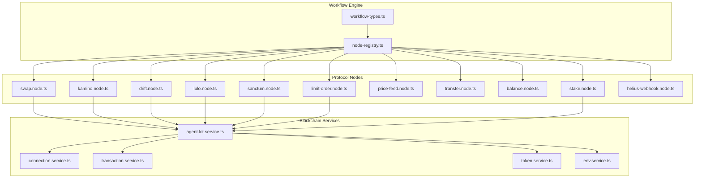

**Diagram sources**
- [node-registry.ts:1-47](file://src/web3/nodes/node-registry.ts#L1-L47)
- [workflow-types.ts:1-91](file://src/web3/workflow-types.ts#L1-L91)
- [connection.service.ts:1-73](file://src/web3/services/connection.service.ts#L1-L73)
- [transaction.service.ts:1-158](file://src/web3/services/transaction.service.ts#L1-L158)
- [token.service.ts:1-45](file://src/web3/services/token.service.ts#L1-L45)
- [agent-kit.service.ts:1-163](file://src/web3/services/agent-kit.service.ts#L1-L163)
- [swap.node.ts:1-209](file://src/web3/nodes/swap.node.ts#L1-L209)
- [kamino.node.ts:1-270](file://src/web3/nodes/kamino.node.ts#L1-L270)
- [drift.node.ts:1-391](file://src/web3/nodes/drift.node.ts#L1-L391)
- [lulo.node.ts:1-360](file://src/web3/nodes/lulo.node.ts#L1-L360)
- [sanctum.node.ts:1-435](file://src/web3/nodes/sanctum.node.ts#L1-L435)
- [limit-order.node.ts:1-303](file://src/web3/nodes/limit-order.node.ts#L1-L303)
- [price-feed.node.ts:1-133](file://src/web3/nodes/price-feed.node.ts#L1-L133)
- [transfer.node.ts:1-199](file://src/web3/nodes/transfer.node.ts#L1-L199)
- [balance.node.ts:1-196](file://src/web3/nodes/balance.node.ts#L1-L196)
- [stake.node.ts:1-297](file://src/web3/nodes/stake.node.ts#L1-L297)
- [helius-webhook.node.ts:1-459](file://src/web3/nodes/helius-webhook.node.ts#L1-L459)

**Section sources**
- [node-registry.ts:1-47](file://src/web3/nodes/node-registry.ts#L1-L47)
- [workflow-types.ts:1-91](file://src/web3/workflow-types.ts#L1-L91)

## Core Components
- Node Execution Model: Defines node interfaces, properties, and execution context for workflow nodes.
- Centralized Node Registry: Registers all node types and exposes them for workflow composition.
- Blockchain Services:
  - ConnectionService: Manages RPC and WebSocket connections with default commitment and fallback logic.
  - TransactionService: Builds, signs, simulates, and confirms transactions with address lookup tables and robust error reporting.
  - TokenService: Provides token decimals caching and conversion utilities for human-readable amounts.
  - AgentKitService: Orchestrates protocol interactions (Jupiter swaps, Drift/Lulo/Sanctum operations) via Crossmint wallet adapters.
  - EnvService: Enforces required environment variables.

**Section sources**
- [workflow-types.ts:1-91](file://src/web3/workflow-types.ts#L1-L91)
- [node-registry.ts:1-47](file://src/web3/nodes/node-registry.ts#L1-L47)
- [connection.service.ts:1-73](file://src/web3/services/connection.service.ts#L1-L73)
- [transaction.service.ts:1-158](file://src/web3/services/transaction.service.ts#L1-L158)
- [token.service.ts:1-45](file://src/web3/services/token.service.ts#L1-L45)
- [agent-kit.service.ts:1-163](file://src/web3/services/agent-kit.service.ts#L1-L163)
- [env.service.ts:1-7](file://src/web3/services/env.service.ts#L1-L7)

## Architecture Overview
The system follows a modular, extensible pattern:
- Workflow nodes implement a common interface and describe their parameters and behavior.
- The registry centralizes discovery and instantiation of nodes.
- Services encapsulate blockchain primitives and protocol integrations.
- AgentKitService acts as a façade for Crossmint-managed wallets and protocol APIs.

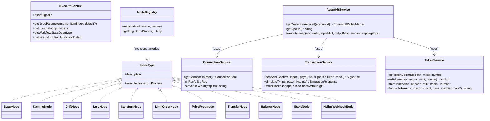

**Diagram sources**
- [workflow-types.ts:12-56](file://src/web3/workflow-types.ts#L12-L56)
- [node-registry.ts:12-21](file://src/web3/nodes/node-registry.ts#L12-L21)
- [connection.service.ts:22-53](file://src/web3/services/connection.service.ts#L22-L53)
- [transaction.service.ts:41-101](file://src/web3/services/transaction.service.ts#L41-L101)
- [token.service.ts:7-44](file://src/web3/services/token.service.ts#L7-L44)
- [agent-kit.service.ts:55-84](file://src/web3/services/agent-kit.service.ts#L55-L84)
- [swap.node.ts:49](file://src/web3/nodes/swap.node.ts#L49)
- [kamino.node.ts:69](file://src/web3/nodes/kamino.node.ts#L69)
- [drift.node.ts:107](file://src/web3/nodes/drift.node.ts#L107)
- [lulo.node.ts:90](file://src/web3/nodes/lulo.node.ts#L90)
- [sanctum.node.ts:110](file://src/web3/nodes/sanctum.node.ts#L110)
- [limit-order.node.ts:80](file://src/web3/nodes/limit-order.node.ts#L80)
- [price-feed.node.ts:5](file://src/web3/nodes/price-feed.node.ts#L5)
- [transfer.node.ts:15](file://src/web3/nodes/transfer.node.ts#L15)
- [balance.node.ts:15](file://src/web3/nodes/balance.node.ts#L15)
- [stake.node.ts:16](file://src/web3/nodes/stake.node.ts#L16)
- [helius-webhook.node.ts:116](file://src/web3/nodes/helius-webhook.node.ts#L116)

## Detailed Component Analysis

### Node Registry and Workflow Types
- Centralized registration ensures all nodes are discoverable and typed consistently.
- Workflow types define node metadata, parameters, and execution semantics.

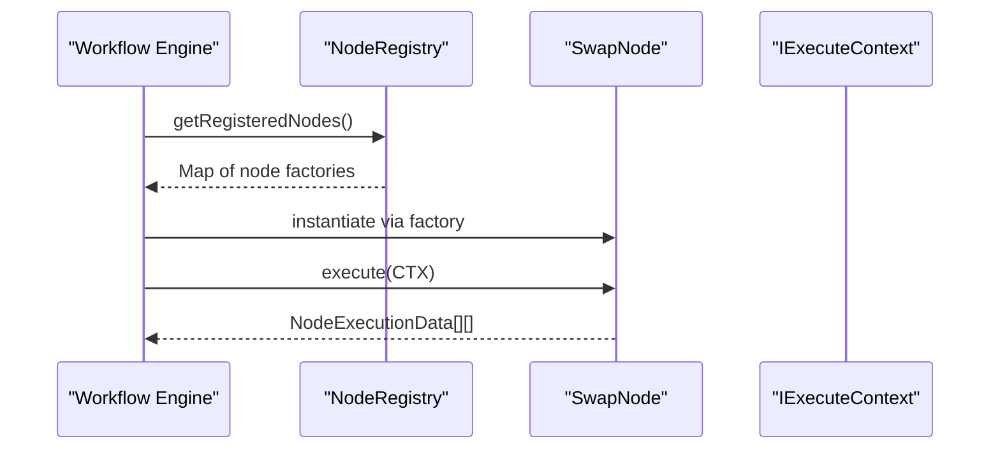

**Diagram sources**
- [node-registry.ts:19-47](file://src/web3/nodes/node-registry.ts#L19-L47)
- [workflow-types.ts:12-56](file://src/web3/workflow-types.ts#L12-L56)

**Section sources**
- [node-registry.ts:1-47](file://src/web3/nodes/node-registry.ts#L1-L47)
- [workflow-types.ts:1-91](file://src/web3/workflow-types.ts#L1-L91)

### Connection Management
- Initializes RPC and WebSocket clients with default commitment and automatic WS fallback.
- Exposes a shared pool for transaction builders and executors.

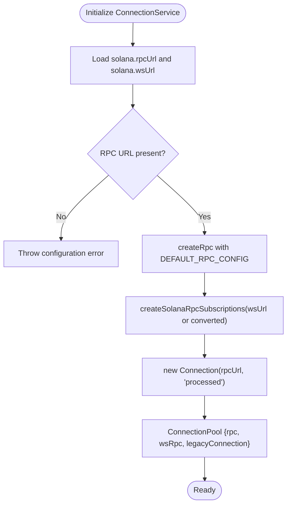

**Diagram sources**
- [connection.service.ts:30-71](file://src/web3/services/connection.service.ts#L30-L71)

**Section sources**
- [connection.service.ts:1-73](file://src/web3/services/connection.service.ts#L1-L73)

### Transaction Construction and Execution
- Builds transactions with instructions, sets fee payer, lifetime, and optional address lookup tables.
- Signs with provided signers and sends with confirmations, with detailed error retrieval and logging.

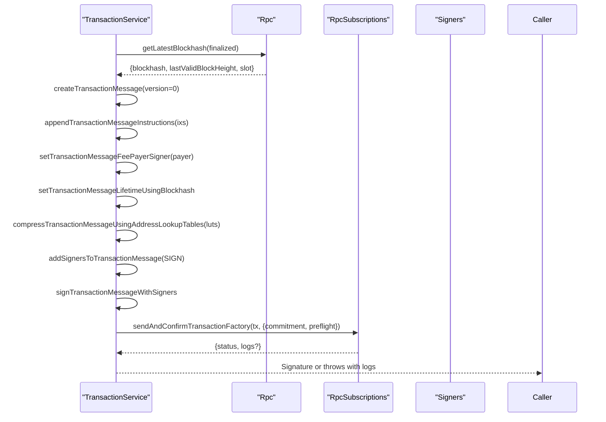

**Diagram sources**
- [transaction.service.ts:41-101](file://src/web3/services/transaction.service.ts#L41-L101)

**Section sources**
- [transaction.service.ts:1-158](file://src/web3/services/transaction.service.ts#L1-L158)

### Token Operations
- Caches token decimals to minimize RPC calls.
- Converts between human-readable amounts and native units.

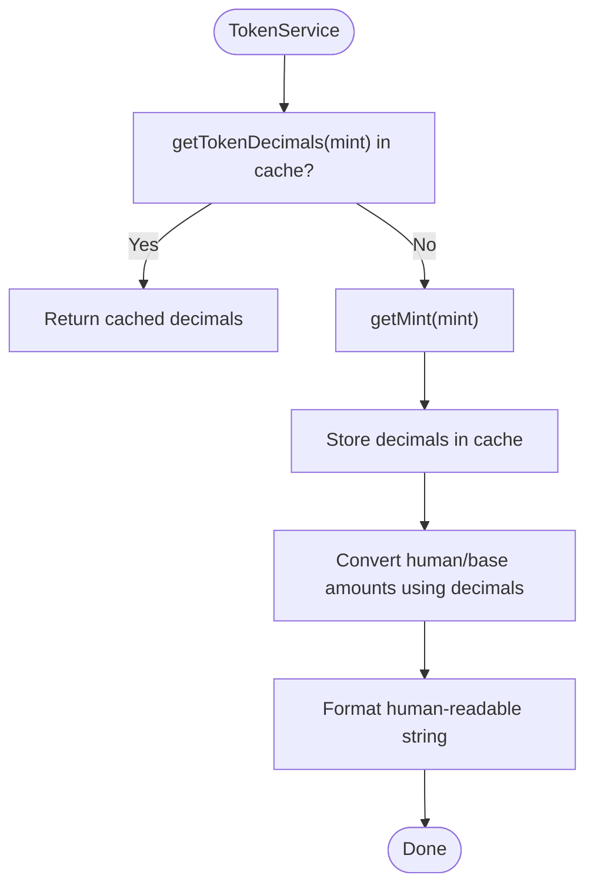

**Diagram sources**
- [token.service.ts:7-44](file://src/web3/services/token.service.ts#L7-L44)

**Section sources**
- [token.service.ts:1-45](file://src/web3/services/token.service.ts#L1-L45)

### AgentKit Orchestration
- Provides unified access to Crossmint-managed wallets and protocol APIs.
- Implements Jupiter swap execution with quoting, transaction retrieval, deserialization, and signing.

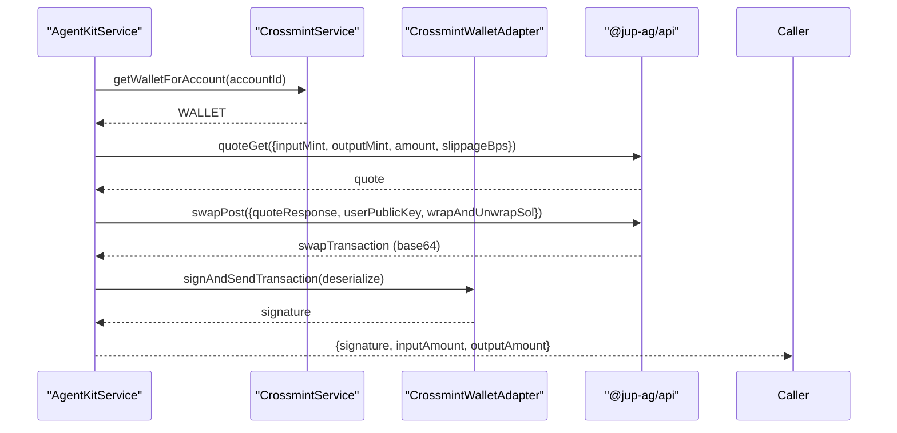

**Diagram sources**
- [agent-kit.service.ts:74-161](file://src/web3/services/agent-kit.service.ts#L74-L161)

**Section sources**
- [agent-kit.service.ts:1-163](file://src/web3/services/agent-kit.service.ts#L1-L163)

### DeFi Integrations

#### Jupiter Swaps and Limit Orders
- SwapNode integrates with AgentKitService to execute swaps with configurable slippage and amount parsing from previous nodes.
- LimitOrderNode creates off-chain limit orders via Jupiter Trigger API, then signs and submits the resulting transaction.

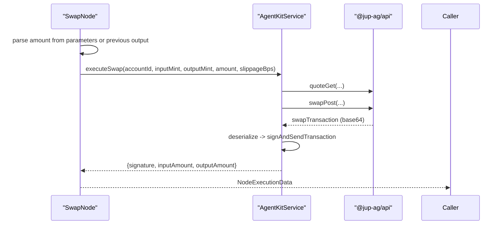

**Diagram sources**
- [swap.node.ts:102-207](file://src/web3/nodes/swap.node.ts#L102-L207)
- [agent-kit.service.ts:99-161](file://src/web3/services/agent-kit.service.ts#L99-L161)

**Section sources**
- [swap.node.ts:1-209](file://src/web3/nodes/swap.node.ts#L1-L209)
- [limit-order.node.ts:137-301](file://src/web3/nodes/limit-order.node.ts#L137-L301)

#### Kamino Lending Vaults
- Parses vault names to addresses, supports deposit/withdraw operations, and handles share-based withdrawals.

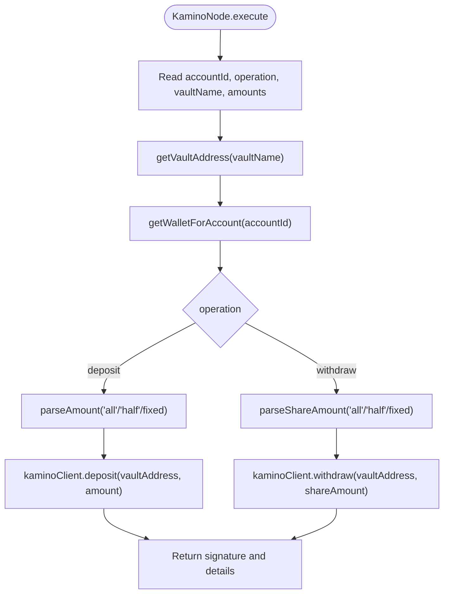

**Diagram sources**
- [kamino.node.ts:132-268](file://src/web3/nodes/kamino.node.ts#L132-L268)

**Section sources**
- [kamino.node.ts:1-270](file://src/web3/nodes/kamino.node.ts#L1-L270)

#### Drift Perpetual Trading
- Supports opening/closing positions and retrieving funding rates via external API with retry and concurrency limits.

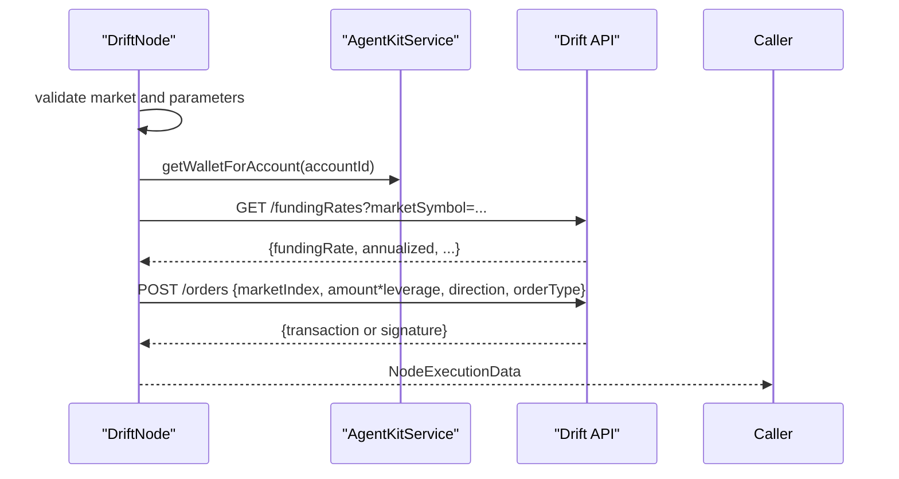

**Diagram sources**
- [drift.node.ts:181-291](file://src/web3/nodes/drift.node.ts#L181-L291)

**Section sources**
- [drift.node.ts:1-391](file://src/web3/nodes/drift.node.ts#L1-L391)

#### Sanctum Liquid Staking
- Handles LST swaps, quotes, and APY retrieval with priority fee configuration.

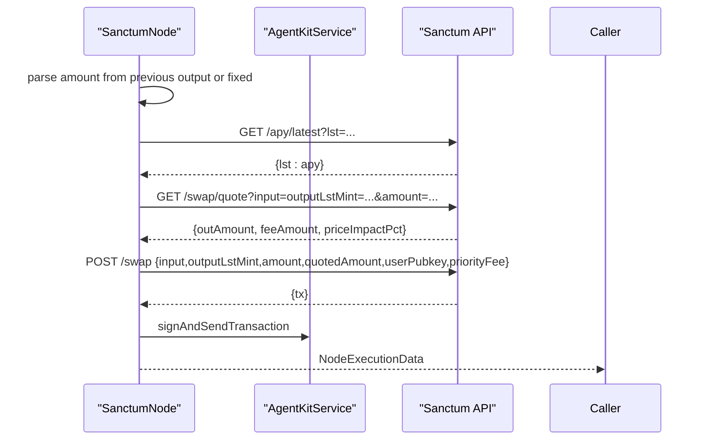

**Diagram sources**
- [sanctum.node.ts:173-310](file://src/web3/nodes/sanctum.node.ts#L173-L310)

**Section sources**
- [sanctum.node.ts:1-435](file://src/web3/nodes/sanctum.node.ts#L1-L435)

#### Lulo Lending
- Retrieves account info, supports deposit/withdraw, and constructs transactions via Lulo API.

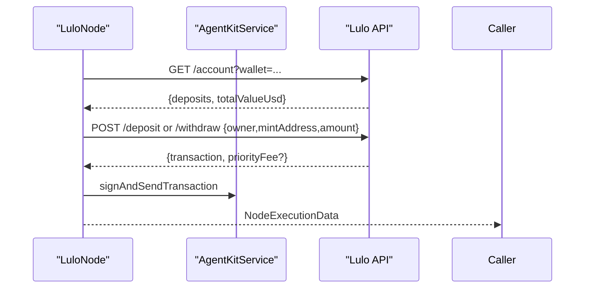

**Diagram sources**
- [lulo.node.ts:139-242](file://src/web3/nodes/lulo.node.ts#L139-L242)

**Section sources**
- [lulo.node.ts:1-360](file://src/web3/nodes/lulo.node.ts#L1-L360)

#### Price Feed Monitoring (Pyth)
- Monitors price feeds and triggers downstream nodes when thresholds are met.

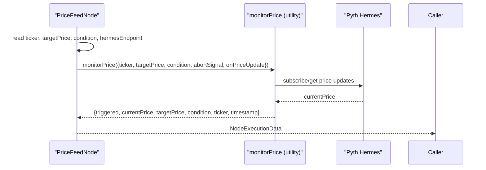

**Diagram sources**
- [price-feed.node.ts:66-131](file://src/web3/nodes/price-feed.node.ts#L66-L131)

**Section sources**
- [price-feed.node.ts:1-133](file://src/web3/nodes/price-feed.node.ts#L1-L133)

#### Transfers and Balance Queries
- TransferNode supports SOL and SPL token transfers with address validation and associated token account handling.
- BalanceNode checks balances and optional thresholds for conditional workflow execution.

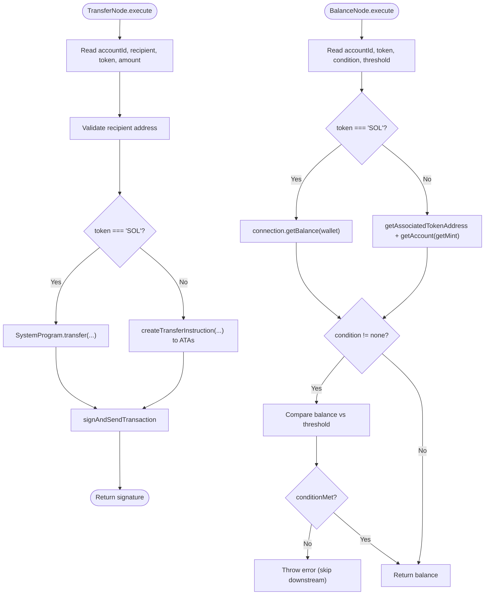

**Diagram sources**
- [transfer.node.ts:60-198](file://src/web3/nodes/transfer.node.ts#L60-L198)
- [balance.node.ts:68-194](file://src/web3/nodes/balance.node.ts#L68-L194)

**Section sources**
- [transfer.node.ts:1-199](file://src/web3/nodes/transfer.node.ts#L1-L199)
- [balance.node.ts:1-196](file://src/web3/nodes/balance.node.ts#L1-L196)

#### Stake Operations (Liquid Staking)
- StakeNode integrates with Jupiter Staking to convert SOL to jupSOL and back, with quote retrieval and transaction signing.

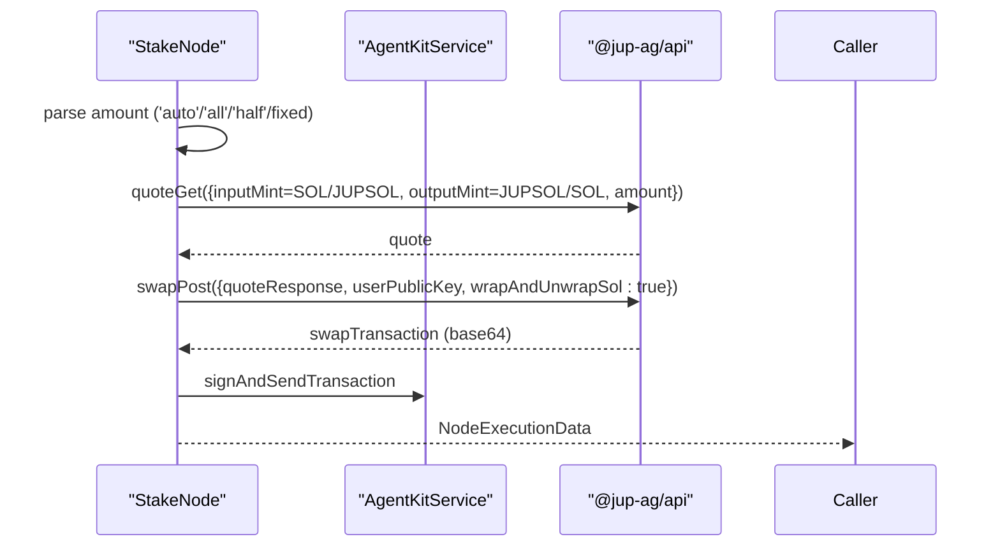

**Diagram sources**
- [stake.node.ts:64-197](file://src/web3/nodes/stake.node.ts#L64-L197)

**Section sources**
- [stake.node.ts:1-297](file://src/web3/nodes/stake.node.ts#L1-L297)

#### Helius Webhook Management
- Creates, retrieves, deletes, and lists Helius webhooks for on-chain event monitoring.

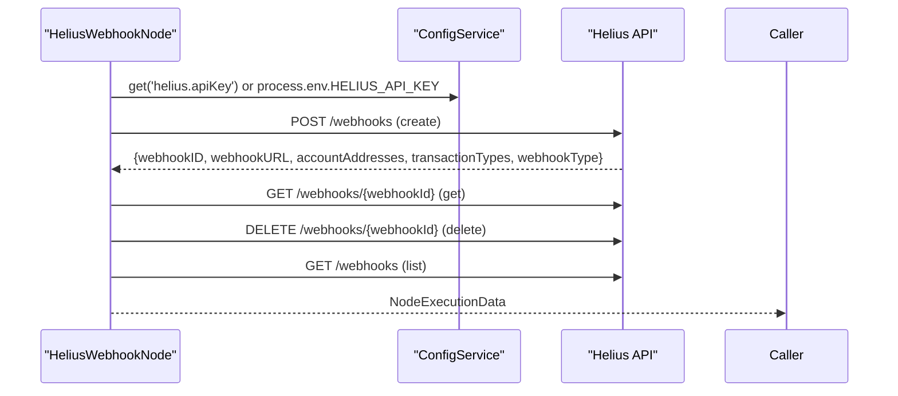

**Diagram sources**
- [helius-webhook.node.ts:187-337](file://src/web3/nodes/helius-webhook.node.ts#L187-L337)

**Section sources**
- [helius-webhook.node.ts:1-459](file://src/web3/nodes/helius-webhook.node.ts#L1-L459)

## Dependency Analysis
- Coupling: Nodes depend on AgentKitService for wallet and protocol access; AgentKitService depends on ConnectionService, TransactionService, TokenService, and environment configuration.
- Cohesion: Each node encapsulates a single protocol concern; services encapsulate blockchain primitives.
- External Dependencies: @solana/kit, @solana/web3.js, @solana/spl-token, @jup-ag/api, and third-party APIs for DeFi protocols.

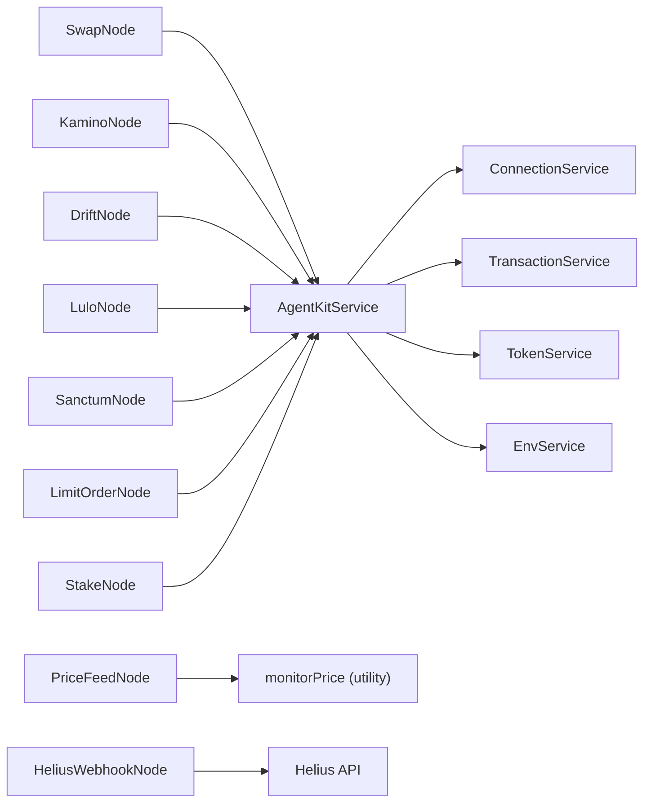

**Diagram sources**
- [swap.node.ts:102](file://src/web3/nodes/swap.node.ts#L102)
- [kamino.node.ts:136](file://src/web3/nodes/kamino.node.ts#L136)
- [drift.node.ts:185](file://src/web3/nodes/drift.node.ts#L185)
- [lulo.node.ts:143](file://src/web3/nodes/lulo.node.ts#L143)
- [sanctum.node.ts:177](file://src/web3/nodes/sanctum.node.ts#L177)
- [limit-order.node.ts:141](file://src/web3/nodes/limit-order.node.ts#L141)
- [stake.node.ts:68](file://src/web3/nodes/stake.node.ts#L68)
- [agent-kit.service.ts:60-84](file://src/web3/services/agent-kit.service.ts#L60-L84)
- [connection.service.ts:22-53](file://src/web3/services/connection.service.ts#L22-L53)
- [transaction.service.ts:31](file://src/web3/services/transaction.service.ts#L31)
- [token.service.ts:1-6](file://src/web3/services/token.service.ts#L1-L6)
- [env.service.ts:1-7](file://src/web3/services/env.service.ts#L1-L7)
- [price-feed.node.ts:88](file://src/web3/nodes/price-feed.node.ts#L88)
- [helius-webhook.node.ts:192](file://src/web3/nodes/helius-webhook.node.ts#L192)

**Section sources**
- [agent-kit.service.ts:1-163](file://src/web3/services/agent-kit.service.ts#L1-L163)
- [connection.service.ts:1-73](file://src/web3/services/connection.service.ts#L1-L73)
- [transaction.service.ts:1-158](file://src/web3/services/transaction.service.ts#L1-L158)
- [token.service.ts:1-45](file://src/web3/services/token.service.ts#L1-L45)
- [env.service.ts:1-7](file://src/web3/services/env.service.ts#L1-L7)

## Performance Considerations
- RPC Provider Selection:
  - Use reliable providers with low-latency endpoints and redundant fallbacks.
  - Configure commitment levels appropriately; processed for faster confirmations, finalized for highest security.
- Concurrency and Retries:
  - Apply rate limiting and exponential backoff for external API calls to DeFi protocols and indexing services.
  - Batch operations where feasible and avoid blocking the event loop.
- Transaction Optimization:
  - Utilize address lookup tables to reduce transaction sizes.
  - Prefer versioned transactions and appropriate compute budgets.
  - Estimate and set priority fees thoughtfully to balance speed and cost.
- Caching:
  - Cache token decimals and frequently accessed metadata to reduce RPC load.
- Monitoring:
  - Log transaction signatures and outcomes; capture and surface on-chain logs for failed transactions.

[No sources needed since this section provides general guidance]

## Troubleshooting Guide
- Missing Environment Variables:
  - Ensure required keys (e.g., RPC URLs, API keys) are present; the environment service enforces presence.
- Transaction Failures:
  - Inspect on-chain logs after failures; the transaction service retrieves and logs transaction meta.
  - Verify blockhash freshness and adjust slippage for swaps.
- Node Parameter Errors:
  - Validate token tickers, vault names, and market identifiers against supported lists.
  - Confirm amount parsing logic respects “auto”, “all”, “half” semantics.
- External API Issues:
  - Implement retries with jitter and enforce timeouts for third-party endpoints.
- Webhook Management:
  - Verify API keys and endpoint reachability; list existing webhooks to diagnose misconfiguration.

**Section sources**
- [env.service.ts:1-7](file://src/web3/services/env.service.ts#L1-L7)
- [transaction.service.ts:70-98](file://src/web3/services/transaction.service.ts#L70-L98)
- [swap.node.ts:128-141](file://src/web3/nodes/swap.node.ts#L128-L141)
- [kamino.node.ts:13-25](file://src/web3/nodes/kamino.node.ts#L13-L25)
- [drift.node.ts:25-44](file://src/web3/nodes/drift.node.ts#L25-L44)
- [helius-webhook.node.ts:192-197](file://src/web3/nodes/helius-webhook.node.ts#L192-L197)

## Conclusion
The Web3 integration provides a robust, extensible framework for composing DeFi workflows on Solana. By centralizing node registration, encapsulating blockchain operations, and offering protocol-specific nodes for major DeFi applications, teams can reliably orchestrate complex financial flows. The design emphasizes configurability, resilience, and observability, enabling secure and efficient blockchain interactions while maintaining clear separation of concerns.

[No sources needed since this section summarizes without analyzing specific files]

## Appendices

### Practical Examples

- Node Configuration
  - SwapNode: Configure account ID, input/output tokens, amount (“auto”/“all”/“half”), and slippage.
  - LimitOrderNode: Define input/output tokens, input amount, target price, and expiry hours.
  - DriftNode: Select market, operation (open/close), amount, leverage, and order type.
  - SanctumNode: Choose LST pair, amount, and priority fee for swaps; query APYs separately.
  - LuloNode: Select operation (deposit/withdraw/info), token, and amount.
  - StakeNode: Choose operation (stake/unstake/info) and amount.
  - TransferNode: Provide recipient, token, and amount; supports SOL and SPL.
  - BalanceNode: Query balance and optionally enforce a threshold condition.
  - PriceFeedNode: Pick Pyth price feed, target price, and comparison condition.
  - HeliusWebhookNode: Create/list/get/delete webhooks with transaction type filters.

- Transaction Construction and Signing
  - Use AgentKitService to obtain a Crossmint-managed wallet adapter and sign transactions returned by protocol APIs.
  - For custom instruction sequences, construct messages with TransactionService helpers and send via sendAndConfirmTx.

- Fee Estimation and Priority Fees
  - For swaps and staking, rely on protocol quotes to estimate output amounts and slippage.
  - For Helius/Sanctum, configure priority fees to influence inclusion speed.

- Error Handling Patterns
  - Wrap external API calls with retries and timeouts.
  - Surface structured errors with contextual fields (operation, token, amount).
  - On transaction failures, retrieve on-chain logs for diagnostics.

[No sources needed since this section provides general guidance]