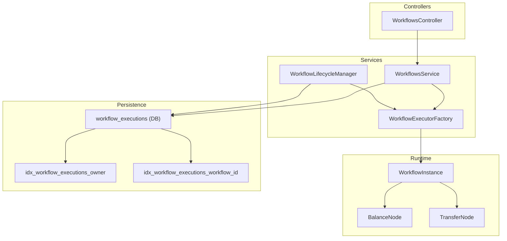
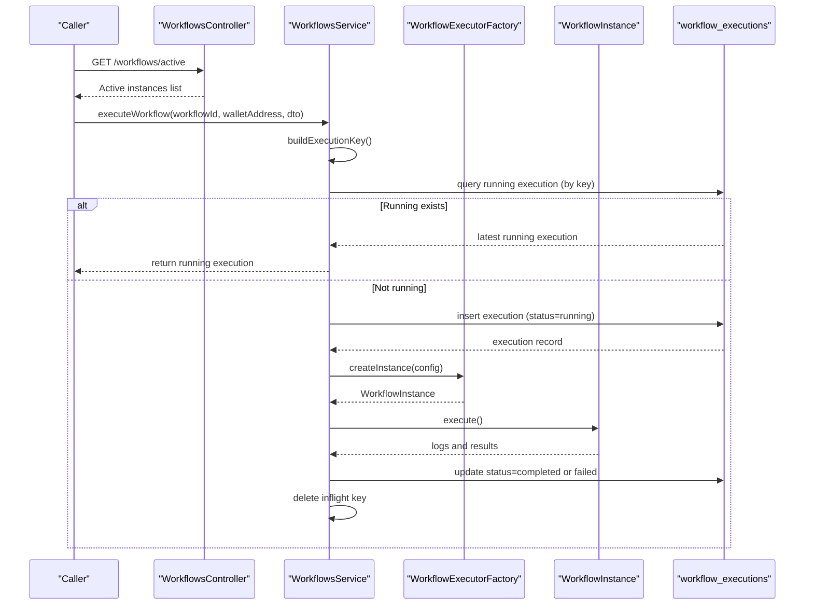
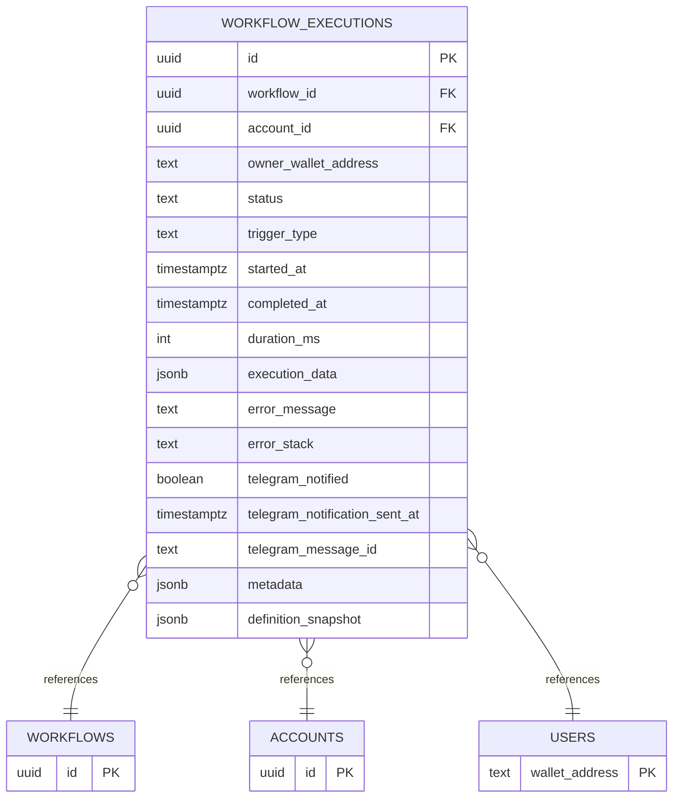
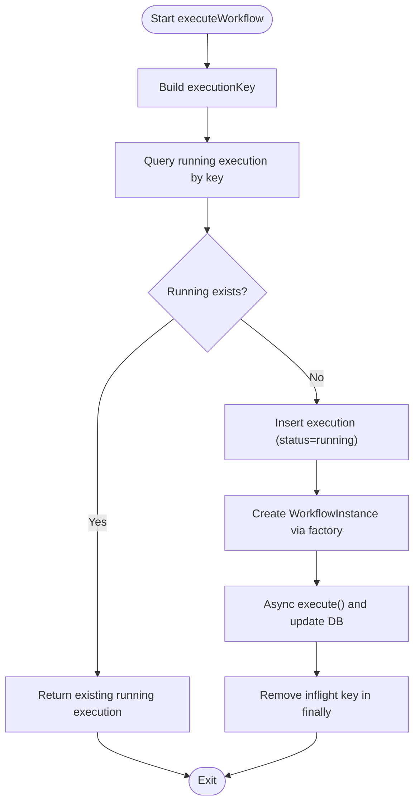
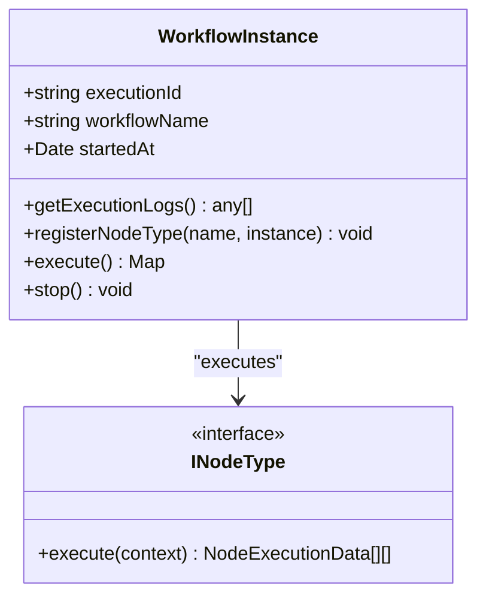
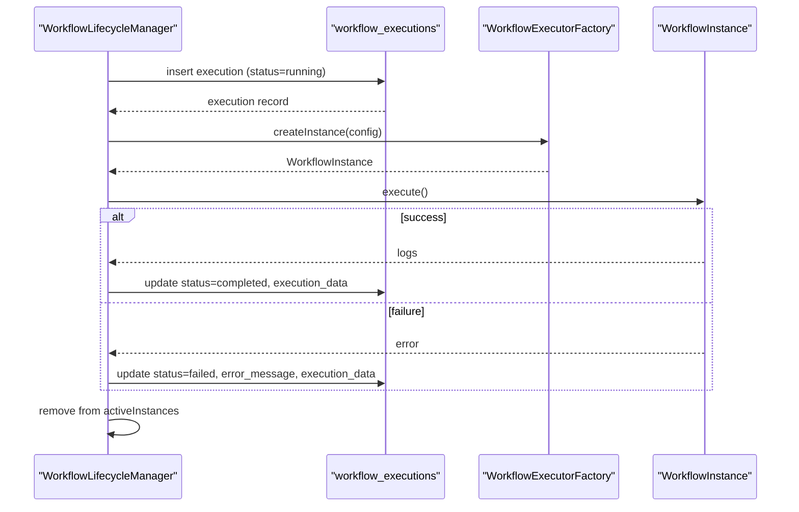
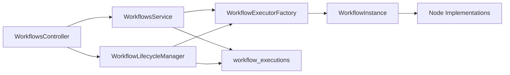

# Execution Lifecycle and State Management

<cite>
**Referenced Files in This Document**
- [workflow-lifecycle.service.ts](file://src/workflows/workflow-lifecycle.service.ts)
- [workflow-instance.ts](file://src/workflows/workflow-instance.ts)
- [workflows.service.ts](file://src/workflows/workflows.service.ts)
- [workflows.controller.ts](file://src/workflows/workflows.controller.ts)
- [workflow-executor.factory.ts](file://src/workflows/workflow-executor.factory.ts)
- [workflow-types.ts](file://src/web3/workflow-types.ts)
- [initial-1.sql](file://src/database/schema/initial-1.sql)
- [20260129000000_update_schema_v2.sql](file://supabase/migrations/20260129000000_update_schema_v2.sql)
- [execute-workflow.dto.ts](file://src/workflows/dto/execute-workflow.dto.ts)
- [balance.node.ts](file://src/web3/nodes/balance.node.ts)
- [transfer.node.ts](file://src/web3/nodes/transfer.node.ts)
</cite>

## Table of Contents
1. [Introduction](#introduction)
2. [Project Structure](#project-structure)
3. [Core Components](#core-components)
4. [Architecture Overview](#architecture-overview)
5. [Detailed Component Analysis](#detailed-component-analysis)
6. [Dependency Analysis](#dependency-analysis)
7. [Performance Considerations](#performance-considerations)
8. [Troubleshooting Guide](#troubleshooting-guide)
9. [Conclusion](#conclusion)
10. [Appendices](#appendices)

## Introduction
This document explains the complete execution lifecycle and state management for workflow runs, from initiation to completion. It covers:
- Execution tracking via the workflow_executions table and its statuses (running, completed, failed)
- Concurrency control using in-memory inflight keys to prevent duplicate executions
- Execution data structure with step-by-step logs, error messages, and summaries
- Asynchronous execution pattern with fire-and-forget behavior, error propagation, and cleanup
- Practical monitoring, status checking, and troubleshooting failed executions
- Performance optimization, timeouts, and resource management strategies

## Project Structure
The execution lifecycle spans several modules:
- Lifecycle Manager: periodic synchronization of active accounts and launching workflow instances
- Workflows Service: manual execution orchestration with concurrency guards and DB persistence
- Workflow Instance: per-run execution engine with node graph traversal and logging
- Executor Factory: constructs instances and registers node types
- Types and DTOs: shared interfaces and request shapes
- Database Schema: workflow_executions table and supporting indices

**Diagram sources**
- [workflows.controller.ts:1-28](file://src/workflows/workflows.controller.ts#L1-L28)
- [workflow-lifecycle.service.ts:1-343](file://src/workflows/workflow-lifecycle.service.ts#L1-L343)
- [workflows.service.ts:1-216](file://src/workflows/workflows.service.ts#L1-L216)
- [workflow-executor.factory.ts:1-42](file://src/workflows/workflow-executor.factory.ts#L1-L42)
- [workflow-instance.ts:1-314](file://src/workflows/workflow-instance.ts#L1-L314)
- [initial-1.sql:117-139](file://src/database/schema/initial-1.sql#L117-L139)
- [20260129000000_update_schema_v2.sql:27-34](file://supabase/migrations/20260129000000_update_schema_v2.sql#L27-L34)

**Section sources**
- [workflows.controller.ts:1-28](file://src/workflows/workflows.controller.ts#L1-L28)
- [workflow-lifecycle.service.ts:1-343](file://src/workflows/workflow-lifecycle.service.ts#L1-L343)
- [workflows.service.ts:1-216](file://src/workflows/workflows.service.ts#L1-L216)
- [workflow-executor.factory.ts:1-42](file://src/workflows/workflow-executor.factory.ts#L1-L42)
- [workflow-instance.ts:1-314](file://src/workflows/workflow-instance.ts#L1-L314)
- [initial-1.sql:117-139](file://src/database/schema/initial-1.sql#L117-L139)
- [20260129000000_update_schema_v2.sql:27-34](file://supabase/migrations/20260129000000_update_schema_v2.sql#L27-L34)

## Core Components
- WorkflowLifecycleManager
  - Periodically polls active accounts and ensures one instance per eligible account
  - Creates execution records in DB with status running and launches async execution
  - Updates DB to completed or failed upon completion and cleans up in-memory instance
- WorkflowsService
  - Manual execution entrypoint with concurrency guards using inflightExecutionKeys
  - Builds executionKey from workflowId:walletAddress:accountId
  - Persists execution record and starts async execution via factory
  - Propagates errors to DB and removes inflight key in finally
- WorkflowInstance
  - Executes the workflow graph, collects step logs, and handles notifications
  - Tracks execution logs per node with status, timing, input, output, and error
  - Supports abort via AbortController and graceful cleanup
- WorkflowExecutorFactory
  - Registers standard node types and constructs WorkflowInstance with injected services
- Types and DTOs
  - Shared interfaces for workflow definitions, node types, and execution context
  - ExecuteWorkflowDto supports optional accountId and params for overrides

**Section sources**
- [workflow-lifecycle.service.ts:70-117](file://src/workflows/workflow-lifecycle.service.ts#L70-L117)
- [workflow-lifecycle.service.ts:238-341](file://src/workflows/workflow-lifecycle.service.ts#L238-L341)
- [workflows.service.ts:14-18](file://src/workflows/workflows.service.ts#L14-L18)
- [workflows.service.ts:83-214](file://src/workflows/workflows.service.ts#L83-L214)
- [workflow-instance.ts:94-151](file://src/workflows/workflow-instance.ts#L94-L151)
- [workflow-instance.ts:162-258](file://src/workflows/workflow-instance.ts#L162-L258)
- [workflow-executor.factory.ts:17-34](file://src/workflows/workflow-executor.factory.ts#L17-L34)
- [workflow-types.ts:1-91](file://src/web3/workflow-types.ts#L1-L91)
- [execute-workflow.dto.ts:1-27](file://src/workflows/dto/execute-workflow.dto.ts#L1-L27)

## Architecture Overview
The execution lifecycle follows a deterministic flow:
- Initiation
  - Manual: WorkflowsService creates a DB record with status running and starts async execution
  - Auto: WorkflowLifecycleManager detects active accounts and launches executions
- Execution
  - WorkflowInstance traverses the workflow graph, executes nodes, and logs steps
  - Notifications are sent based on node or global settings
- Completion
  - On success: DB updated to completed with execution_data containing steps and summary
  - On failure: DB updated to failed with error_message and execution_data
- Cleanup
  - Lifecycle Manager removes stopped instances
  - WorkflowsService removes inflight keys in finally blocks

**Diagram sources**
- [workflows.controller.ts:11-26](file://src/workflows/workflows.controller.ts#L11-L26)
- [workflows.service.ts:83-214](file://src/workflows/workflows.service.ts#L83-L214)
- [workflow-executor.factory.ts:17-34](file://src/workflows/workflow-executor.factory.ts#L17-L34)
- [workflow-instance.ts:94-151](file://src/workflows/workflow-instance.ts#L94-L151)
- [initial-1.sql:117-139](file://src/database/schema/initial-1.sql#L117-L139)

## Detailed Component Analysis

### Execution Tracking with workflow_executions
- Purpose
  - Persist execution metadata, status, timestamps, and execution_data
- Key Fields
  - id, workflow_id, account_id, owner_wallet_address, status, trigger_type, started_at, completed_at, duration_ms, execution_data, error_message, error_stack, telegram_notified, telegram_notification_sent_at, telegram_message_id, metadata, definition_snapshot
- Status Transitions
  - Manual trigger: running -> completed or failed
  - Auto trigger: similar transitions managed by lifecycle manager
- Indices
  - Owner index and workflow_id index improve query performance for history and stats views

**Diagram sources**
- [initial-1.sql:117-139](file://src/database/schema/initial-1.sql#L117-L139)
- [20260129000000_update_schema_v2.sql:27-34](file://supabase/migrations/20260129000000_update_schema_v2.sql#L27-L34)

**Section sources**
- [initial-1.sql:117-139](file://src/database/schema/initial-1.sql#L117-L139)
- [20260129000000_update_schema_v2.sql:18-24](file://supabase/migrations/20260129000000_update_schema_v2.sql#L18-L24)

### Concurrency Control with inflightExecutionKeys
- Mechanism
  - Build a composite key: workflowId:walletAddress:accountId (or 'none' if absent)
  - Check for existing running execution by the same key
  - Track inflight keys in memory to avoid duplicate runs
- Race Condition Handling
  - Double-checked guard: after inflight set insertion, re-check DB for running execution
  - Atomic DB updates ensure only one writer updates status to completed/failed
- Cleanup
  - Remove inflight key in finally blocks after async execution completes

**Diagram sources**
- [workflows.service.ts:83-214](file://src/workflows/workflows.service.ts#L83-L214)

**Section sources**
- [workflows.service.ts:14-18](file://src/workflows/workflows.service.ts#L14-L18)
- [workflows.service.ts:83-214](file://src/workflows/workflows.service.ts#L83-L214)

### Execution Data Structure and Step Logs
- Structure
  - execution_data.steps: array of per-node logs
  - execution_data.summary: human-readable summary
- Step Log Fields
  - nodeId, nodeName, nodeType, startedAt, input, status, durationMs, output/error
- Collection
  - WorkflowInstance collects logs during node execution and exposes them via getExecutionLogs()

**Diagram sources**
- [workflow-instance.ts:33-151](file://src/workflows/workflow-instance.ts#L33-L151)
- [workflow-types.ts:12-15](file://src/web3/workflow-types.ts#L12-L15)

**Section sources**
- [workflow-instance.ts:80-82](file://src/workflows/workflow-instance.ts#L80-L82)
- [workflow-instance.ts:215-257](file://src/workflows/workflow-instance.ts#L215-L257)

### Asynchronous Execution Pattern and Cleanup
- Fire-and-Forget
  - Both manual and auto triggers start execution asynchronously
  - API returns immediately with the newly created execution record
- Error Propagation
  - Exceptions are caught, logged, and persisted to DB with error_message and execution_data
- Cleanup
  - Lifecycle Manager removes stopped instances from memory
  - WorkflowsService removes inflight keys in finally blocks

**Diagram sources**
- [workflow-lifecycle.service.ts:257-341](file://src/workflows/workflow-lifecycle.service.ts#L257-L341)
- [initial-1.sql:117-139](file://src/database/schema/initial-1.sql#L117-L139)

**Section sources**
- [workflow-lifecycle.service.ts:257-341](file://src/workflows/workflow-lifecycle.service.ts#L257-L341)

### Practical Examples

#### Monitoring Active Instances
- Endpoint: GET /workflows/active
- Returns in-memory active instances with executionId, workflowName, ownerWalletAddress, isRunning, nodeCount, startedAt

**Section sources**
- [workflows.controller.ts:11-26](file://src/workflows/workflows.controller.ts#L11-L26)
- [workflow-lifecycle.service.ts:122-154](file://src/workflows/workflow-lifecycle.service.ts#L122-L154)

#### Checking Execution Status
- Query workflow_executions by executionId
- Inspect status, started_at, completed_at, error_message, and execution_data.summary

**Section sources**
- [initial-1.sql:117-139](file://src/database/schema/initial-1.sql#L117-L139)

#### Troubleshooting Failed Executions
- Retrieve execution record and review execution_data.steps for node-level details
- Check error_message and execution_data.summary for high-level cause
- Use definition_snapshot to reproduce or audit the workflow definition at runtime

**Section sources**
- [workflows.service.ts:191-207](file://src/workflows/workflows.service.ts#L191-L207)
- [workflow-lifecycle.service.ts:318-335](file://src/workflows/workflow-lifecycle.service.ts#L318-L335)
- [20260129000000_update_schema_v2.sql:19-20](file://supabase/migrations/20260129000000_update_schema_v2.sql#L19-L20)

## Dependency Analysis
- Controllers depend on Lifecycle Manager for listing active instances
- Services orchestrate execution and persist state to DB
- Factory injects services and registers node types into instances
- Instances depend on node implementations for actual work
- DB schema defines the contract for execution tracking and indices

**Diagram sources**
- [workflows.controller.ts:1-28](file://src/workflows/workflows.controller.ts#L1-L28)
- [workflow-lifecycle.service.ts:1-343](file://src/workflows/workflow-lifecycle.service.ts#L1-L343)
- [workflows.service.ts:1-216](file://src/workflows/workflows.service.ts#L1-L216)
- [workflow-executor.factory.ts:1-42](file://src/workflows/workflow-executor.factory.ts#L1-L42)
- [workflow-instance.ts:1-314](file://src/workflows/workflow-instance.ts#L1-L314)
- [initial-1.sql:117-139](file://src/database/schema/initial-1.sql#L117-L139)

**Section sources**
- [workflows.controller.ts:1-28](file://src/workflows/workflows.controller.ts#L1-L28)
- [workflow-lifecycle.service.ts:1-343](file://src/workflows/workflow-lifecycle.service.ts#L1-L343)
- [workflows.service.ts:1-216](file://src/workflows/workflows.service.ts#L1-L216)
- [workflow-executor.factory.ts:1-42](file://src/workflows/workflow-executor.factory.ts#L1-L42)
- [workflow-instance.ts:1-314](file://src/workflows/workflow-instance.ts#L1-L314)
- [initial-1.sql:117-139](file://src/database/schema/initial-1.sql#L117-L139)

## Performance Considerations
- Concurrency Guards
  - inflightExecutionKeys prevents duplicate runs and reduces wasted compute
  - Double-checked DB lookup ensures correctness under race conditions
- Database Indexes
  - Owner and workflow_id indices accelerate history and analytics queries
- Asynchronous Execution
  - Fire-and-forget minimizes API latency and improves throughput
- Resource Management
  - AbortController allows cancellation of long-running nodes
  - Lifecycle Manager prunes inactive instances to control memory footprint

[No sources needed since this section provides general guidance]

## Troubleshooting Guide
- Duplicate Executions
  - Symptom: Multiple runs for the same workflow/wallet/account
  - Action: Verify inflight keys and running DB records; ensure inflight keys are cleaned up
- Stuck in Running
  - Symptom: Execution remains running indefinitely
  - Action: Check inflight keys and DB updates; confirm async execution path completes
- Missing Notifications
  - Symptom: No Telegram updates
  - Action: Confirm chatId mapping and node telegramNotify flags
- Insufficient Funds (Auto-trigger)
  - Symptom: Auto-launch skipped for low SOL balance
  - Action: Ensure minimum balance threshold is met before triggering

**Section sources**
- [workflows.service.ts:83-214](file://src/workflows/workflows.service.ts#L83-L214)
- [workflow-lifecycle.service.ts:216-255](file://src/workflows/workflow-lifecycle.service.ts#L216-L255)

## Conclusion
The execution lifecycle combines robust DB-backed state tracking with efficient in-memory concurrency control and asynchronous execution. The workflow_executions table captures end-to-end visibility, while inflight keys and double-checked guards prevent duplicates. Step logs and summaries enable effective monitoring and troubleshooting. With proper indexing and resource controls, the system scales to handle frequent manual and automated runs.

[No sources needed since this section summarizes without analyzing specific files]

## Appendices

### Example Node Implementations
- BalanceNode
  - Queries SOL or SPL token balances and optionally enforces conditions
- TransferNode
  - Sends transfers via Crossmint wallet and returns signatures

**Section sources**
- [balance.node.ts:68-196](file://src/web3/nodes/balance.node.ts#L68-L196)
- [transfer.node.ts:60-199](file://src/web3/nodes/transfer.node.ts#L60-L199)