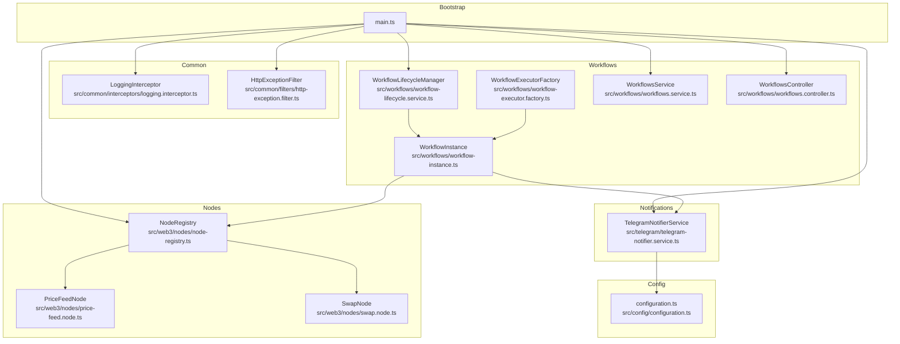
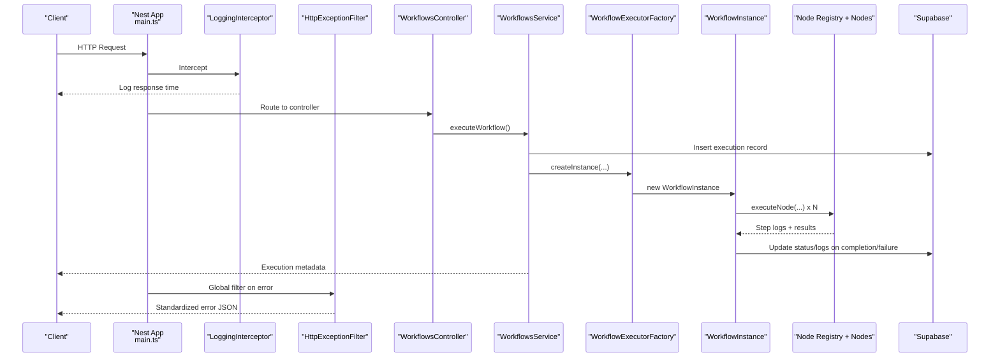
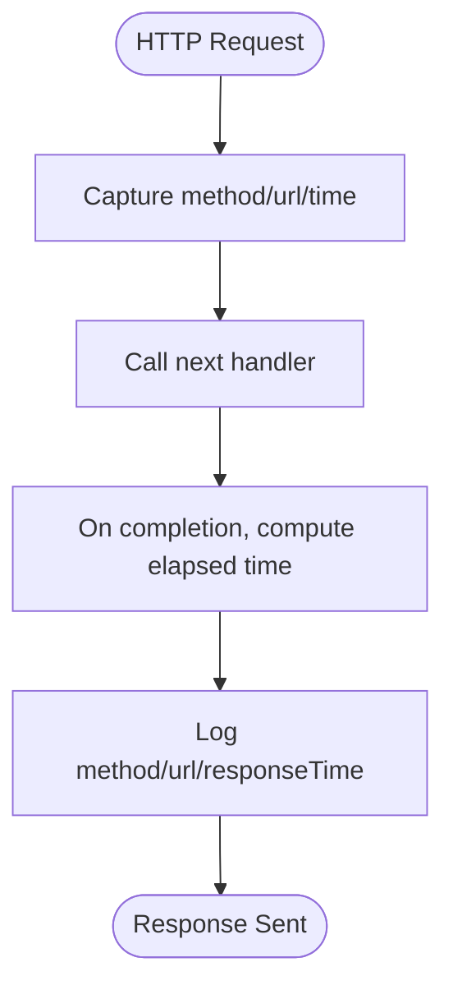
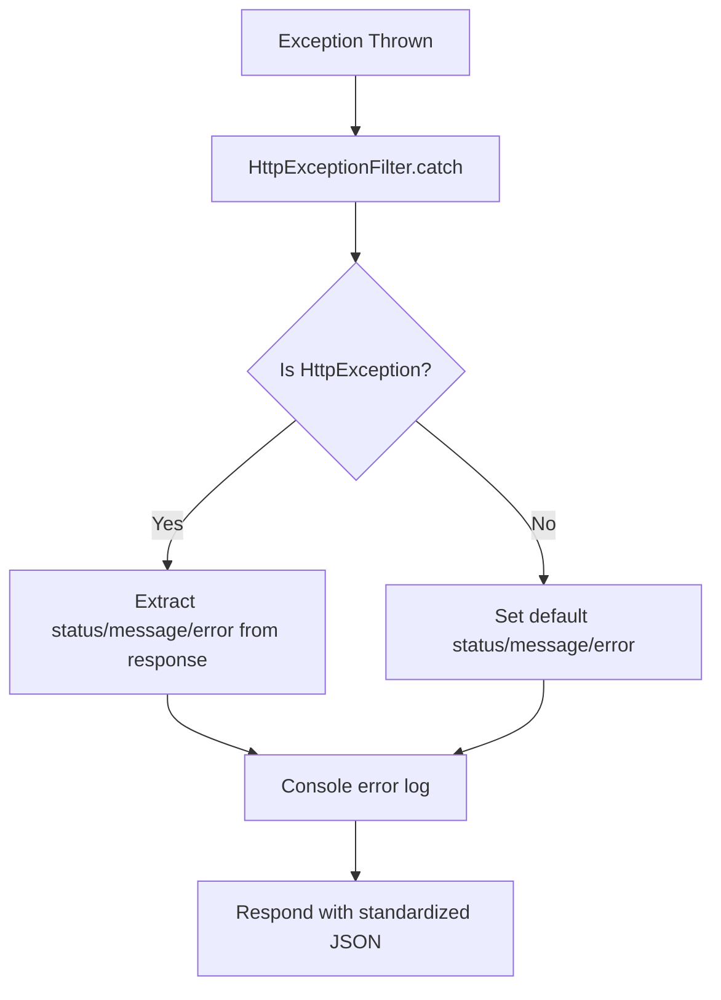
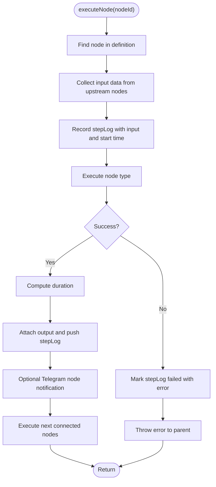
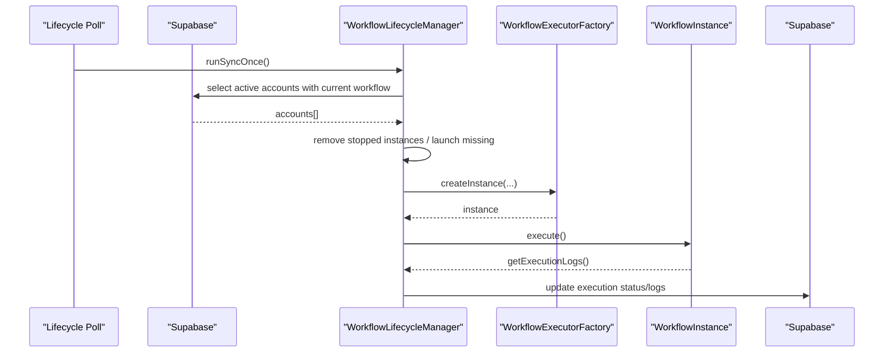
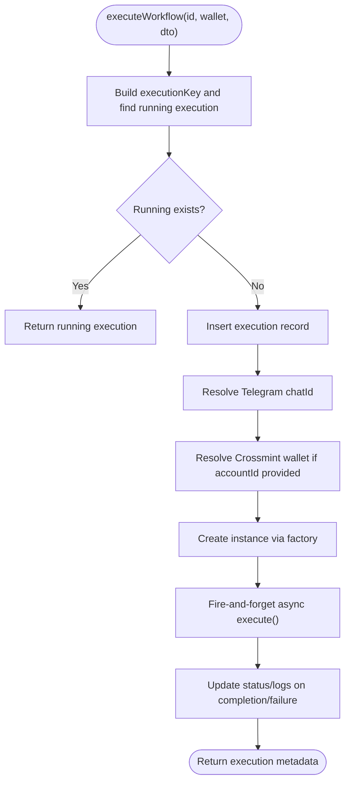
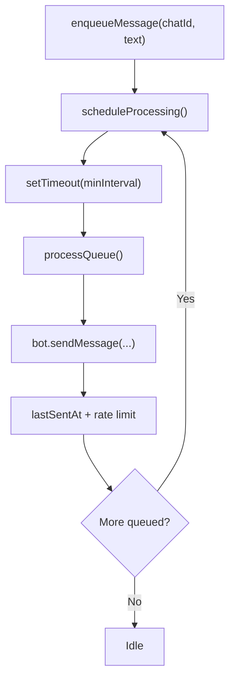
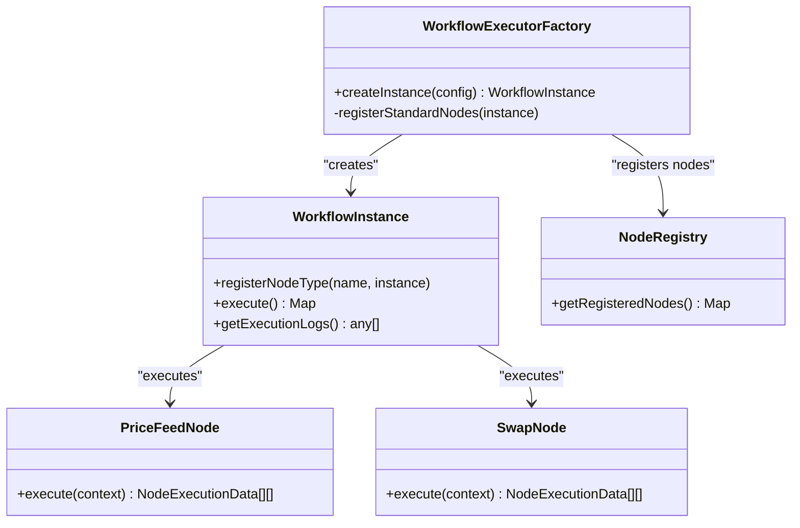
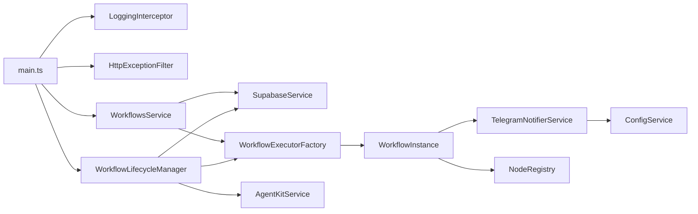

# Monitoring and Debugging

<cite>
**Referenced Files in This Document**
- [main.ts](file://src/main.ts)
- [logging.interceptor.ts](file://src/common/interceptors/logging.interceptor.ts)
- [http-exception.filter.ts](file://src/common/filters/http-exception.filter.ts)
- [workflow-instance.ts](file://src/workflows/workflow-instance.ts)
- [workflow-lifecycle.service.ts](file://src/workflows/workflow-lifecycle.service.ts)
- [workflows.service.ts](file://src/workflows/workflows.service.ts)
- [workflow-executor.factory.ts](file://src/workflows/workflow-executor.factory.ts)
- [telegram-notifier.service.ts](file://src/telegram/telegram-notifier.service.ts)
- [workflows.controller.ts](file://src/workflows/workflows.controller.ts)
- [node-registry.ts](file://src/web3/nodes/node-registry.ts)
- [configuration.ts](file://src/config/configuration.ts)
- [price-feed.node.ts](file://src/web3/nodes/price-feed.node.ts)
- [swap.node.ts](file://src/web3/nodes/swap.node.ts)
</cite>

## Table of Contents
1. [Introduction](#introduction)
2. [Project Structure](#project-structure)
3. [Core Components](#core-components)
4. [Architecture Overview](#architecture-overview)
5. [Detailed Component Analysis](#detailed-component-analysis)
6. [Dependency Analysis](#dependency-analysis)
7. [Performance Considerations](#performance-considerations)
8. [Troubleshooting Guide](#troubleshooting-guide)
9. [Conclusion](#conclusion)
10. [Appendices](#appendices)

## Introduction
This document focuses on monitoring and debugging workflow execution observability and troubleshooting capabilities. It explains the execution logging system that captures step-by-step execution traces, error details, and performance metrics, documents the logging interceptor usage for API request/response tracking and the exception filter for error standardization, and provides debugging techniques including execution log analysis, error message interpretation, and state inspection methods. It also covers monitoring dashboards, alerting mechanisms, performance metrics collection, practical examples of common execution failures, and production troubleshooting procedures.

## Project Structure
The backend is a NestJS application with modularized concerns:
- Application bootstrap and global middleware registration
- Common interceptors and filters for logging and error standardization
- Workflow engine with lifecycle management, execution orchestration, and telemetry
- Telegram notifier for runtime notifications
- Node registry and individual node implementations for workflow steps
- Configuration module for environment-driven settings

**Diagram sources**
- [main.ts:1-81](file://src/main.ts#L1-L81)
- [logging.interceptor.ts:1-20](file://src/common/interceptors/logging.interceptor.ts#L1-L20)
- [http-exception.filter.ts:1-40](file://src/common/filters/http-exception.filter.ts#L1-L40)
- [workflow-lifecycle.service.ts:1-343](file://src/workflows/workflow-lifecycle.service.ts#L1-L343)
- [workflow-instance.ts:1-314](file://src/workflows/workflow-instance.ts#L1-L314)
- [workflow-executor.factory.ts:1-42](file://src/workflows/workflow-executor.factory.ts#L1-L42)
- [workflows.service.ts:1-216](file://src/workflows/workflows.service.ts#L1-L216)
- [workflows.controller.ts:1-28](file://src/workflows/workflows.controller.ts#L1-L28)
- [telegram-notifier.service.ts:1-185](file://src/telegram/telegram-notifier.service.ts#L1-L185)
- [node-registry.ts:1-47](file://src/web3/nodes/node-registry.ts#L1-L47)
- [configuration.ts:1-45](file://src/config/configuration.ts#L1-L45)
- [price-feed.node.ts:1-133](file://src/web3/nodes/price-feed.node.ts#L1-L133)
- [swap.node.ts:1-209](file://src/web3/nodes/swap.node.ts#L1-L209)

**Section sources**
- [main.ts:1-81](file://src/main.ts#L1-L81)
- [configuration.ts:1-45](file://src/config/configuration.ts#L1-L45)

## Core Components
- Logging Interceptor: Captures HTTP request method, URL, and response time for every request.
- Exception Filter: Standardizes error responses with consistent fields and logs errors.
- Workflow Instance: Orchestrates execution, records per-step logs with timing and outcomes, and integrates notifications.
- Lifecycle Manager: Polls active accounts, launches and cleans up workflow instances, persists execution status and logs.
- Workflows Service: Handles manual executions, deduplicates concurrent runs, and updates execution records.
- Telegram Notifier: Sends start/completion/error notifications and queues messages with rate limiting.
- Node Registry and Nodes: Centralized registration of node types; nodes implement execution logic and emit logs.

**Section sources**
- [logging.interceptor.ts:1-20](file://src/common/interceptors/logging.interceptor.ts#L1-L20)
- [http-exception.filter.ts:1-40](file://src/common/filters/http-exception.filter.ts#L1-L40)
- [workflow-instance.ts:1-314](file://src/workflows/workflow-instance.ts#L1-L314)
- [workflow-lifecycle.service.ts:1-343](file://src/workflows/workflow-lifecycle.service.ts#L1-L343)
- [workflows.service.ts:1-216](file://src/workflows/workflows.service.ts#L1-L216)
- [telegram-notifier.service.ts:1-185](file://src/telegram/telegram-notifier.service.ts#L1-L185)
- [node-registry.ts:1-47](file://src/web3/nodes/node-registry.ts#L1-L47)

## Architecture Overview
The system combines global middleware for API observability with workflow-specific execution logging and notifications. Lifecycle and service layers persist execution state and logs to the database, while nodes contribute per-step telemetry.

**Diagram sources**
- [main.ts:1-81](file://src/main.ts#L1-L81)
- [logging.interceptor.ts:1-20](file://src/common/interceptors/logging.interceptor.ts#L1-L20)
- [http-exception.filter.ts:1-40](file://src/common/filters/http-exception.filter.ts#L1-L40)
- [workflows.controller.ts:1-28](file://src/workflows/workflows.controller.ts#L1-L28)
- [workflows.service.ts:1-216](file://src/workflows/workflows.service.ts#L1-L216)
- [workflow-executor.factory.ts:1-42](file://src/workflows/workflow-executor.factory.ts#L1-L42)
- [workflow-instance.ts:1-314](file://src/workflows/workflow-instance.ts#L1-L314)
- [node-registry.ts:1-47](file://src/web3/nodes/node-registry.ts#L1-L47)

## Detailed Component Analysis

### Logging Interceptor
- Purpose: Measure and log request latency for every HTTP request.
- Behavior: Captures method and URL, measures elapsed time, and logs a formatted message.
- Impact: Provides baseline API performance telemetry and aids in correlating slow endpoints with downstream errors.

**Diagram sources**
- [logging.interceptor.ts:1-20](file://src/common/interceptors/logging.interceptor.ts#L1-L20)

**Section sources**
- [logging.interceptor.ts:1-20](file://src/common/interceptors/logging.interceptor.ts#L1-L20)

### Exception Filter
- Purpose: Standardize error responses and log structured error details.
- Behavior: Extracts status, error code, and message from thrown exceptions; logs to console; responds with a consistent JSON envelope containing success flag and error metadata.

**Diagram sources**
- [http-exception.filter.ts:1-40](file://src/common/filters/http-exception.filter.ts#L1-L40)

**Section sources**
- [http-exception.filter.ts:1-40](file://src/common/filters/http-exception.filter.ts#L1-L40)

### Workflow Instance Execution Logging
- Purpose: Record per-step execution logs with timing, inputs, outputs, and errors.
- Behavior: Builds a step log with node identity, input payload, start time, and outcome. On success, captures duration and output; on failure, captures duration and error message. Pushes each step into an execution log array.

**Diagram sources**
- [workflow-instance.ts:162-258](file://src/workflows/workflow-instance.ts#L162-L258)

**Section sources**
- [workflow-instance.ts:162-258](file://src/workflows/workflow-instance.ts#L162-L258)

### Lifecycle Manager and Execution Persistence
- Purpose: Periodically synchronize active accounts with workflow instances, launch new instances, and persist execution status and logs.
- Behavior: Polls for active accounts, creates execution records, instantiates workflow instances, executes them asynchronously, and updates database with completion or failure, including step logs.

**Diagram sources**
- [workflow-lifecycle.service.ts:48-341](file://src/workflows/workflow-lifecycle.service.ts#L48-L341)

**Section sources**
- [workflow-lifecycle.service.ts:48-341](file://src/workflows/workflow-lifecycle.service.ts#L48-L341)

### Manual Execution Flow and Deduplication
- Purpose: Allow manual triggering of workflows, prevent overlapping runs, and persist execution state.
- Behavior: Builds an execution key from workflowId, walletAddress, and optional accountId; checks for existing running executions; inserts a new execution record; resolves to the running execution if present; launches instance asynchronously and updates status/logs.

**Diagram sources**
- [workflows.service.ts:83-214](file://src/workflows/workflows.service.ts#L83-L214)

**Section sources**
- [workflows.service.ts:83-214](file://src/workflows/workflows.service.ts#L83-L214)

### Telegram Notifications
- Purpose: Provide real-time updates for workflow lifecycle events and node completions.
- Behavior: Queues messages with a minimum interval, sends Markdown-formatted messages, and logs delivery attempts. Integrates with workflow instance and services to notify start, completion, and errors.

**Diagram sources**
- [telegram-notifier.service.ts:124-164](file://src/telegram/telegram-notifier.service.ts#L124-L164)

**Section sources**
- [telegram-notifier.service.ts:1-185](file://src/telegram/telegram-notifier.service.ts#L1-L185)

### Node Registry and Node Implementations
- Purpose: Centralized registration of node types and implementation of execution logic with per-step logging.
- Behavior: Nodes define parameters, inputs/outputs, and whether to notify. They implement execute(context) and may log intermediate states. The registry exposes all node factories to the workflow executor.

**Diagram sources**
- [workflow-executor.factory.ts:17-40](file://src/workflows/workflow-executor.factory.ts#L17-L40)
- [workflow-instance.ts:87-89](file://src/workflows/workflow-instance.ts#L87-L89)
- [node-registry.ts:19-47](file://src/web3/nodes/node-registry.ts#L19-L47)
- [price-feed.node.ts:66-131](file://src/web3/nodes/price-feed.node.ts#L66-L131)
- [swap.node.ts:102-207](file://src/web3/nodes/swap.node.ts#L102-L207)

**Section sources**
- [node-registry.ts:1-47](file://src/web3/nodes/node-registry.ts#L1-L47)
- [price-feed.node.ts:66-131](file://src/web3/nodes/price-feed.node.ts#L66-L131)
- [swap.node.ts:102-207](file://src/web3/nodes/swap.node.ts#L102-L207)

## Dependency Analysis
- Global middleware: LoggingInterceptor and HttpExceptionFilter are registered globally in the application bootstrap.
- Lifecycle Manager depends on SupabaseService, WorkflowExecutorFactory, and AgentKitService to manage instances and balances.
- WorkflowsService depends on SupabaseService and WorkflowExecutorFactory to handle manual executions and deduplicate concurrent runs.
- WorkflowInstance depends on injected services (TelegramNotifierService, CrossmintService, AgentKitService) and the Node Registry to execute nodes.
- TelegramNotifierService depends on configuration for enabling/disabling notifications and rate-limiting queue processing.

**Diagram sources**
- [main.ts:1-81](file://src/main.ts#L1-L81)
- [workflow-lifecycle.service.ts:19-23](file://src/workflows/workflow-lifecycle.service.ts#L19-L23)
- [workflows.service.ts:8-12](file://src/workflows/workflows.service.ts#L8-L12)
- [workflow-executor.factory.ts:10-15](file://src/workflows/workflow-executor.factory.ts#L10-L15)
- [workflow-instance.ts:70-74](file://src/workflows/workflow-instance.ts#L70-L74)
- [telegram-notifier.service.ts:14-24](file://src/telegram/telegram-notifier.service.ts#L14-L24)

**Section sources**
- [main.ts:1-81](file://src/main.ts#L1-L81)
- [workflow-lifecycle.service.ts:19-23](file://src/workflows/workflow-lifecycle.service.ts#L19-L23)
- [workflows.service.ts:8-12](file://src/workflows/workflows.service.ts#L8-L12)
- [workflow-executor.factory.ts:10-15](file://src/workflows/workflow-executor.factory.ts#L10-L15)
- [workflow-instance.ts:70-74](file://src/workflows/workflow-instance.ts#L70-L74)
- [telegram-notifier.service.ts:14-24](file://src/telegram/telegram-notifier.service.ts#L14-L24)

## Performance Considerations
- API Latency: LoggingInterceptor provides per-request timing; use it to identify slow endpoints and correlate with downstream database or external service calls.
- Execution Timing: WorkflowInstance computes per-step durations and total execution time; leverage these metrics to profile bottlenecks in nodes.
- Database Writes: Lifecycle Manager and WorkflowsService write execution status and logs; batch or throttle writes if throughput increases.
- Notification Rate Limits: TelegramNotifierService enforces a minimum interval between messages; ensure queue sizes remain reasonable to avoid backlog.
- Solana RPC Calls: Lifecycle Manager checks wallet balances; cache or backoff on RPC calls to reduce latency and rate limits.

[No sources needed since this section provides general guidance]

## Troubleshooting Guide

### Execution Log Analysis
- Access execution logs:
  - Lifecycle Manager persists logs upon completion/failure; inspect the execution record’s execution_data.steps.
  - WorkflowInstance.getExecutionLogs() returns the in-memory step logs during execution.
- Interpretation:
  - Each step includes node identity, input payload, start time, duration, and outcome (success or failure).
  - Failure steps include an error message; use it to pinpoint the failing node and parameter context.
- Correlate with database:
  - Use executionId to join workflow_executions with node-level logs stored in execution_data.steps.

**Section sources**
- [workflow-lifecycle.service.ts:304-339](file://src/workflows/workflow-lifecycle.service.ts#L304-L339)
- [workflow-instance.ts:80-82](file://src/workflows/workflow-instance.ts#L80-L82)

### Error Message Interpretation
- Standardized Errors:
  - HttpExceptionFilter ensures consistent error responses with code, message, and timestamp.
  - Use the error code and message to quickly categorize failures (validation, authorization, internal).
- Node-Level Errors:
  - Nodes may throw or return structured error payloads; check the step log’s error field for actionable details.

**Section sources**
- [http-exception.filter.ts:30-37](file://src/common/filters/http-exception.filter.ts#L30-L37)
- [price-feed.node.ts:114-127](file://src/web3/nodes/price-feed.node.ts#L114-L127)
- [swap.node.ts:190-203](file://src/web3/nodes/swap.node.ts#L190-L203)

### State Inspection Methods
- Active Instances:
  - Use the WorkflowsController GET endpoint to list active workflow instances held in memory by the lifecycle manager.
- In-Flight Executions:
  - WorkflowsService tracks inflight execution keys to prevent overlapping runs; inspect this mechanism when investigating concurrency issues.
- Telegram Notifications:
  - Verify TelegramNotifierService is enabled and configured; check queue processing and rate-limiting behavior.

**Section sources**
- [workflows.controller.ts:11-26](file://src/workflows/workflows.controller.ts#L11-L26)
- [workflows.service.ts:14-18](file://src/workflows/workflows.service.ts#L14-L18)
- [telegram-notifier.service.ts:14-24](file://src/telegram/telegram-notifier.service.ts#L14-L24)

### Common Execution Failures and Resolution Strategies
- Node Type Not Registered:
  - Symptom: Unregistered node type error during execution.
  - Cause: Node not included in the registry or not registered via the factory.
  - Resolution: Ensure node registration in the registry and that the factory registers it during instance creation.
- Missing Required Parameters:
  - Symptom: Node throws due to missing parameters (e.g., account ID for swaps).
  - Cause: Incorrect workflow definition or missing upstream node output.
  - Resolution: Validate node parameters and upstream data; ensure preceding nodes produce expected outputs.
- Insufficient SOL Balance:
  - Symptom: Lifecycle Manager skips launching a workflow due to low balance.
  - Cause: Wallet SOL balance below threshold.
  - Resolution: Top up the wallet or adjust the minimum balance requirement.
- Duplicate Concurrent Executions:
  - Symptom: Overlapping runs or delayed execution resolution.
  - Cause: Lack of deduplication.
  - Resolution: Rely on WorkflowsService inflight keys to deduplicate; avoid manual triggers until previous run completes.

**Section sources**
- [workflow-instance.ts:180-183](file://src/workflows/workflow-instance.ts#L180-L183)
- [node-registry.ts:23-47](file://src/web3/nodes/node-registry.ts#L23-L47)
- [swap.node.ts:124-126](file://src/web3/nodes/swap.node.ts#L124-L126)
- [workflow-lifecycle.service.ts:246-255](file://src/workflows/workflow-lifecycle.service.ts#L246-L255)
- [workflows.service.ts:88-107](file://src/workflows/workflows.service.ts#L88-L107)

### Debugging Tools and Development Workflows
- Local Logs:
  - Review console logs from LoggingInterceptor, HttpExceptionFilter, WorkflowInstance, and TelegramNotifierService for immediate insights.
- API Documentation:
  - Use Swagger at the configured path to test endpoints and validate request/response shapes.
- Environment Configuration:
  - Adjust TELEGRAM_NOTIFY_ENABLED and related keys in configuration to enable/disable notifications and tune behavior.

**Section sources**
- [main.ts:39-63](file://src/main.ts#L39-L63)
- [configuration.ts:12-16](file://src/config/configuration.ts#L12-L16)

### Production Troubleshooting Procedures
- Immediate Actions:
  - Check active instances endpoint for current workload.
  - Inspect recent execution records for failed statuses and step logs.
- Deep Dive:
  - Correlate API latency spikes with LoggingInterceptor logs.
  - Standardize error responses using HttpExceptionFilter to unify incident reporting.
- Preventive Measures:
  - Monitor TelegramNotifier queue length and rate-limiting behavior.
  - Add structured metrics around execution durations and node counts for dashboarding.

**Section sources**
- [workflows.controller.ts:11-26](file://src/workflows/workflows.controller.ts#L11-L26)
- [workflows.service.ts:110-122](file://src/workflows/workflows.service.ts#L110-L122)
- [telegram-notifier.service.ts:130-164](file://src/telegram/telegram-notifier.service.ts#L130-L164)

## Conclusion
The system provides robust execution observability through global logging, standardized error responses, comprehensive per-step logs, and lifecycle persistence. By leveraging the active instances endpoint, execution logs, and notification queues, teams can effectively monitor, debug, and troubleshoot workflow executions. Extending the system with structured metrics and alerts will further enhance operational visibility and reliability.

[No sources needed since this section summarizes without analyzing specific files]

## Appendices

### Monitoring Dashboards and Alerting Mechanisms
- Dashboards:
  - Track API response times via LoggingInterceptor logs.
  - Visualize workflow execution durations and node-level latencies from WorkflowInstance logs.
  - Monitor Telegram notification delivery rates and queue depth.
- Alerting:
  - Alert on sustained high response times, frequent workflow failures, or Telegram delivery failures.
  - Alert on insufficient wallet balances preventing workflow launches.

[No sources needed since this section provides general guidance]

### Performance Metrics Collection
- Metrics to Collect:
  - API request/response time (LoggingInterceptor).
  - Workflow total duration and per-step duration (WorkflowInstance).
  - Node execution counts and error rates (per node type).
  - Telegram notification success rate and queue lag.
- Storage:
  - Persist metrics alongside execution records for historical analysis.

[No sources needed since this section provides general guidance]