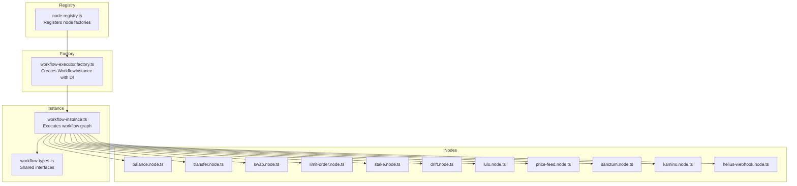
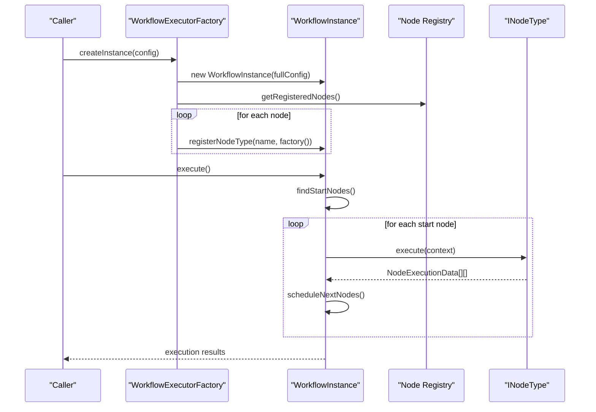
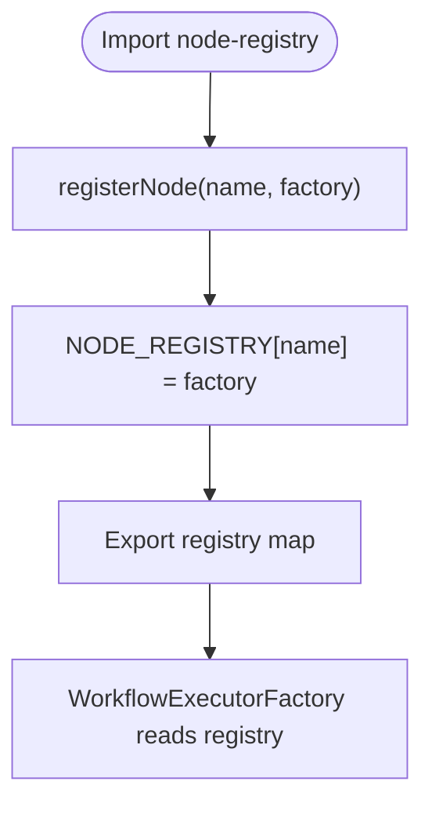
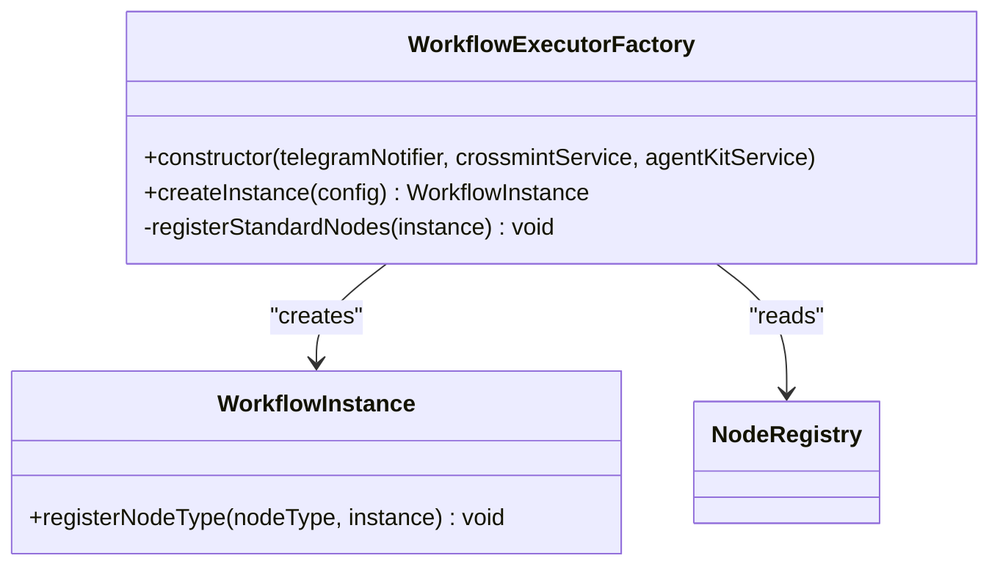
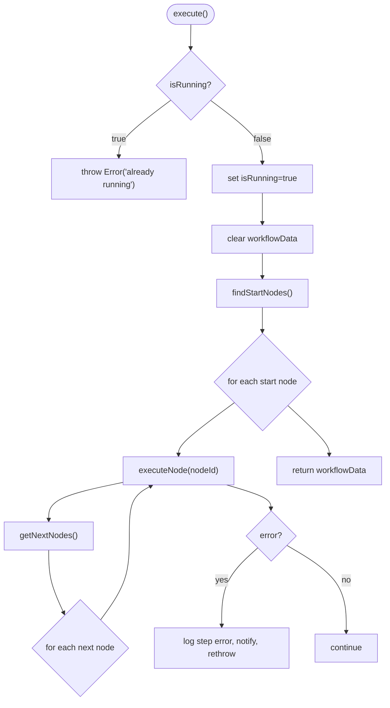
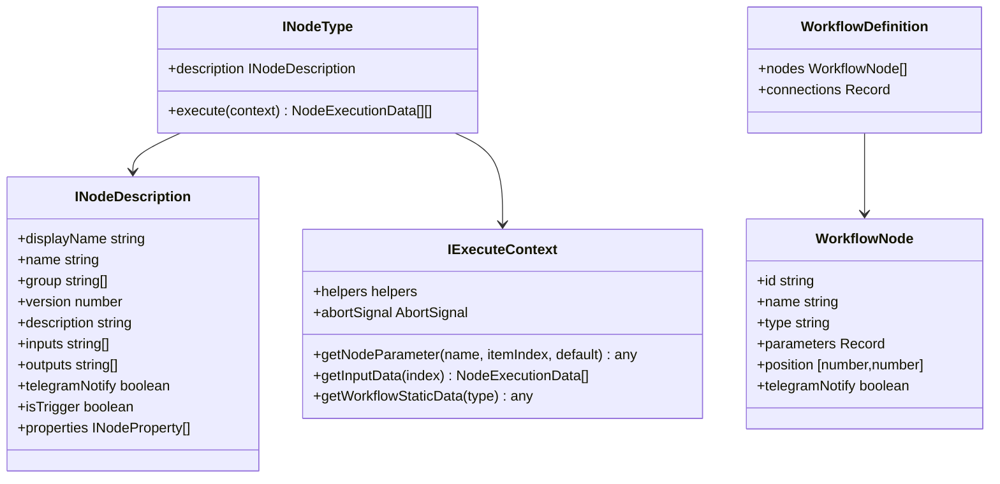
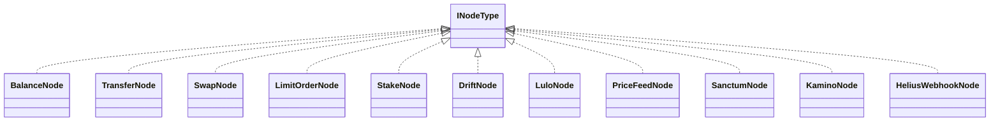
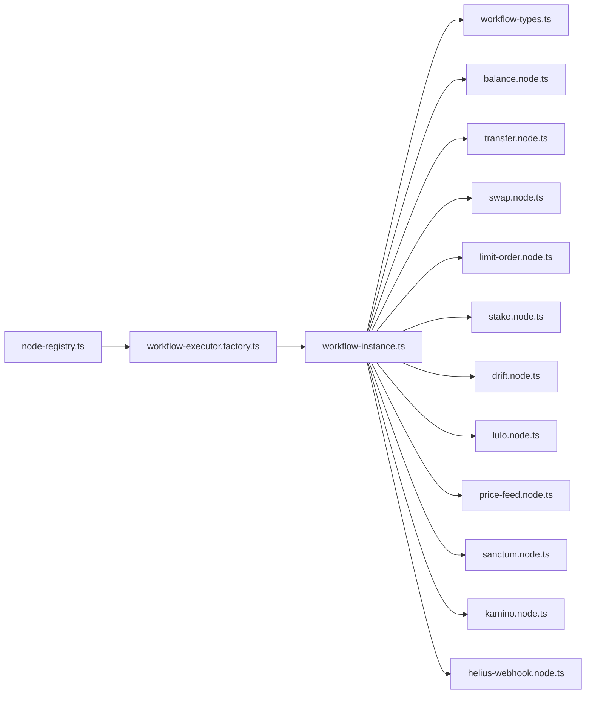

# Node Registry and Execution System

<cite>
**Referenced Files in This Document**
- [node-registry.ts](file://src/web3/nodes/node-registry.ts)
- [workflow-executor.factory.ts](file://src/workflows/workflow-executor.factory.ts)
- [workflow-instance.ts](file://src/workflows/workflow-instance.ts)
- [workflow-types.ts](file://src/web3/workflow-types.ts)
- [balance.node.ts](file://src/web3/nodes/balance.node.ts)
- [transfer.node.ts](file://src/web3/nodes/transfer.node.ts)
- [swap.node.ts](file://src/web3/nodes/swap.node.ts)
- [limit-order.node.ts](file://src/web3/nodes/limit-order.node.ts)
- [stake.node.ts](file://src/web3/nodes/stake.node.ts)
- [drift.node.ts](file://src/web3/nodes/drift.node.ts)
- [lulo.node.ts](file://src/web3/nodes/lulo.node.ts)
- [price-feed.node.ts](file://src/web3/nodes/price-feed.node.ts)
- [sanctum.node.ts](file://src/web3/nodes/sanctum.node.ts)
- [kamino.node.ts](file://src/web3/nodes/kamino.node.ts)
- [helius-webhook.node.ts](file://src/web3/nodes/helius-webhook.node.ts)
</cite>

## Table of Contents
1. [Introduction](#introduction)
2. [Project Structure](#project-structure)
3. [Core Components](#core-components)
4. [Architecture Overview](#architecture-overview)
5. [Detailed Component Analysis](#detailed-component-analysis)
6. [Dependency Analysis](#dependency-analysis)
7. [Performance Considerations](#performance-considerations)
8. [Troubleshooting Guide](#troubleshooting-guide)
9. [Conclusion](#conclusion)

## Introduction
This document explains the node registry and execution system with a focus on the factory pattern and node type management. It covers:
- How node types are registered and discovered
- How WorkflowExecutorFactory creates isolated execution instances with dependency injection
- How WorkflowInstance manages individual execution contexts, state tracking, error handling, and resource cleanup
- The 11 supported node types, their interfaces, and execution patterns
- Practical examples of registration, factory instantiation, and execution context management
- Performance considerations, memory management, and concurrent execution patterns

## Project Structure
The execution system centers around three main areas:
- Node registry and discovery
- Workflow execution factory and instance lifecycle
- Node implementations implementing a common interface

**Diagram sources**
- [node-registry.ts:1-47](file://src/web3/nodes/node-registry.ts#L1-L47)
- [workflow-executor.factory.ts:1-42](file://src/workflows/workflow-executor.factory.ts#L1-L42)
- [workflow-instance.ts:1-314](file://src/workflows/workflow-instance.ts#L1-L314)
- [workflow-types.ts:1-91](file://src/web3/workflow-types.ts#L1-L91)

**Section sources**
- [node-registry.ts:1-47](file://src/web3/nodes/node-registry.ts#L1-L47)
- [workflow-executor.factory.ts:1-42](file://src/workflows/workflow-executor.factory.ts#L1-L42)
- [workflow-instance.ts:1-314](file://src/workflows/workflow-instance.ts#L1-L314)
- [workflow-types.ts:1-91](file://src/web3/workflow-types.ts#L1-L91)

## Core Components
- Node registry: A global Map that registers node type factories by name and exposes a getter for all registered nodes.
- Factory: WorkflowExecutorFactory constructs WorkflowInstance with injected services and auto-registers all nodes from the registry.
- Instance: WorkflowInstance encapsulates a single workflow execution, orchestrates traversal of the workflow graph, and manages execution logs and notifications.

Key responsibilities:
- Registration: registerNode(name, factory) adds a node factory to the registry.
- Discovery: getRegisteredNodes() returns the registry for iteration.
- Instantiation: WorkflowExecutorFactory.createInstance(...) builds a WorkflowInstance with injected services and registers all nodes.
- Execution: WorkflowInstance.execute() traverses nodes, resolves inputs, injects context, executes node.execute(...), and continues downstream.

**Section sources**
- [node-registry.ts:12-21](file://src/web3/nodes/node-registry.ts#L12-L21)
- [node-registry.ts:36-46](file://src/web3/nodes/node-registry.ts#L36-L46)
- [workflow-executor.factory.ts:17-34](file://src/workflows/workflow-executor.factory.ts#L17-L34)
- [workflow-executor.factory.ts:36-40](file://src/workflows/workflow-executor.factory.ts#L36-L40)
- [workflow-instance.ts:87-89](file://src/workflows/workflow-instance.ts#L87-L89)
- [workflow-instance.ts:94-151](file://src/workflows/workflow-instance.ts#L94-L151)

## Architecture Overview
The system follows a factory pattern with a registry-driven node discovery mechanism. Each node implements a shared interface and is executed within an isolated WorkflowInstance.

**Diagram sources**
- [workflow-executor.factory.ts:17-40](file://src/workflows/workflow-executor.factory.ts#L17-L40)
- [workflow-instance.ts:94-151](file://src/workflows/workflow-instance.ts#L94-L151)
- [node-registry.ts:19-21](file://src/web3/nodes/node-registry.ts#L19-L21)

## Detailed Component Analysis

### Node Registry
- Purpose: Central place to register node factories and expose them for discovery.
- Mechanism: registerNode(name, factory) stores a factory function under a unique name. getRegisteredNodes() returns the registry map for iteration.
- Registration: All 11 node types are imported and registered in node-registry.ts.

**Diagram sources**
- [node-registry.ts:12-21](file://src/web3/nodes/node-registry.ts#L12-L21)
- [node-registry.ts:36-46](file://src/web3/nodes/node-registry.ts#L36-L46)

**Section sources**
- [node-registry.ts:12-21](file://src/web3/nodes/node-registry.ts#L12-L21)
- [node-registry.ts:36-46](file://src/web3/nodes/node-registry.ts#L36-L46)

### WorkflowExecutorFactory
- Role: Creates isolated WorkflowInstance with dependency injection and auto-registers all nodes from the registry.
- Dependencies: Injects TelegramNotifierService, CrossmintService, AgentKitService.
- Behavior: Merges provided config with injected services, constructs WorkflowInstance, and registers standard nodes.

**Diagram sources**
- [workflow-executor.factory.ts:8-15](file://src/workflows/workflow-executor.factory.ts#L8-L15)
- [workflow-executor.factory.ts:17-34](file://src/workflows/workflow-executor.factory.ts#L17-L34)
- [workflow-executor.factory.ts:36-40](file://src/workflows/workflow-executor.factory.ts#L36-L40)

**Section sources**
- [workflow-executor.factory.ts:8-15](file://src/workflows/workflow-executor.factory.ts#L8-L15)
- [workflow-executor.factory.ts:17-34](file://src/workflows/workflow-executor.factory.ts#L17-L34)
- [workflow-executor.factory.ts:36-40](file://src/workflows/workflow-executor.factory.ts#L36-L40)

### WorkflowInstance
- Responsibilities:
  - Holds node registry per instance, workflow definition, and execution logs.
  - Manages execution state, start detection, input resolution, and downstream scheduling.
  - Provides IExecuteContext to nodes with parameter injection, input retrieval, helpers, and abort signal.
  - Handles notifications and error propagation.
- Execution flow:
  - Validates running state, clears workflowData, finds start nodes, executes each start node, and schedules next nodes.
  - On error, records step log, sends error notification, and rethrows.
  - Supports stop() to abort execution via AbortController.

**Diagram sources**
- [workflow-instance.ts:94-151](file://src/workflows/workflow-instance.ts#L94-L151)
- [workflow-instance.ts:162-258](file://src/workflows/workflow-instance.ts#L162-L258)

**Section sources**
- [workflow-instance.ts:33-75](file://src/workflows/workflow-instance.ts#L33-L75)
- [workflow-instance.ts:94-151](file://src/workflows/workflow-instance.ts#L94-L151)
- [workflow-instance.ts:162-258](file://src/workflows/workflow-instance.ts#L162-L258)
- [workflow-instance.ts:260-312](file://src/workflows/workflow-instance.ts#L260-L312)

### Node Type Interfaces and Execution Patterns
All nodes implement INodeType and IExecuteContext. The shared interfaces define:
- INodeType: description metadata and execute(context) returning NodeExecutionData[][].
- IExecuteContext: getNodeParameter, getInputData, getWorkflowStaticData, helpers.returnJsonArray, and optional abortSignal.
- WorkflowNode and WorkflowDefinition define the graph structure.

**Diagram sources**
- [workflow-types.ts:12-56](file://src/web3/workflow-types.ts#L12-L56)
- [workflow-types.ts:61-90](file://src/web3/workflow-types.ts#L61-L90)

**Section sources**
- [workflow-types.ts:12-56](file://src/web3/workflow-types.ts#L12-L56)
- [workflow-types.ts:61-90](file://src/web3/workflow-types.ts#L61-L90)

### Supported Node Types
The system supports 11 node types. Each implements INodeType and uses the shared interfaces. Below are their roles and execution patterns:

- BalanceNode
  - Purpose: Query SOL or SPL token balances and optionally enforce conditions.
  - Execution: Iterates input items, retrieves wallet via AgentKitService, queries RPC, applies optional condition checks, and returns structured results.
  - Key parameters: accountId, token, condition, threshold.

- TransferNode
  - Purpose: Transfer SOL or SPL tokens to a recipient using Crossmint custodial wallet.
  - Execution: Validates inputs, constructs transactions, signs and sends via AgentKitService, returns signature and metadata.
  - Key parameters: accountId, recipient, token, amount.

- SwapNode
  - Purpose: Swap tokens via Jupiter aggregator using Crossmint custodial wallet.
  - Execution: Parses amount (supports auto/all/half), calls AgentKitService to execute swap, returns signature and amounts.
  - Key parameters: accountId, inputToken, outputToken, amount, slippageBps.

- LimitOrderNode
  - Purpose: Create limit orders on Jupiter Trigger API using Crossmint wallet.
  - Execution: Builds order payload, calls external API with retry/timeout/limiter, deserializes and signs transaction, returns order and signature.
  - Key parameters: accountId, inputToken, outputToken, inputAmount, targetPrice, expiryHours.

- StakeNode
  - Purpose: Stake/unstake SOL for jupSOL or retrieve staking info via Jupiter API.
  - Execution: Uses Jupiter APIs to get quotes and execute swaps, handles minimum stake thresholds, returns signatures and amounts.
  - Key parameters: accountId, operation, amount.

- DriftNode
  - Purpose: Trade perpetual contracts on Drift Protocol (open/close positions, funding rates).
  - Execution: Calls Drift API for funding rates and gateway for building transactions, handles retries/timeouts, returns signature.
  - Key parameters: accountId, operation, market, amount, leverage, orderType, limitPrice.

- LuloNode
  - Purpose: Deposit/withdraw assets on Lulo lending protocol or fetch account info.
  - Execution: Uses Lulo/FlexLend API with retry/timeout/limiter, builds transactions, signs and sends, returns results.
  - Key parameters: accountId, operation, token, amount.

- PriceFeedNode
  - Purpose: Monitor Pyth price feeds and trigger workflow when target price is reached.
  - Execution: Uses monitorPrice utility with abortSignal to poll until condition met, returns trigger result.
  - Key parameters: ticker, targetPrice, condition, hermesEndpoint.

- SanctumNode
  - Purpose: Swap LSTs on Sanctum, get APY, or get quotes.
  - Execution: Calls Sanctum APIs for quotes and swaps, handles priority fees, returns signatures and amounts.
  - Key parameters: accountId, operation, inputLst, outputLst, amount, priorityFee.

- KaminoNode
  - Purpose: Interact with Kamino vaults (deposit/withdraw).
  - Execution: Resolves vault address, initializes client with Crossmint wallet adapter, performs deposit/withdraw, returns signature and details.
  - Key parameters: accountId, operation, vaultName, amount/shareAmount.

- HeliusWebhookNode
  - Purpose: Create/manage/list Helius webhooks for on-chain event monitoring.
  - Execution: Calls Helius API with retry/timeout/limiter, returns webhook metadata or deletion confirmation.
  - Key parameters: operation, webhookId, webhookUrl, accountAddresses, transactionTypes, webhookType.

**Diagram sources**
- [balance.node.ts:15-66](file://src/web3/nodes/balance.node.ts#L15-L66)
- [transfer.node.ts:15-58](file://src/web3/nodes/transfer.node.ts#L15-L58)
- [swap.node.ts:49-100](file://src/web3/nodes/swap.node.ts#L49-L100)
- [limit-order.node.ts:80-135](file://src/web3/nodes/limit-order.node.ts#L80-L135)
- [stake.node.ts:16-57](file://src/web3/nodes/stake.node.ts#L16-L57)
- [drift.node.ts:107-179](file://src/web3/nodes/drift.node.ts#L107-L179)
- [lulo.node.ts:90-137](file://src/web3/nodes/lulo.node.ts#L90-L137)
- [price-feed.node.ts:5-64](file://src/web3/nodes/price-feed.node.ts#L5-L64)
- [sanctum.node.ts:110-171](file://src/web3/nodes/sanctum.node.ts#L110-L171)
- [kamino.node.ts:69-130](file://src/web3/nodes/kamino.node.ts#L69-L130)
- [helius-webhook.node.ts:116-185](file://src/web3/nodes/helius-webhook.node.ts#L116-L185)

**Section sources**
- [balance.node.ts:15-196](file://src/web3/nodes/balance.node.ts#L15-L196)
- [transfer.node.ts:15-199](file://src/web3/nodes/transfer.node.ts#L15-L199)
- [swap.node.ts:49-209](file://src/web3/nodes/swap.node.ts#L49-L209)
- [limit-order.node.ts:80-303](file://src/web3/nodes/limit-order.node.ts#L80-L303)
- [stake.node.ts:16-297](file://src/web3/nodes/stake.node.ts#L16-L297)
- [drift.node.ts:107-391](file://src/web3/nodes/drift.node.ts#L107-L391)
- [lulo.node.ts:90-360](file://src/web3/nodes/lulo.node.ts#L90-L360)
- [price-feed.node.ts:5-133](file://src/web3/nodes/price-feed.node.ts#L5-L133)
- [sanctum.node.ts:110-435](file://src/web3/nodes/sanctum.node.ts#L110-L435)
- [kamino.node.ts:69-270](file://src/web3/nodes/kamino.node.ts#L69-L270)
- [helius-webhook.node.ts:116-459](file://src/web3/nodes/helius-webhook.node.ts#L116-L459)

## Dependency Analysis
- Registry-to-Factory: WorkflowExecutorFactory depends on getRegisteredNodes() to discover and register nodes.
- Factory-to-Instance: Factory constructs WorkflowInstance and injects services.
- Instance-to-Nodes: Instance holds a per-execution registry of node instances and invokes execute(context).
- Node-to-Context: Nodes receive IExecuteContext with getNodeParameter, getInputData, helpers, and abortSignal.

**Diagram sources**
- [node-registry.ts:19-21](file://src/web3/nodes/node-registry.ts#L19-L21)
- [workflow-executor.factory.ts:36-40](file://src/workflows/workflow-executor.factory.ts#L36-L40)
- [workflow-instance.ts:87-89](file://src/workflows/workflow-instance.ts#L87-L89)

**Section sources**
- [node-registry.ts:19-21](file://src/web3/nodes/node-registry.ts#L19-L21)
- [workflow-executor.factory.ts:36-40](file://src/workflows/workflow-executor.factory.ts#L36-L40)
- [workflow-instance.ts:87-89](file://src/workflows/workflow-instance.ts#L87-L89)

## Performance Considerations
- Concurrency and rate limiting:
  - Several nodes use external API calls with retry/backoff and concurrency limits (e.g., LimitOrderNode, DriftNode, LuloNode, SanctumNode, HeliusWebhookNode). These patterns help avoid throttling and improve resilience.
- Memory management:
  - WorkflowInstance maintains per-execution state (nodes registry, workflowData map, logs). After completion or error, state is cleared or finalized to prevent leaks.
- Abort handling:
  - AbortController is used to cancel long-running operations (e.g., PriceFeedNode polling), enabling timely cleanup.
- Input/output batching:
  - Nodes iterate input items and return arrays of NodeExecutionData, allowing efficient batch processing.

[No sources needed since this section provides general guidance]

## Troubleshooting Guide
Common issues and diagnostics:
- Unregistered node type during execution:
  - Symptom: Error indicating an unregistered node type.
  - Cause: Node type not registered in node-registry.ts or not included in the factory registration loop.
  - Action: Ensure registerNode(...) is called for the node and that the factory’s registerStandardNodes iterates getRegisteredNodes().
- Duplicate or invalid node names:
  - Symptom: Overwritten registrations or conflicts.
  - Action: Verify unique node names in registerNode calls.
- Missing injected services:
  - Symptom: Errors like “service not available”.
  - Action: Confirm WorkflowExecutorFactory injects required services and passes them to WorkflowInstance.
- Long-running triggers:
  - Symptom: Nodes like PriceFeedNode appear stuck.
  - Action: Use stop() on WorkflowInstance to abort via AbortController; ensure abortSignal is respected by nodes.
- External API errors:
  - Symptom: Errors from external APIs (Drift, Lulo, Sanctum, Helius).
  - Action: Review retry/backoff and limiter configurations; check API keys and endpoints.

**Section sources**
- [workflow-instance.ts:180-183](file://src/workflows/workflow-instance.ts#L180-L183)
- [workflow-instance.ts:167-169](file://src/workflows/workflow-instance.ts#L167-L169)
- [workflow-executor.factory.ts:23-28](file://src/workflows/workflow-executor.factory.ts#L23-L28)

## Conclusion
The node registry and execution system leverages a clean factory pattern with a registry-driven discovery mechanism. WorkflowExecutorFactory composes WorkflowInstance with injected services and auto-registers nodes, while WorkflowInstance orchestrates graph execution, manages state, and ensures robust error handling and notifications. The 11 node types demonstrate consistent interfaces and execution patterns, enabling scalable automation of Solana-related tasks.