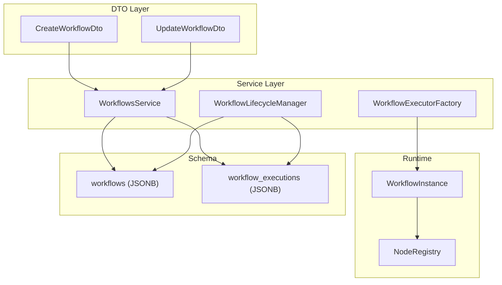
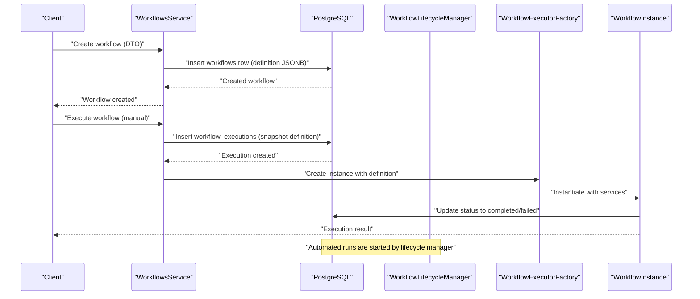
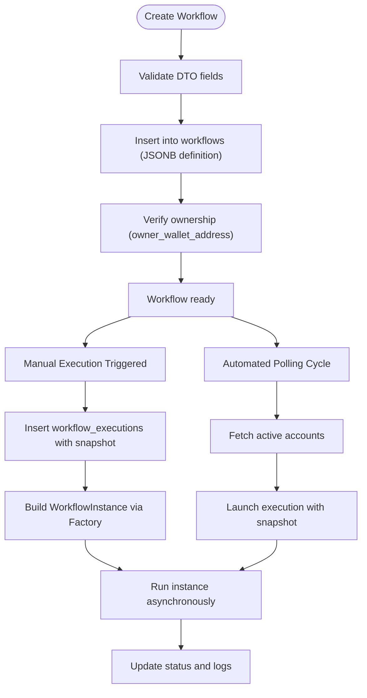
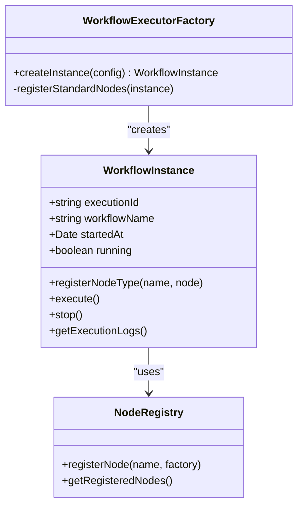
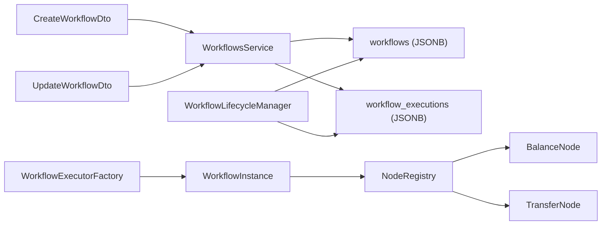

# Workflow Definition and Management

<cite>
**Referenced Files in This Document**
- [create-workflow.dto.ts](file://src/workflows/dto/create-workflow.dto.ts)
- [update-workflow.dto.ts](file://src/workflows/dto/update-workflow.dto.ts)
- [workflows.service.ts](file://src/workflows/workflows.service.ts)
- [workflow-lifecycle.service.ts](file://src/workflows/workflow-lifecycle.service.ts)
- [workflow-executor.factory.ts](file://src/workflows/workflow-executor.factory.ts)
- [workflow-instance.ts](file://src/workflows/workflow-instance.ts)
- [workflow-types.ts](file://src/web3/workflow-types.ts)
- [node-registry.ts](file://src/web3/nodes/node-registry.ts)
- [balance.node.ts](file://src/web3/nodes/balance.node.ts)
- [transfer.node.ts](file://src/web3/nodes/transfer.node.ts)
- [initial-1.sql](file://src/database/schema/initial-1.sql)
</cite>

## Table of Contents
1. [Introduction](#introduction)
2. [Project Structure](#project-structure)
3. [Core Components](#core-components)
4. [Architecture Overview](#architecture-overview)
5. [Detailed Component Analysis](#detailed-component-analysis)
6. [Dependency Analysis](#dependency-analysis)
7. [Performance Considerations](#performance-considerations)
8. [Troubleshooting Guide](#troubleshooting-guide)
9. [Conclusion](#conclusion)
10. [Appendices](#appendices)

## Introduction
This document explains how workflows are defined, validated, stored, executed, and managed in the backend. It focuses on the JSONB storage format for workflow definitions, the DTO validation schemas for creation and updates, the lifecycle from creation to execution, ownership and permissions, storage schema and indexing strategies, query patterns, and best practices for designing reusable workflow templates. Versioning, backward compatibility, and migration strategies for schema changes are also covered.

## Project Structure
The workflow system spans several modules:
- DTOs define validation rules for creating and updating workflows.
- Services handle persistence, execution orchestration, and lifecycle management.
- Types define the JSONB schema for workflow definitions and node contracts.
- Node registry and node implementations provide executable building blocks.
- Database schema defines tables and JSONB fields for storing workflows and executions.

**Diagram sources**
- [create-workflow.dto.ts:1-63](file://src/workflows/dto/create-workflow.dto.ts#L1-L63)
- [update-workflow.dto.ts:1-44](file://src/workflows/dto/update-workflow.dto.ts#L1-L44)
- [workflows.service.ts:1-216](file://src/workflows/workflows.service.ts#L1-L216)
- [workflow-lifecycle.service.ts:1-343](file://src/workflows/workflow-lifecycle.service.ts#L1-L343)
- [workflow-executor.factory.ts:1-42](file://src/workflows/workflow-executor.factory.ts#L1-L42)
- [workflow-instance.ts:1-314](file://src/workflows/workflow-instance.ts#L1-L314)
- [node-registry.ts:1-47](file://src/web3/nodes/node-registry.ts#L1-L47)
- [initial-1.sql:140-153](file://src/database/schema/initial-1.sql#L140-L153)
- [initial-1.sql:117-139](file://src/database/schema/initial-1.sql#L117-L139)

**Section sources**
- [create-workflow.dto.ts:1-63](file://src/workflows/dto/create-workflow.dto.ts#L1-L63)
- [update-workflow.dto.ts:1-44](file://src/workflows/dto/update-workflow.dto.ts#L1-L44)
- [workflows.service.ts:1-216](file://src/workflows/workflows.service.ts#L1-L216)
- [workflow-lifecycle.service.ts:1-343](file://src/workflows/workflow-lifecycle.service.ts#L1-L343)
- [workflow-executor.factory.ts:1-42](file://src/workflows/workflow-executor.factory.ts#L1-L42)
- [workflow-instance.ts:1-314](file://src/workflows/workflow-instance.ts#L1-L314)
- [node-registry.ts:1-47](file://src/web3/nodes/node-registry.ts#L1-L47)
- [initial-1.sql:117-153](file://src/database/schema/initial-1.sql#L117-L153)

## Core Components
- CreateWorkflowDto and UpdateWorkflowDto define validation rules for workflow creation and updates, including required fields, optional fields, and JSONB definition shape expectations.
- WorkflowsService persists workflows and orchestrates manual executions, enforcing ownership checks and preventing concurrent runs.
- WorkflowLifecycleManager periodically discovers active accounts and launches automated workflow executions.
- WorkflowExecutorFactory constructs WorkflowInstance with registered nodes and injects runtime services.
- WorkflowInstance executes the workflow graph, manages notifications, and records execution logs.
- WorkflowDefinition types describe the JSONB structure for nodes, connections, and parameters.

**Section sources**
- [create-workflow.dto.ts:1-63](file://src/workflows/dto/create-workflow.dto.ts#L1-L63)
- [update-workflow.dto.ts:1-44](file://src/workflows/dto/update-workflow.dto.ts#L1-L44)
- [workflows.service.ts:60-81](file://src/workflows/workflows.service.ts#L60-L81)
- [workflow-lifecycle.service.ts:70-117](file://src/workflows/workflow-lifecycle.service.ts#L70-L117)
- [workflow-executor.factory.ts:17-34](file://src/workflows/workflow-executor.factory.ts#L17-L34)
- [workflow-instance.ts:94-151](file://src/workflows/workflow-instance.ts#L94-L151)
- [workflow-types.ts:82-91](file://src/web3/workflow-types.ts#L82-L91)

## Architecture Overview
The system stores workflow definitions as JSONB in the workflows table and snapshots the definition into workflow_executions during execution. Ownership is enforced via owner_wallet_address. Lifecycle management polls active accounts and starts executions, while manual execution is triggered by clients.

**Diagram sources**
- [workflows.service.ts:60-81](file://src/workflows/workflows.service.ts#L60-L81)
- [workflows.service.ts:83-214](file://src/workflows/workflows.service.ts#L83-L214)
- [workflow-lifecycle.service.ts:238-341](file://src/workflows/workflow-lifecycle.service.ts#L238-L341)
- [workflow-executor.factory.ts:17-34](file://src/workflows/workflow-executor.factory.ts#L17-L34)
- [workflow-instance.ts:94-151](file://src/workflows/workflow-instance.ts#L94-L151)
- [initial-1.sql:140-153](file://src/database/schema/initial-1.sql#L140-L153)
- [initial-1.sql:117-139](file://src/database/schema/initial-1.sql#L117-L139)

## Detailed Component Analysis

### Validation Schemas: CreateWorkflowDto and UpdateWorkflowDto
- CreateWorkflowDto enforces:
  - name: required string
  - description: optional string
  - definition: required JSON object (JSONB-compatible)
  - isActive: optional boolean (default applied at service level)
  - telegramChatId: optional string
- UpdateWorkflowDto enforces:
  - name, description, definition, isActive, telegramChatId as optional fields

Validation ensures that the workflow definition is a JSON object suitable for storage in a JSONB column and supports partial updates.

**Section sources**
- [create-workflow.dto.ts:4-62](file://src/workflows/dto/create-workflow.dto.ts#L4-L62)
- [update-workflow.dto.ts:4-42](file://src/workflows/dto/update-workflow.dto.ts#L4-L42)

### Workflow Storage Schema and Indexing Strategies
- workflows table:
  - id: primary key
  - owner_wallet_address: foreign key to users
  - name, description: text
  - definition: JSONB (required)
  - canvas_id: optional foreign key to canvases
  - is_public: boolean
  - created_at, updated_at: timestamps
- workflow_executions table:
  - id: primary key
  - workflow_id: foreign key to workflows
  - account_id: optional foreign key to accounts
  - owner_wallet_address: text
  - status: enum-like constraint
  - trigger_type: enum-like constraint
  - started_at, completed_at: timestamps
  - execution_data: JSONB
  - error_message, error_stack: text
  - telegram_notified, telegram_notification_sent_at, telegram_message_id: notification metadata
  - metadata: JSONB
  - definition_snapshot: JSONB snapshot of the workflow definition at execution time

Recommended indexing strategies for performance:
- Primary keys are indexed by default.
- Add GIN index on workflows.definition for filtering by nested fields (e.g., node types, parameters).
- Consider GIN index on workflow_executions.execution_data and definition_snapshot for analytics and debugging.
- Add B-tree or GIN index on workflow_executions.status and workflow_executions.workflow_id for frequent queries.
- Add GIN index on workflow_executions.metadata for tag-based filtering.

**Section sources**
- [initial-1.sql:140-153](file://src/database/schema/initial-1.sql#L140-L153)
- [initial-1.sql:117-139](file://src/database/schema/initial-1.sql#L117-L139)

### Query Patterns for Workflow Definitions and Executions
Common queries include:
- Retrieve a workflow by id and owner_wallet_address for ownership verification.
- Insert a new workflow with definition JSONB.
- Insert a workflow execution with a snapshot of the definition.
- Update execution status and logs atomically.
- List active executions per workflow/account/status.

These patterns are visible in the service methods that perform inserts, selects, and updates against the workflows and workflow_executions tables.

**Section sources**
- [workflows.service.ts:45-58](file://src/workflows/workflows.service.ts#L45-L58)
- [workflows.service.ts:64-80](file://src/workflows/workflows.service.ts#L64-L80)
- [workflows.service.ts:109-123](file://src/workflows/workflows.service.ts#L109-L123)
- [workflows.service.ts:177-208](file://src/workflows/workflows.service.ts#L177-L208)

### Workflow Lifecycle: Creation to Execution
- Creation:
  - Owner submits CreateWorkflowDto.
  - Service inserts a row into workflows with definition as JSONB.
  - Ownership is enforced by requiring owner_wallet_address to match the requester’s wallet.
- Manual execution:
  - Service validates existence and ownership, prevents concurrent runs, and creates a workflow_executions record with a definition_snapshot.
  - Factory builds a WorkflowInstance and executes asynchronously, updating status and logs upon completion.
- Automated execution:
  - Lifecycle manager periodically syncs active accounts, checks balances, creates execution records, and runs WorkflowInstance asynchronously.

**Diagram sources**
- [workflows.service.ts:60-81](file://src/workflows/workflows.service.ts#L60-L81)
- [workflows.service.ts:83-214](file://src/workflows/workflows.service.ts#L83-L214)
- [workflow-lifecycle.service.ts:70-117](file://src/workflows/workflow-lifecycle.service.ts#L70-L117)
- [workflow-lifecycle.service.ts:238-341](file://src/workflows/workflow-lifecycle.service.ts#L238-L341)

**Section sources**
- [workflows.service.ts:60-81](file://src/workflows/workflows.service.ts#L60-L81)
- [workflows.service.ts:83-214](file://src/workflows/workflows.service.ts#L83-L214)
- [workflow-lifecycle.service.ts:70-117](file://src/workflows/workflow-lifecycle.service.ts#L70-L117)
- [workflow-lifecycle.service.ts:238-341](file://src/workflows/workflow-lifecycle.service.ts#L238-L341)

### Permission Checks and Ownership Verification
- Ownership verification:
  - Queries filter workflows by id and owner_wallet_address to ensure only the owner can execute or manage a workflow.
- Concurrent execution protection:
  - Service tracks inflight execution keys per workflowId:walletAddress:accountId to prevent overlapping runs.
- Automated run guardrails:
  - Lifecycle manager checks minimum SOL balance before launching executions for accounts using Crossmint wallets.

**Section sources**
- [workflows.service.ts:45-58](file://src/workflows/workflows.service.ts#L45-L58)
- [workflows.service.ts:16-18](file://src/workflows/workflows.service.ts#L16-L18)
- [workflows.service.ts:89-107](file://src/workflows/workflows.service.ts#L89-L107)
- [workflow-lifecycle.service.ts:216-229](file://src/workflows/workflow-lifecycle.service.ts#L216-L229)

### Execution Engine: WorkflowInstance and Node Registry
- WorkflowInstance:
  - Executes the workflow graph by traversing nodes, resolving inputs from previous nodes, and invoking node types.
  - Manages execution logs, notifications, and abort signals.
- Node Registry:
  - Central registry of node types; nodes are registered by name and instantiated at runtime.
- Example nodes:
  - BalanceNode: queries SOL or SPL token balances and optionally enforces conditions.
  - TransferNode: transfers SOL or SPL tokens using Crossmint custodial wallets.

**Diagram sources**
- [workflow-instance.ts:33-75](file://src/workflows/workflow-instance.ts#L33-L75)
- [workflow-instance.ts:94-151](file://src/workflows/workflow-instance.ts#L94-L151)
- [workflow-executor.factory.ts:17-34](file://src/workflows/workflow-executor.factory.ts#L17-L34)
- [node-registry.ts:19-21](file://src/web3/nodes/node-registry.ts#L19-L21)

**Section sources**
- [workflow-instance.ts:33-151](file://src/workflows/workflow-instance.ts#L33-L151)
- [workflow-executor.factory.ts:17-40](file://src/workflows/workflow-executor.factory.ts#L17-L40)
- [node-registry.ts:23-47](file://src/web3/nodes/node-registry.ts#L23-L47)
- [balance.node.ts:15-66](file://src/web3/nodes/balance.node.ts#L15-L66)
- [transfer.node.ts:15-58](file://src/web3/nodes/transfer.node.ts#L15-L58)

### Practical Examples and Best Practices
- Creating a workflow:
  - Prepare a definition JSONB with nodes and connections.
  - Submit CreateWorkflowDto with name, optional description, and the definition.
  - Store and snapshot the definition for reproducible executions.
- Modifying a workflow:
  - Use UpdateWorkflowDto to change name, description, or definition.
  - Keep node ids stable to preserve execution continuity.
- Designing reusable templates:
  - Use parameters consistently across nodes.
  - Prefer explicit node types and clear node names.
  - Keep connections minimal and deterministic.
- Notifications:
  - Optionally enable telegramNotify per node or globally via node descriptions.
- Security and permissions:
  - Always verify owner_wallet_address on reads and writes.
  - Avoid exposing internal execution internals outside the system.

[No sources needed since this section provides general guidance]

### Versioning, Backward Compatibility, and Migration Strategies
- Versioning:
  - Node types include a version field in their description; this enables future version-aware execution.
- Backward compatibility:
  - When changing workflow definition structure, maintain a stable subset of fields and introduce optional fields.
  - Use JSONB schema validation or application-level checks to detect incompatible changes.
- Migration strategies:
  - Introduce a new workflows.version column or embed version info inside definition.
  - Provide a migration job that updates older definitions to newer schema versions.
  - Maintain a compatibility layer in WorkflowInstance to interpret legacy definitions.

[No sources needed since this section provides general guidance]

## Dependency Analysis
The following diagram shows key dependencies among components involved in workflow creation, execution, and lifecycle management.

**Diagram sources**
- [create-workflow.dto.ts:1-63](file://src/workflows/dto/create-workflow.dto.ts#L1-L63)
- [update-workflow.dto.ts:1-44](file://src/workflows/dto/update-workflow.dto.ts#L1-L44)
- [workflows.service.ts:1-216](file://src/workflows/workflows.service.ts#L1-L216)
- [workflow-lifecycle.service.ts:1-343](file://src/workflows/workflow-lifecycle.service.ts#L1-L343)
- [workflow-executor.factory.ts:1-42](file://src/workflows/workflow-executor.factory.ts#L1-L42)
- [workflow-instance.ts:1-314](file://src/workflows/workflow-instance.ts#L1-L314)
- [node-registry.ts:1-47](file://src/web3/nodes/node-registry.ts#L1-L47)
- [balance.node.ts:1-196](file://src/web3/nodes/balance.node.ts#L1-L196)
- [transfer.node.ts:1-199](file://src/web3/nodes/transfer.node.ts#L1-L199)
- [initial-1.sql:140-153](file://src/database/schema/initial-1.sql#L140-L153)
- [initial-1.sql:117-139](file://src/database/schema/initial-1.sql#L117-L139)

**Section sources**
- [workflows.service.ts:1-216](file://src/workflows/workflows.service.ts#L1-L216)
- [workflow-lifecycle.service.ts:1-343](file://src/workflows/workflow-lifecycle.service.ts#L1-L343)
- [workflow-executor.factory.ts:1-42](file://src/workflows/workflow-executor.factory.ts#L1-L42)
- [workflow-instance.ts:1-314](file://src/workflows/workflow-instance.ts#L1-L314)
- [node-registry.ts:1-47](file://src/web3/nodes/node-registry.ts#L1-L47)
- [initial-1.sql:117-153](file://src/database/schema/initial-1.sql#L117-L153)

## Performance Considerations
- JSONB indexing:
  - Add GIN indexes on frequently queried JSONB fields (definition, execution_data, metadata).
- Query selectivity:
  - Filter by owner_wallet_address and workflow_id to reduce scans.
- Concurrency control:
  - Use inflight execution keys to avoid duplicate runs and reduce contention.
- Asynchronous execution:
  - Offload long-running work to background tasks and update statuses atomically.

[No sources needed since this section provides general guidance]

## Troubleshooting Guide
- Workflow not found:
  - Verify owner_wallet_address matches the requester and that the workflow exists.
- Concurrent execution errors:
  - Check inflight execution keys and existing running executions before starting a new run.
- Execution stuck:
  - Inspect workflow_executions status and logs; confirm asynchronous completion handlers ran.
- Node failures:
  - Review execution logs and node-specific error messages captured in execution_data.

**Section sources**
- [workflows.service.ts:45-58](file://src/workflows/workflows.service.ts#L45-L58)
- [workflows.service.ts:89-107](file://src/workflows/workflows.service.ts#L89-L107)
- [workflows.service.ts:177-208](file://src/workflows/workflows.service.ts#L177-L208)
- [workflow-lifecycle.service.ts:300-340](file://src/workflows/workflow-lifecycle.service.ts#L300-L340)

## Conclusion
The workflow system leverages JSONB for flexible, schema-less definition storage, validated by DTOs and enforced by ownership checks. Executions are persisted with snapshots for auditability, and lifecycle management automates runs with guardrails. By adopting recommended indexing strategies, versioning approaches, and best practices for template design, teams can build robust, reusable, and maintainable workflows.

[No sources needed since this section summarizes without analyzing specific files]

## Appendices

### Appendix A: Workflow Definition JSONB Schema Overview
- nodes: array of nodes with id, name, type, parameters, optional position and telegramNotify flag.
- connections: object keyed by source node id; each entry contains a main array of connection groups; each group contains connection entries with node, type, and index.

**Section sources**
- [workflow-types.ts:82-91](file://src/web3/workflow-types.ts#L82-L91)

### Appendix B: Example Node Types
- BalanceNode: queries balances and optionally enforces thresholds.
- TransferNode: performs transfers using Crossmint wallets.

**Section sources**
- [balance.node.ts:68-194](file://src/web3/nodes/balance.node.ts#L68-L194)
- [transfer.node.ts:60-196](file://src/web3/nodes/transfer.node.ts#L60-L196)