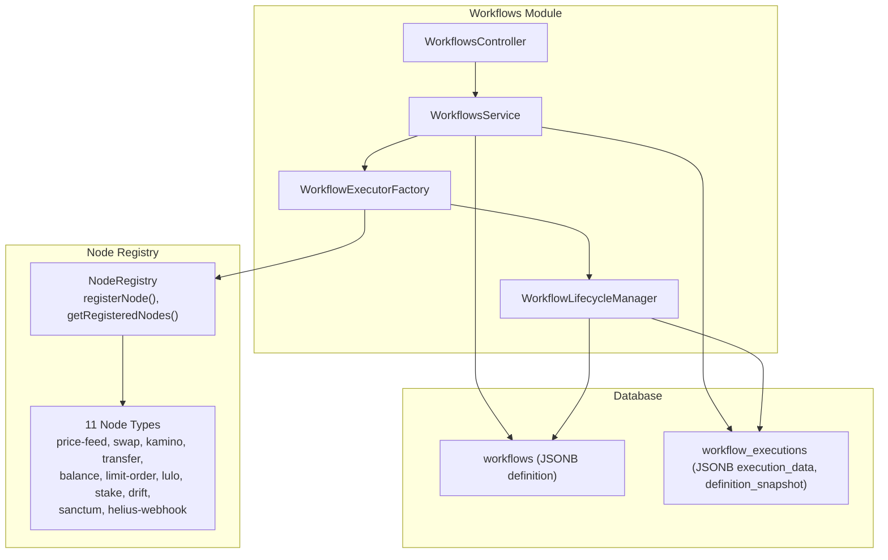
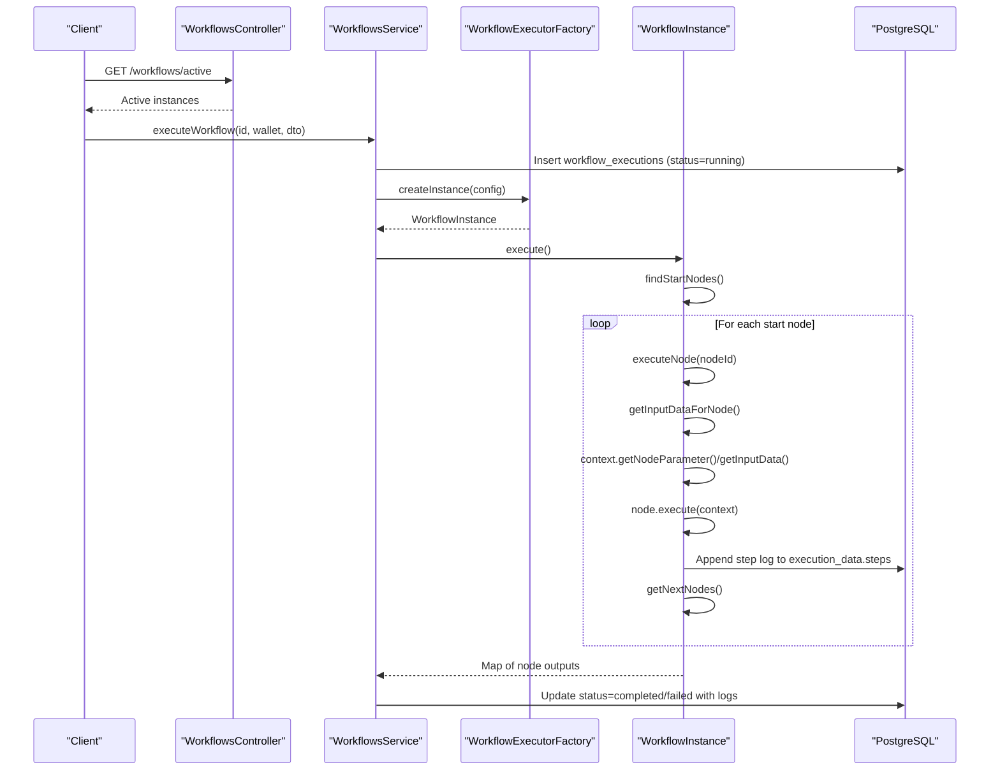
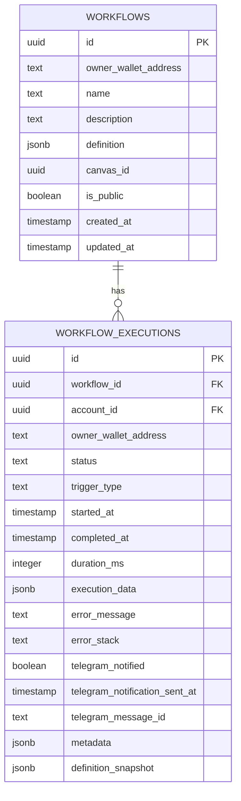
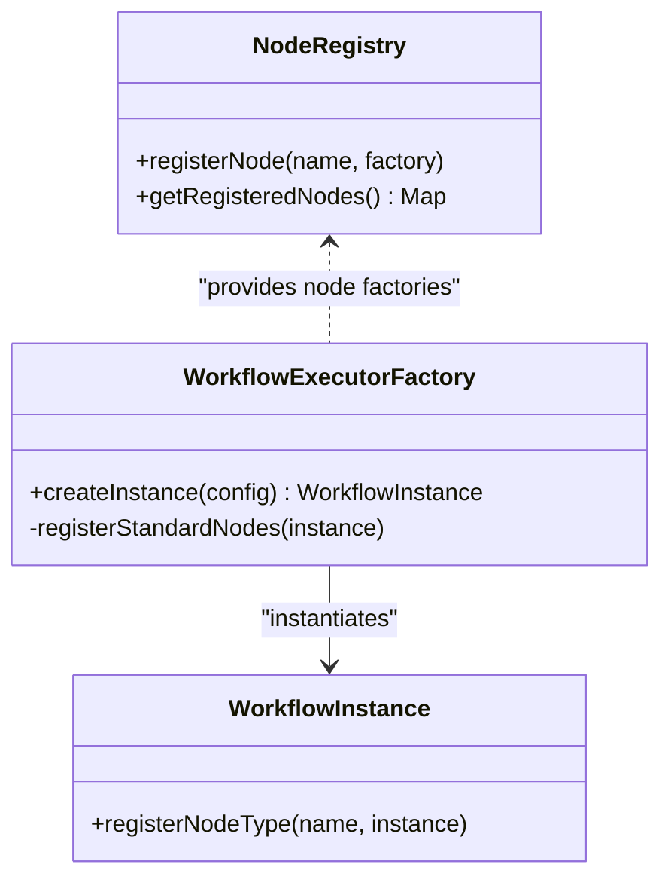
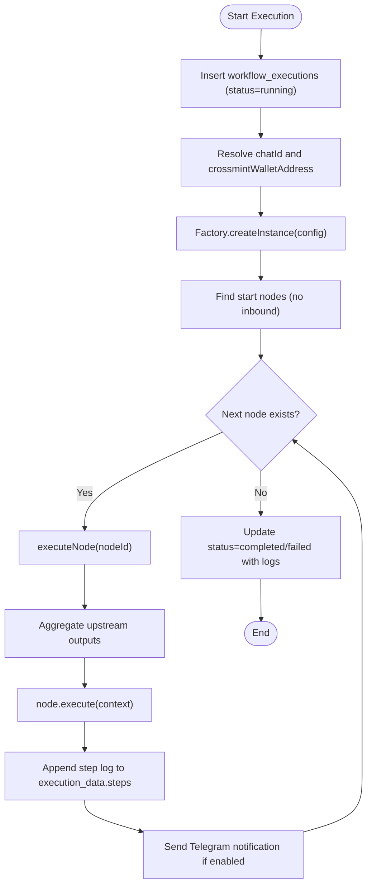
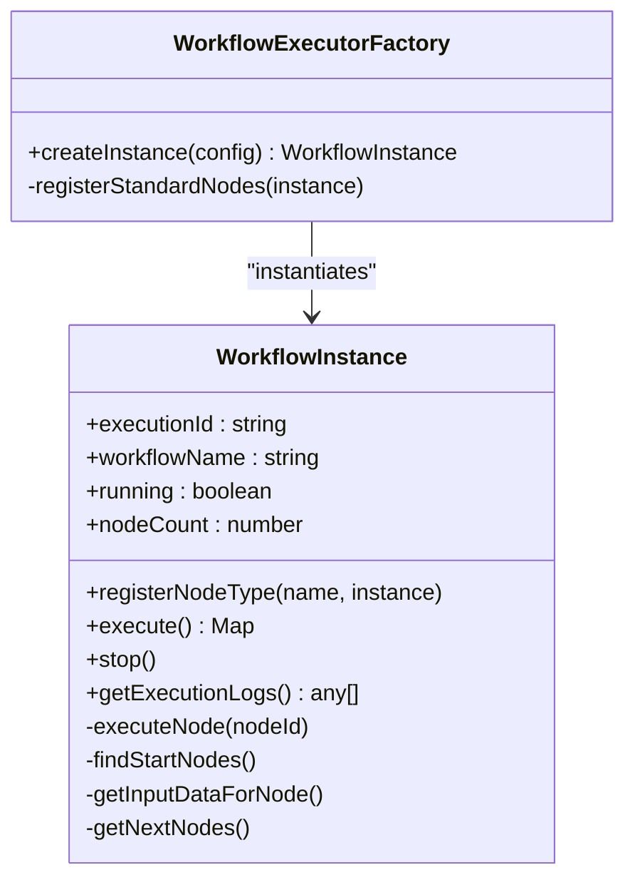
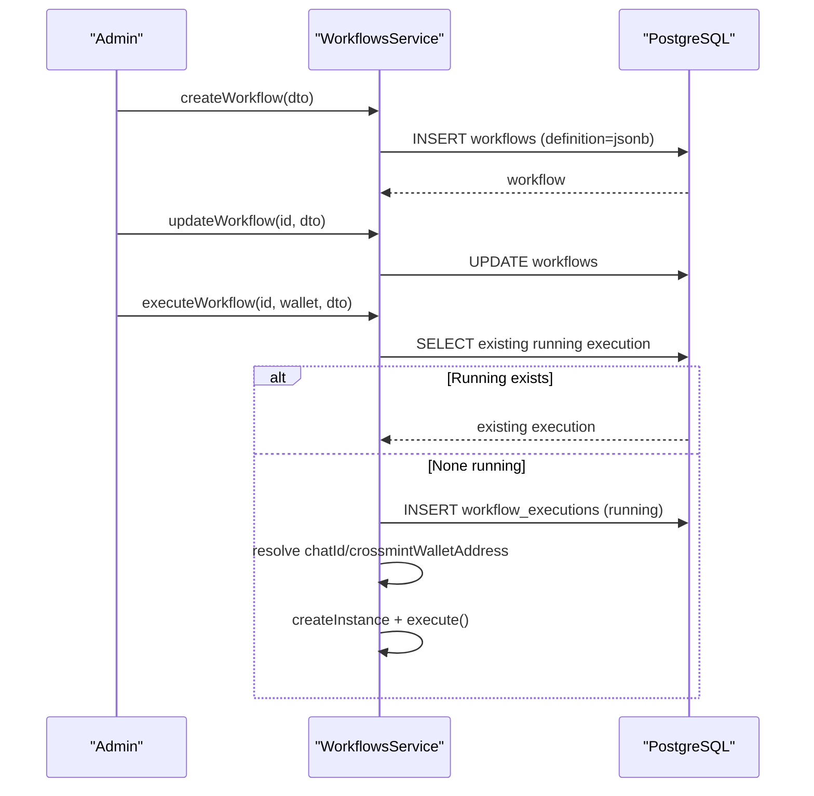
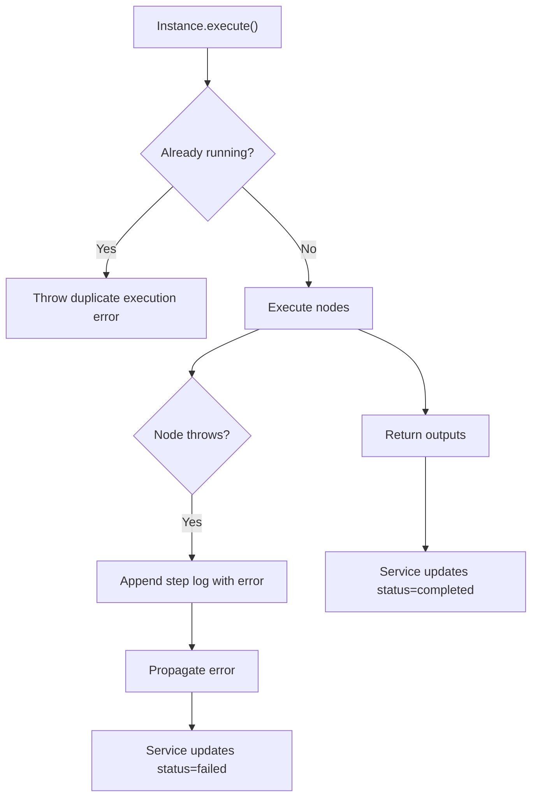
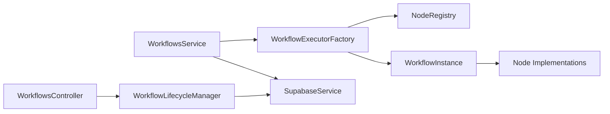

# Workflow Engine

<cite>
**Referenced Files in This Document**
- [workflow-executor.factory.ts](file://src/workflows/workflow-executor.factory.ts)
- [workflow-instance.ts](file://src/workflows/workflow-instance.ts)
- [workflows.service.ts](file://src/workflows/workflows.service.ts)
- [workflows.controller.ts](file://src/workflows/workflows.controller.ts)
- [workflow-lifecycle.service.ts](file://src/workflows/workflow-lifecycle.service.ts)
- [workflows.module.ts](file://src/workflows/workflows.module.ts)
- [create-workflow.dto.ts](file://src/workflows/dto/create-workflow.dto.ts)
- [update-workflow.dto.ts](file://src/workflows/dto/update-workflow.dto.ts)
- [execute-workflow.dto.ts](file://src/workflows/dto/execute-workflow.dto.ts)
- [node-registry.ts](file://src/web3/nodes/node-registry.ts)
- [workflow-types.ts](file://src/web3/workflow-types.ts)
- [price-feed.node.ts](file://src/web3/nodes/price-feed.node.ts)
- [swap.node.ts](file://src/web3/nodes/swap.node.ts)
- [initial-1.sql](file://src/database/schema/initial-1.sql)
- [20260129000000_update_schema_v2.sql](file://supabase/migrations/20260129000000_update_schema_v2.sql)
</cite>

## Table of Contents
1. [Introduction](#introduction)
2. [Project Structure](#project-structure)
3. [Core Components](#core-components)
4. [Architecture Overview](#architecture-overview)
5. [Detailed Component Analysis](#detailed-component-analysis)
6. [Dependency Analysis](#dependency-analysis)
7. [Performance Considerations](#performance-considerations)
8. [Troubleshooting Guide](#troubleshooting-guide)
9. [Conclusion](#conclusion)
10. [Appendices](#appendices)

## Introduction
This document explains the workflow engine’s visual workflow builder and execution system. It covers:
- The workflow definition format stored as JSONB in PostgreSQL
- The node registry system managing 11 workflow node types
- The execution lifecycle from creation to completion
- The workflow-executor.factory for creating isolated execution instances
- The workflow-instance for handling individual execution tracking
- The three workflow DTOs for validation
- Implementation of workflow CRUD operations, execution scheduling, error handling and retry logic, and state management
- Practical examples of workflow creation, node configuration, execution monitoring, and troubleshooting failed executions
- Performance considerations, scalability patterns, and best practices for complex workflow design
- Guidance on workflow debugging, execution analytics, and optimization strategies

## Project Structure
The workflow engine is organized around a NestJS module with clear separation of concerns:
- Workflows module orchestrates controllers, services, factories, and lifecycle managers
- Node registry centralizes node registration and discovery
- Types define the shared interfaces for nodes, contexts, and workflow definitions
- PostgreSQL schema stores workflows and executions as JSONB documents with relational metadata

**Diagram sources**
- [workflows.module.ts:10-16](file://src/workflows/workflows.module.ts#L10-L16)
- [workflows.controller.ts:7-27](file://src/workflows/workflows.controller.ts#L7-L27)
- [workflows.service.ts:7-12](file://src/workflows/workflows.service.ts#L7-L12)
- [workflow-executor.factory.ts:8-41](file://src/workflows/workflow-executor.factory.ts#L8-L41)
- [workflow-lifecycle.service.ts:11-23](file://src/workflows/workflow-lifecycle.service.ts#L11-L23)
- [node-registry.ts:7-47](file://src/web3/nodes/node-registry.ts#L7-L47)
- [initial-1.sql:117-153](file://src/database/schema/initial-1.sql#L117-L153)

**Section sources**
- [workflows.module.ts:10-16](file://src/workflows/workflows.module.ts#L10-L16)
- [initial-1.sql:117-153](file://src/database/schema/initial-1.sql#L117-L153)

## Core Components
- WorkflowExecutorFactory: Creates isolated WorkflowInstance with registered node types and injected services
- WorkflowInstance: Executes a single workflow instance, manages logs, notifications, and node execution graph
- WorkflowsService: Handles CRUD and execution orchestration, deduplicates concurrent runs, persists execution state
- WorkflowLifecycleManager: Polls active accounts, launches auto-triggered workflows, monitors balances, and cleans up instances
- Node Registry: Central registry for 11 node types; new nodes are registered here
- Workflow Types: Shared interfaces for nodes, execution context, and workflow definitions
- DTOs: Validation for create, update, and execute requests

**Section sources**
- [workflow-executor.factory.ts:8-41](file://src/workflows/workflow-executor.factory.ts#L8-L41)
- [workflow-instance.ts:33-75](file://src/workflows/workflow-instance.ts#L33-L75)
- [workflows.service.ts:7-12](file://src/workflows/workflows.service.ts#L7-L12)
- [workflow-lifecycle.service.ts:11-23](file://src/workflows/workflow-lifecycle.service.ts#L11-L23)
- [node-registry.ts:7-47](file://src/web3/nodes/node-registry.ts#L7-L47)
- [workflow-types.ts:4-91](file://src/web3/workflow-types.ts#L4-L91)
- [create-workflow.dto.ts:4-63](file://src/workflows/dto/create-workflow.dto.ts#L4-L63)
- [update-workflow.dto.ts:4-44](file://src/workflows/dto/update-workflow.dto.ts#L4-L44)
- [execute-workflow.dto.ts:5-27](file://src/workflows/dto/execute-workflow.dto.ts#L5-L27)

## Architecture Overview
The engine executes workflows as directed acyclic graphs (DAGs) defined in JSONB. Each node is a pluggable component implementing a common interface. Execution proceeds from “start” nodes (no inbound connections) to downstream nodes, aggregating input data from upstream outputs.

**Diagram sources**
- [workflows.controller.ts:11-26](file://src/workflows/workflows.controller.ts#L11-L26)
- [workflows.service.ts:83-214](file://src/workflows/workflows.service.ts#L83-L214)
- [workflow-executor.factory.ts:17-34](file://src/workflows/workflow-executor.factory.ts#L17-L34)
- [workflow-instance.ts:94-151](file://src/workflows/workflow-instance.ts#L94-L151)
- [initial-1.sql:117-139](file://src/database/schema/initial-1.sql#L117-L139)

## Detailed Component Analysis

### Workflow Definition Format (JSONB in PostgreSQL)
- Workflows table stores definition as JSONB, enabling flexible DAG structures
- WorkflowExecutions table stores execution_data as JSONB with steps and summary, plus definition_snapshot for historical replay
- Schema v2 adds indexes for owner and workflow_id, and allows nullable account_id for system workflows

**Diagram sources**
- [initial-1.sql:140-153](file://src/database/schema/initial-1.sql#L140-L153)
- [initial-1.sql:117-139](file://src/database/schema/initial-1.sql#L117-L139)
- [20260129000000_update_schema_v2.sql:18-39](file://supabase/migrations/20260129000000_update_schema_v2.sql#L18-L39)

**Section sources**
- [initial-1.sql:140-153](file://src/database/schema/initial-1.sql#L140-L153)
- [initial-1.sql:117-139](file://src/database/schema/initial-1.sql#L117-L139)
- [20260129000000_update_schema_v2.sql:18-39](file://supabase/migrations/20260129000000_update_schema_v2.sql#L18-L39)

### Node Registry System (11 Node Types)
- Central registry exposes registerNode and getRegisteredNodes
- Automatically registers 11 node types during import
- Factory injects all registered nodes into each WorkflowInstance

**Diagram sources**
- [node-registry.ts:7-47](file://src/web3/nodes/node-registry.ts#L7-L47)
- [workflow-executor.factory.ts:36-40](file://src/workflows/workflow-executor.factory.ts#L36-L40)
- [workflow-instance.ts:87-89](file://src/workflows/workflow-instance.ts#L87-L89)

**Section sources**
- [node-registry.ts:7-47](file://src/web3/nodes/node-registry.ts#L7-L47)
- [workflow-executor.factory.ts:36-40](file://src/workflows/workflow-executor.factory.ts#L36-L40)
- [workflow-instance.ts:87-89](file://src/workflows/workflow-instance.ts#L87-L89)

### Execution Lifecycle: From Creation to Completion
- Manual execution: controller triggers service, which creates a running execution record, resolves Telegram chat and optional Crossmint wallet, builds instance, and fires async execution
- Auto execution: lifecycle manager polls active accounts, checks minimum SOL balance, creates execution records, and launches instances
- Instance execution: finds start nodes, executes each node with input aggregation, collects logs, sends Telegram notifications per node or workflow, and updates execution status

**Diagram sources**
- [workflows.service.ts:109-214](file://src/workflows/workflows.service.ts#L109-L214)
- [workflow-lifecycle.service.ts:258-341](file://src/workflows/workflow-lifecycle.service.ts#L258-L341)
- [workflow-instance.ts:162-258](file://src/workflows/workflow-instance.ts#L162-L258)
- [initial-1.sql:117-139](file://src/database/schema/initial-1.sql#L117-L139)

**Section sources**
- [workflows.service.ts:83-214](file://src/workflows/workflows.service.ts#L83-L214)
- [workflow-lifecycle.service.ts:70-341](file://src/workflows/workflow-lifecycle.service.ts#L70-L341)
- [workflow-instance.ts:94-151](file://src/workflows/workflow-instance.ts#L94-L151)

### WorkflowExecutorFactory and WorkflowInstance
- Factory constructs WorkflowInstance with injected services and registers all node types
- Instance encapsulates execution state, logs, and execution graph traversal
- Context supports parameter injection, input data retrieval, and abort signals

**Diagram sources**
- [workflow-executor.factory.ts:17-34](file://src/workflows/workflow-executor.factory.ts#L17-L34)
- [workflow-instance.ts:33-314](file://src/workflows/workflow-instance.ts#L33-L314)

**Section sources**
- [workflow-executor.factory.ts:17-34](file://src/workflows/workflow-executor.factory.ts#L17-L34)
- [workflow-instance.ts:33-314](file://src/workflows/workflow-instance.ts#L33-L314)

### Workflow CRUD Operations and Scheduling
- Create: Inserts workflow with owner wallet address, name, description, and JSONB definition
- Update: Allows partial updates to name, description, definition, activity flag, and Telegram chat ID
- Execute: Deduplicates concurrent runs per workflow/wallet/account, creates execution record, resolves context, and starts async execution
- Schedule: Lifecycle manager periodically polls active accounts and auto-starts workflows for eligible accounts

**Diagram sources**
- [workflows.service.ts:60-81](file://src/workflows/workflows.service.ts#L60-L81)
- [workflows.service.ts:83-214](file://src/workflows/workflows.service.ts#L83-L214)
- [workflow-lifecycle.service.ts:70-117](file://src/workflows/workflow-lifecycle.service.ts#L70-L117)

**Section sources**
- [workflows.service.ts:60-81](file://src/workflows/workflows.service.ts#L60-L81)
- [workflows.service.ts:83-214](file://src/workflows/workflows.service.ts#L83-L214)
- [workflow-lifecycle.service.ts:70-117](file://src/workflows/workflow-lifecycle.service.ts#L70-L117)

### Error Handling and Retry Logic
- Instance throws on duplicate execution and aborts on stop; node failures are captured with step logs and surfaced to the execution record
- Service wraps execution in try/catch, updating status to failed with error messages and logs
- Lifecycle manager cleans up instances after completion/failure and continues polling

**Diagram sources**
- [workflow-instance.ts:94-151](file://src/workflows/workflow-instance.ts#L94-L151)
- [workflows.service.ts:171-211](file://src/workflows/workflows.service.ts#L171-L211)

**Section sources**
- [workflow-instance.ts:94-151](file://src/workflows/workflow-instance.ts#L94-L151)
- [workflows.service.ts:171-211](file://src/workflows/workflows.service.ts#L171-L211)

### State Management Throughout Execution
- Execution record transitions: pending → running → completed or failed
- Execution data includes steps array with per-node logs and a summary
- Definition snapshot preserved for historical replay and auditing

**Section sources**
- [initial-1.sql:117-139](file://src/database/schema/initial-1.sql#L117-L139)
- [workflows.service.ts:176-207](file://src/workflows/workflows.service.ts#L176-L207)
- [workflow-lifecycle.service.ts:304-333](file://src/workflows/workflow-lifecycle.service.ts#L304-L333)

### Practical Examples

#### Example 1: Creating a Workflow with a Price Trigger and Swap
- Define a workflow with two nodes:
  - pythPriceFeed: monitors SOL price and triggers when condition met
  - jupiterSwap: swaps tokens using Crossmint custodial wallet
- Store the workflow definition as JSONB in the workflows table
- Use CreateWorkflowDto for validation

**Section sources**
- [create-workflow.dto.ts:20-44](file://src/workflows/dto/create-workflow.dto.ts#L20-L44)
- [price-feed.node.ts:66-131](file://src/web3/nodes/price-feed.node.ts#L66-L131)
- [swap.node.ts:102-207](file://src/web3/nodes/swap.node.ts#L102-L207)

#### Example 2: Executing a Workflow Manually
- Call executeWorkflow with ExecuteWorkflowDto
- The service ensures no concurrent runs, creates a running execution record, resolves Telegram chat and optional Crossmint wallet, and starts asynchronous execution
- Monitor progress via the active instances endpoint

**Section sources**
- [execute-workflow.dto.ts:5-27](file://src/workflows/dto/execute-workflow.dto.ts#L5-L27)
- [workflows.service.ts:83-214](file://src/workflows/workflows.service.ts#L83-L214)
- [workflows.controller.ts:11-26](file://src/workflows/workflows.controller.ts#L11-L26)

#### Example 3: Monitoring Auto-Executed Workflows
- Lifecycle manager periodically polls active accounts, checks minimum SOL balance, and launches workflow instances
- Use the active instances endpoint to inspect running instances

**Section sources**
- [workflow-lifecycle.service.ts:48-117](file://src/workflows/workflow-lifecycle.service.ts#L48-L117)
- [workflows.controller.ts:11-26](file://src/workflows/workflows.controller.ts#L11-L26)

#### Example 4: Troubleshooting a Failed Execution
- Inspect workflow_executions for error_message and execution_data.steps
- Use definition_snapshot to replay the exact DAG at the time of failure
- Check Telegram notifications for node-level alerts

**Section sources**
- [initial-1.sql:117-139](file://src/database/schema/initial-1.sql#L117-L139)
- [workflows.service.ts:194-207](file://src/workflows/workflows.service.ts#L194-L207)
- [workflow-instance.ts:233-243](file://src/workflows/workflow-instance.ts#L233-L243)

## Dependency Analysis
- Controllers depend on lifecycle manager for diagnostics
- Services depend on SupabaseService for persistence and WorkflowExecutorFactory for execution
- Factory depends on node registry and injected services
- Instances depend on node implementations and execution context

**Diagram sources**
- [workflows.controller.ts:9-26](file://src/workflows/workflows.controller.ts#L9-L26)
- [workflows.service.ts:7-12](file://src/workflows/workflows.service.ts#L7-L12)
- [workflow-executor.factory.ts:8-15](file://src/workflows/workflow-executor.factory.ts#L8-L15)
- [node-registry.ts:7-21](file://src/web3/nodes/node-registry.ts#L7-L21)
- [workflow-instance.ts:33-75](file://src/workflows/workflow-instance.ts#L33-L75)

**Section sources**
- [workflows.controller.ts:9-26](file://src/workflows/workflows.controller.ts#L9-L26)
- [workflows.service.ts:7-12](file://src/workflows/workflows.service.ts#L7-L12)
- [workflow-executor.factory.ts:8-15](file://src/workflows/workflow-executor.factory.ts#L8-L15)
- [node-registry.ts:7-21](file://src/web3/nodes/node-registry.ts#L7-L21)
- [workflow-instance.ts:33-75](file://src/workflows/workflow-instance.ts#L33-L75)

## Performance Considerations
- Asynchronous execution: execution is fire-and-forget from API perspective, reducing latency
- Deduplication: inflightExecutionKeys prevent overlapping runs per workflow/wallet/account
- Indexing: schema v2 adds indexes on owner_wallet_address and workflow_id for efficient querying
- Balances: lifecycle manager checks minimum SOL balance before launching to avoid wasted attempts
- Logging granularity: step logs enable targeted performance analysis per node

**Section sources**
- [workflows.service.ts:14-18](file://src/workflows/workflows.service.ts#L14-L18)
- [20260129000000_update_schema_v2.sql:27-39](file://supabase/migrations/20260129000000_update_schema_v2.sql#L27-L39)
- [workflow-lifecycle.service.ts:216-229](file://src/workflows/workflow-lifecycle.service.ts#L216-L229)
- [workflow-instance.ts:215-231](file://src/workflows/workflow-instance.ts#L215-L231)

## Troubleshooting Guide
- Duplicate execution errors: ensure no concurrent runs using the deduplication mechanism
- Node parameter issues: verify parameters passed via context.getNodeParameter and injected services
- Telegram notifications: confirm chat_id mapping and service availability
- Execution logs: inspect execution_data.steps for node-level errors and timestamps
- Auto-execution failures: check SOL balance and account status; review logs and cleanup

**Section sources**
- [workflow-instance.ts:94-151](file://src/workflows/workflow-instance.ts#L94-L151)
- [workflows.service.ts:171-211](file://src/workflows/workflows.service.ts#L171-L211)
- [workflow-lifecycle.service.ts:300-341](file://src/workflows/workflow-lifecycle.service.ts#L300-L341)

## Conclusion
The workflow engine provides a robust, extensible system for building and executing visual workflows. Its JSONB-backed definitions, modular node registry, and lifecycle management enable scalable automation with strong observability and resilience. By leveraging the provided DTOs, controllers, services, and lifecycle manager, teams can design complex workflows while maintaining operational simplicity and performance.

## Appendices

### Workflow DTOs Reference
- CreateWorkflowDto: Validates name, description, definition, optional isActive, and optional telegramChatId
- UpdateWorkflowDto: Validates partial updates to name, description, definition, isActive, and telegramChatId
- ExecuteWorkflowDto: Extends signed request with optional params and accountId

**Section sources**
- [create-workflow.dto.ts:4-63](file://src/workflows/dto/create-workflow.dto.ts#L4-L63)
- [update-workflow.dto.ts:4-44](file://src/workflows/dto/update-workflow.dto.ts#L4-L44)
- [execute-workflow.dto.ts:5-27](file://src/workflows/dto/execute-workflow.dto.ts#L5-L27)

### Node Type Reference
- 11 node types registered: pythPriceFeed, jupiterSwap, kamino, transfer, getBalance, jupiterLimitOrder, luloLend, stakeSOL, driftPerp, sanctumLst, heliusWebhook

**Section sources**
- [node-registry.ts:23-47](file://src/web3/nodes/node-registry.ts#L23-L47)