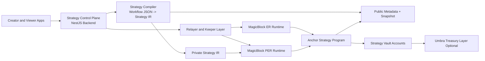

# Strategy Deploy Platform Development Spec

## Document Info

- Project: PinTool Backend Strategy Platform Migration
- Version: `0.1`
- Status: Draft / Implementation Ready
- Scope: Based on current `app-backend` codebase
- Primary goal: Transform the current workflow automation product into a strategy deployment platform where strategy logic is private, deployable, and selectively visible

---

## 1. Executive Summary

This project will transform the current backend from a workflow automation engine into a `strategy control plane + private execution plane`.

The existing system already provides:

- strategy-like graph definitions via workflow JSON
- an execution runtime for node orchestration
- account-level wallet isolation via Crossmint
- persistence for workflows, accounts, executions, and transaction history

The new platform will introduce:

- `Strategy` as the first-class product model
- `public strategy metadata` separate from `private strategy implementation`
- an `Anchor-based strategy state layer`
- `MagicBlock ER` for delegated execution
- `MagicBlock PER` for encrypted/private strategy implementation and state
- optional `Umbra` integration for private treasury balances and selective disclosure

The recommended delivery path is:

1. semantic migration of current workflow concepts into strategy concepts
2. strategy compiler that transforms workflow JSON into public/private IR
3. Anchor program for strategy registry, vault, state, and public snapshots
4. MagicBlock ER integration for execution runtime
5. MagicBlock PER integration for private strategy details
6. optional Umbra treasury privacy layer

---

## 2. Product Goal

### 2.1 Core Product Goal

Allow a creator to:

- define a strategy
- deploy the strategy
- fund the strategy
- execute the strategy using a private execution model
- expose strategy existence and performance publicly
- hide implementation details from non-owners

### 2.2 User Promise

Public users can:

- discover strategies
- view creator identity
- view performance summary
- view risk profile
- subscribe or allocate to a strategy

Public users cannot:

- inspect the full strategy graph
- inspect thresholds or internal rules
- inspect private balances or internal positions
- inspect transaction messages or internal execution logs

Creators can:

- inspect the full private strategy implementation
- inspect private state and balances
- change permissions
- update strategy versions
- revoke access for other roles

---

## 3. Current System Baseline

### 3.1 Existing Assets To Preserve

The current codebase already contains the following reusable platform primitives:

- workflow graph schema in `backend/src/web3/workflow-types.ts`
- runtime graph executor in `backend/src/workflows/workflow-instance.ts`
- workflow lifecycle polling in `backend/src/workflows/workflow-lifecycle.service.ts`
- strategy-like persistence in `backend/src/workflows/workflows.service.ts`
- custodial wallet isolation in `backend/src/crossmint/crossmint.service.ts`
- node registry and node descriptions in `backend/src/web3/nodes/node-registry.ts`
- user/account/execution persistence in `backend/src/database/schema/initial-1.sql`

### 3.2 Existing Limitations

The current system has the following architectural limits:

- workflow definition is both the control object and the execution object
- private and public visibility are not formally separated
- execution logic is mostly off-chain TypeScript runtime logic
- account abstraction is close to a strategy vault, but not modeled as such
- DeFi connectors are action nodes, but not compiled strategy actions
- there is no cryptographically private execution layer

---

## 4. In Scope

### 4.1 Included

- strategy terminology migration in backend models and APIs
- public/private strategy definition split
- strategy compiler service
- Anchor program for core strategy objects
- MagicBlock ER integration
- MagicBlock PER integration for private strategy state
- strategy deploy and run lifecycle
- strategy vault model based on current account model
- public strategy snapshots
- execution logging split between public and private views
- private treasury integration design with Umbra

### 4.2 Excluded From First Delivery

- full migration of all current nodes to on-chain Anchor CPI
- full anonymous mixer flows via Umbra
- complex multi-strategy portfolio netting
- permissionless third-party strategy authoring marketplace economics
- production-grade fee settlement automation across all supported protocols
- full frontend redesign unless needed for MVP flows

---

## 5. Non-Goals

- replacing the entire backend with on-chain logic
- removing Crossmint immediately
- making all DeFi integrations fully trustless in phase 1
- hiding all public signals perfectly at launch
- supporting every existing node as an on-chain instruction in the first release

---

## 6. Target Architecture

## 6.1 High-Level Layers

### A. Strategy Control Plane

Implemented in the existing NestJS backend.

Responsibilities:

- strategy CRUD
- strategy publishing
- strategy versioning
- AI-assisted strategy authoring
- strategy compilation
- public listing and indexing
- creator dashboard
- relayer / keeper orchestration
- authorization and role mapping

### B. Strategy Execution Plane

Implemented using Anchor + MagicBlock ER/PER.

Responsibilities:

- strategy state storage
- vault state storage
- execution cursor management
- permissioned strategy state execution
- risk/guard evaluation
- delegated execution sessions

### C. Privacy Plane

Implemented using MagicBlock PER and optional Umbra.

Responsibilities:

- hide strategy logic and parameters
- hide internal execution state
- hide internal logs and tx messages
- optionally hide treasury balances and private transfers

### D. Public Strategy Surface

Implemented in backend + optional on-chain public snapshot accounts.

Responsibilities:

- strategy discovery
- performance summary
- risk profile
- creator-facing branding and metadata
- delayed or coarse-grained position reporting

---

## 6.2 Architecture Diagram

---

## 7. Core Domain Model

## 7.1 New Product Concepts

### Strategy

The creator-authored deployable logic package.

Contains:

- public metadata
- private definition reference
- compiled IR reference
- execution mode
- visibility mode
- lifecycle state

### Strategy Deployment

A concrete instance of a strategy running for a given creator/vault/account.

Contains:

- strategy id
- vault id
- execution layer
- current state reference
- public snapshot reference
- lifecycle status

### Strategy Vault

The capital container used by the deployed strategy.

Contains:

- owner
- wallet binding or vault account binding
- private or public asset mode
- treasury mode

### Strategy Run

A specific execution attempt or execution cycle of a strategy.

Contains:

- run id
- deployment id
- execution layer
- public outcome
- private outcome ref
- logs and status

### Public Snapshot

The public-facing strategy summary.

Contains:

- status
- APY/PnL summary
- coarse exposure summary
- last executed at
- risk band

---

## 7.2 Public vs Private Data Split

### Public Data

- strategy name
- description
- creator wallet
- tags and category
- fee model
- risk score
- public performance summary
- current status
- coarse TVL / range if allowed

### Private Data

- full graph definition
- thresholds
- route logic
- execution preferences
- internal balances
- internal logs
- tx messages
- private positions
- execution cursor internals

---

## 8. SDK / Protocol Features To Use

## 8.1 MagicBlock Features Required

### ER

- account delegation lifecycle
- Magic Router SDK
- delegated execution routing
- commit and undelegate flow

### PER

- Permission Program
- member flags and group-based permissions
- TEE authorization flow
- private state execution
- private balances/logs/message visibility control

### Private Payments API

- `deposit`
- `transfer`
- `withdraw`
- `balance`
- `private-balance`
- `initialize-mint` if required for private asset setup

## 8.2 Umbra Features Required

### Phase 1 Optional / Phase 2 Preferred

- `getUmbraClient`
- registration in confidential mode
- X25519 key registration
- shared-mode encrypted balances
- encrypted balance query
- direct deposit / withdraw
- compliance grants for selective disclosure

### Not Required In MVP

- full mixer/UTXO anonymous flows
- relayer-based anonymous claim UX
- full anonymous user commitment registration unless specifically needed for a later privacy track

---

## 9. Functional Requirements

## 9.1 Strategy Authoring

The system must allow creators to:

- create a strategy from the current workflow graph model
- save drafts
- validate graph structure
- compile strategy into public/private representations
- publish a strategy

### Acceptance Criteria

- creator can save a valid strategy draft
- compiler produces a `public metadata payload`
- compiler produces a `private definition payload`
- publishing stores strategy with explicit visibility mode

## 9.2 Strategy Deployment

The system must allow creators to:

- create a deployment from a strategy
- bind a vault/account to the deployment
- choose execution mode: `offchain`, `er`, or `per`
- initialize public snapshot state

### Acceptance Criteria

- a deployment record is created
- associated vault/account is linked
- deployment can enter `draft`, `deployed`, `paused`, `stopped`

## 9.3 Private Execution

The system must allow deployed private strategies to:

- store private state in PER-protected execution context
- expose public status without revealing implementation details
- restrict detailed state visibility to creator and authorized roles

### Acceptance Criteria

- non-owner cannot retrieve private definition
- non-owner cannot view private execution state
- creator can retrieve authorized private state via PER auth flow

## 9.4 Public Strategy Listing

The system must expose public strategy listings with:

- strategy metadata
- creator
- risk label
- status
- summary performance

### Acceptance Criteria

- public endpoint returns only public fields
- no private graph or threshold data is returned

## 9.5 Private Treasury

The system should support:

- private deposits into strategy treasury
- private transfers within strategy asset layer
- private balance query for creator

### Acceptance Criteria

- creator can deposit to private balance layer
- creator can see private balance
- public viewers cannot see treasury detail

---

## 10. Technical Design

## 10.1 Backend Refactor Plan

### Existing Backend Modules To Extend

- `workflows` -> evolve into `strategies`
- `agent` -> extend to programmatic strategy deployment
- `workflow-ai` -> evolve into strategy authoring assistant
- `crossmint` -> continue to provision vault wallets where needed
- `web3` -> split into `strategy adapters`, `keepers`, and `protocol connectors`

### New Backend Modules

- `strategies/`
- `strategy-compiler/`
- `strategy-deployments/`
- `strategy-snapshots/`
- `private-execution/`
- `keepers/`
- `magicblock/`
- `umbra/`

## 10.2 Strategy Compiler

### Input

Current `WorkflowDefinition`

### Output

- `PublicStrategyMetadata`
- `PrivateStrategyDefinition`
- `CompiledStrategyIR`
- `ExecutionRequirements`

### Compiler Responsibilities

- validate graph
- classify node types into public, private, hybrid, or off-chain-only
- extract public-safe metadata
- isolate private implementation details
- generate deployable IR for Anchor / ER / PER execution

### Compiler Classification Rules

#### Public-safe

- name
- description
- category
- coarse risk labels

#### Private-only

- thresholds
- routing logic
- exact execution graph
- allocation rules

#### Hybrid-adapter instructions

- swaps
- Kamino / Drift / Sanctum / Lulo interactions

#### Off-chain triggers

- webhook triggers
- polling triggers
- AI generation
- Telegram notifications

---

## 10.3 Anchor Program Design

## 10.3.1 Program Name

Suggested name: `strategy_runtime`

## 10.3.2 Design Principles

The Anchor program must remain intentionally thin.

Rules:

- only store state that must be authoritative on-chain
- do not mirror the full workflow graph on-chain
- do not store private execution cursor or private guard internals publicly
- do not make the core strategy program directly provider-coupled to MagicBlock or Umbra lifecycle objects
- keep strategy template publishing immutable and deployment state mutable

The backend remains the source of truth for:

- workflow JSON authoring
- strategy compilation
- private definition storage
- provider-specific bindings for PER / Umbra in MVP

The Anchor program is the source of truth for:

- deployment authority
- vault authority
- lifecycle gating
- state revisioning
- public snapshot publication

## 10.3.3 Anchor Accounts

### StrategyVersion

Represents an immutable published strategy version.

This account is optional in MVP. If discovery/versioning continues to live primarily in the backend, this can be introduced in phase 2 instead of phase 1.

Fields:

- `creator`
- `version`
- `public_metadata_hash`
- `private_definition_commitment`
- `status`

Notes:

- once published, this account should be append-only / immutable
- versioning should create a new PDA, not mutate an old version in place

### StrategyDeployment

Represents one mutable deployment of one exact strategy version.

Fields:

- `creator`
- `strategy_version`
- `vault_authority`
- `execution_mode` (`offchain`, `er`, `per`)
- `lifecycle_status` (`draft`, `deployed`, `paused`, `stopped`, `closed`)
- `state_revision`
- `private_state_commitment`
- `last_commit_slot`

Notes:

- deployments pin one published strategy version
- execution mode belongs here, not in the immutable strategy version template

### VaultAuthority

Represents the PDA authority that controls strategy-owned assets.

Fields:

- `deployment`
- `creator`
- `custody_mode` (`spl`, `per_external`, `umbra_external`)
- `status`
- `allowed_mint_config_hash`

Notes:

- this account should model authority and custody semantics, not opaque provider metadata
- provider-specific references should remain off-chain or in a generic external binding record

### StrategyState

Represents the minimal mutable authoritative state for strategy execution.

Fields:

- `deployment`
- `lifecycle_status`
- `state_revision`
- `private_state_commitment`
- `last_result_code`
- `last_commit_slot`

Notes:

- do not store full execution cursor here
- do not store detailed guard internals here
- do not store route logic or internal positions here
- detailed private runtime state belongs in PER or off-chain keeper state

### PublicSnapshot

Represents a coarse, public, optional disclosure surface.

Fields:

- `deployment`
- `snapshot_revision`
- `published_slot`
- `status`
- `pnl_summary_bps`
- `risk_band`
- `public_metrics_hash`

Notes:

- snapshots are not the core execution state
- snapshots should be coarse and optionally delayed
- snapshots must be monotonic by revision

### ExternalExecutionBinding

Represents a generic binding to an external execution/privacy provider.

This account is optional and should not be introduced in MVP unless on-chain proof of provider binding is strictly required.

Fields:

- `deployment`
- `provider_type`
- `external_ref_hash`
- `status`

Notes:

- use this only if a generic on-chain external binding is required
- do not encode MagicBlock PER-specific lifecycle directly into the core strategy program in v1

---

## 10.3.4 Authority Model, PDA Seeds, and Replay Protection

### Required Roles

- `creator_authority`
- `deployment_authority`
- `vault_authority_pda`
- `keeper_or_execution_authority`
- `snapshot_writer_authority`

### Required Constraints

- all mutable accounts must use deterministic PDA seeds
- all mutable writes must check signer authority explicitly
- deployment-state writes must enforce monotonic `state_revision`
- snapshot writes must enforce monotonic `snapshot_revision`
- deployment close must require inactive lifecycle state and safe asset handoff

### Suggested PDA Seed Model

- `StrategyVersion`: `['strategy_version', creator, version]`
- `StrategyDeployment`: `['strategy_deployment', creator, strategy_version, deployment_nonce]`
- `VaultAuthority`: `['vault_authority', deployment]`
- `StrategyState`: `['strategy_state', deployment]`
- `PublicSnapshot`: `['public_snapshot', deployment]`

### Replay / Stale Keeper Protection

- every `commit_state` call must include the expected current `state_revision`
- state transition succeeds only if the expected revision matches the stored revision
- successful commit increments `state_revision`
- snapshot publication must use the same monotonic pattern for `snapshot_revision`

---

## 10.3.5 Anchor Instructions

### Phase 1 Required Instructions

- `initialize_strategy_version` (optional in MVP if strategy version registry remains off-chain)
- `initialize_deployment`
- `initialize_vault_authority`
- `initialize_strategy_state`
- `set_lifecycle_status`
- `commit_state`
- `set_public_snapshot`
- `close_deployment`

### Phase 2 Required Instructions

- `delegate_strategy_state`
- `commit_and_finalize_state`
- `sync_external_execution_binding` (only if generic external binding becomes necessary)

### Phase 3 Optional Instructions

- `apply_guard_result`
- `distribute_fees`
- `settle_vault_transfer`

Notes:

- provider-specific actions like PER permission creation should remain in the control plane unless a generic on-chain abstraction is clearly required
- do not expose MagicBlock provider lifecycle as first-class core instructions in v1

---

## 10.4 Execution Model

## 10.4.1 Phase 1 Execution Model

Use the current backend runtime as orchestrator.

Flow:

1. creator deploys strategy
2. compiler generates strategy IR
3. backend creates deployment, vault authority, and minimal state accounts
4. backend launches keeper-run execution
5. backend updates public snapshot only when a safe coarse snapshot should be published

## 10.4.2 Phase 2 Execution Model

Introduce ER delegated execution.

Flow:

1. deployment-linked strategy state account is delegated to ER
2. relayer/keeper prepares routed transactions using Magic Router
3. execution occurs in ER
4. state is committed back using monotonic `state_revision`
5. public snapshot is updated only from sanitized outputs

## 10.4.3 Phase 3 Execution Model

Introduce PER private execution.

Flow:

1. private strategy state moved under PER-protected execution
2. permission group created in the provider layer and associated with the deployment in the control plane
3. creator retrieves TEE auth token
4. relayer/creator interacts with private state
5. `commit_state` updates only minimal authoritative on-chain state plus a private-state commitment
6. public snapshot receives only coarse safe summary outputs

---

## 10.5 Node Migration Plan

## 10.5.1 Classification Table

| Existing Node | Target Classification | Delivery Plan |
| --- | --- | --- |
| `pythPriceFeed` | Off-chain trigger + on-chain guard | keep off-chain, add strategy guard checks |
| `heliusWebhook` | Off-chain ingress | keep off-chain only |
| `getBalance` | Guard / predicate | convert to on-chain strategy guard model |
| `transfer` | Settlement action | migrate into Anchor vault operations |
| `jupiterSwap` | Hybrid adapter | off-chain route builder + on-chain state transition |
| `jupiterLimitOrder` | Hybrid adapter | off-chain builder in later phase |
| `kamino` | Hybrid adapter | off-chain adapter first, CPI later if needed |
| `driftPerp` | Hybrid adapter | off-chain adapter first |
| `sanctumLst` | Hybrid adapter | off-chain adapter first |
| `luloLend` | Hybrid adapter | off-chain adapter first |
| `stakeSOL` | Hybrid adapter | off-chain adapter first |

## 10.5.2 First Three To Migrate

The first three execution capabilities to formalize are:

1. `strategy guard evaluation`
2. `vault transfer and settlement`
3. `strategy state transition`

Reason:

- they are protocol-agnostic
- they establish core execution semantics
- they are prerequisites for private strategy execution

---

## 10.6 Data Model Changes

## 10.6.1 Existing Tables To Extend

### `workflows`

Treat as temporary backing table for strategy definitions.

Add fields:

- `strategy_type`
- `public_metadata jsonb`
- `private_definition_ref text`
- `compiled_ir jsonb`
- `execution_mode text`
- `visibility_mode text`
- `current_version integer`

### `accounts`

Treat as strategy deployments / vault containers.

Add fields:

- `strategy_id uuid`
- `deployment_status text`
- `execution_endpoint text`
- `private_state_account text`
- `public_snapshot_account text`
- `treasury_mode text`

### `workflow_executions`

Treat as strategy runs.

Add fields:

- `execution_layer text`
- `deployment_id uuid`
- `public_snapshot_hash text`
- `private_state_ref text`
- `er_session_id text`
- `per_session_id text`

## 10.6.2 New Tables

- `strategies`
- `strategy_versions`
- `strategy_deployments`
- `strategy_permissions`
- `strategy_public_snapshots`
- `strategy_runs`

---

## 10.7 API Design

## 10.7.1 New Endpoints

### Strategy Authoring

- `POST /api/strategies`
- `PATCH /api/strategies/:id`
- `POST /api/strategies/:id/compile`
- `POST /api/strategies/:id/publish`
- `GET /api/strategies/:id`
- `GET /api/strategies/public`

### Strategy Deployment

- `POST /api/strategies/:id/deploy`
- `POST /api/deployments/:id/pause`
- `POST /api/deployments/:id/resume`
- `POST /api/deployments/:id/stop`
- `GET /api/deployments/:id`

### Private Execution

- `POST /api/private-execution/:deploymentId/auth/challenge`
- `POST /api/private-execution/:deploymentId/auth/verify`
- `GET /api/private-execution/:deploymentId/state`
- `GET /api/private-execution/:deploymentId/logs`

### Treasury

- `POST /api/treasury/:deploymentId/deposit`
- `POST /api/treasury/:deploymentId/withdraw`
- `GET /api/treasury/:deploymentId/public-balance`
- `GET /api/treasury/:deploymentId/private-balance`

---

## 11. Security and Privacy Requirements

## 11.1 Privacy Rules

- the full strategy graph must never be returned to unauthorized viewers
- strategy threshold values must never be included in public APIs
- detailed execution logs must remain private by default
- public snapshot generation must sanitize outputs
- treasury details must remain private if private asset mode is enabled

## 11.2 Permission Model

Supported roles:

- `creator`
- `operator`
- `viewer`
- `subscriber`
- `auditor`

Mapping:

- `creator` -> full PER authority
- `operator` -> limited execution visibility
- `viewer` -> public snapshot only
- `subscriber` -> product-defined limited view
- `auditor` -> explicit selective disclosure path

## 11.3 Selective Disclosure

Use:

- MagicBlock PER permission flags for execution/state visibility
- Umbra compliance grants for treasury visibility when private asset mode is enabled

---

## 12. Testing Strategy

## 12.1 Test Layers

### Unit Tests

- compiler classification rules
- public/private split logic
- strategy API validation
- permission mapping rules

### Integration Tests

- strategy publish flow
- deployment creation flow
- public snapshot update flow
- private execution auth flow
- private treasury deposit/withdraw flow

### End-to-End Tests

- creator creates and deploys strategy
- viewer sees public listing only
- creator accesses private state
- viewer cannot access private state

### On-Chain / Runtime Tests

- Anchor account initialization
- ER delegation lifecycle
- PER auth and external execution binding flow
- private execution commit and undelegate flow

## 12.2 Definition Of Done For Each Phase

### Phase 1 Done

- strategy CRUD exists
- compiler exists
- public/private split exists
- basic deployment exists
- public listing exists

### Phase 2 Done

- Anchor strategy accounts exist
- ER routing works
- strategy state transitions execute through delegated flow

### Phase 3 Done

- PER permissions work
- creator-only private state retrieval works
- public snapshots still work without leakage

### Phase 4 Done

- optional Umbra treasury privacy works
- selective disclosure path works

---

## 13. Delivery Plan

## 13.1 Track A: Hackathon MVP (10 Working Days)

| Day | Goal | Deliverables |
| --- | --- | --- |
| 1 | terminology migration and spec lock | strategy naming, schema plan, route map |
| 2 | compiler skeleton | workflow -> public/private strategy IR |
| 3 | strategy CRUD endpoints | draft, compile, publish |
| 4 | deployment model | deploy strategy to vault/account |
| 5 | Anchor account skeleton | strategy version, deployment, vault authority, minimal state, public snapshot |
| 6 | public strategy listing | public listing endpoint and snapshot rendering |
| 7 | PER integration skeleton | permission model and private state path |
| 8 | private execution flow | creator-only state access |
| 9 | demo integration | deploy, run, view, private owner access |
| 10 | polish and verification | docs, test pass, demo script |

## 13.2 Track B: Productization Plan (6 Weeks)

| Week | Theme | Deliverables |
| --- | --- | --- |
| 1 | platform semantic migration | strategy models, API shape, DB migrations |
| 2 | compiler and public/private split | compiler, metadata extraction, validation |
| 3 | Anchor core state layer | strategy registry, vault, state, snapshot |
| 4 | ER execution integration | router integration, delegated execution |
| 5 | PER privacy integration | permission groups, private state access |
| 6 | treasury privacy and hardening | optional Umbra integration, tests, docs |

---

## 14. Concrete Implementation Tasks

## 14.1 Backend Tasks

### Strategy Domain

- create `backend/src/strategies/`
- add DTOs for create/update/compile/publish
- add `StrategiesService`
- add `StrategiesController`
- add strategy listing endpoint

### Compiler

- create `backend/src/strategy-compiler/`
- implement `classifyNodes()`
- implement `extractPublicMetadata()`
- implement `extractPrivateDefinition()`
- implement `compileStrategyIR()`

### Deployment

- create `backend/src/strategy-deployments/`
- create deployment DTOs and services
- add deployment lifecycle endpoints
- bind deployment to existing account/vault model

### Private Execution Module

- create `backend/src/private-execution/`
- add challenge/verify flow for creator access
- add private state retrieval service
- add snapshot sanitation layer

### MagicBlock Integration Module

- create `backend/src/magicblock/`
- wrap router SDK usage
- wrap PER auth flow
- wrap delegation lifecycle operations

### Umbra Integration Module

- create `backend/src/umbra/`
- implement client factory
- implement confidential registration flow
- implement treasury deposit/withdraw/query abstraction

---

## 14.2 On-Chain Tasks

### Anchor Program

- create `programs/strategy_runtime/`
- implement accounts
- implement create/init instructions
- implement public snapshot update instruction
- implement permission binding support

### ER/PER Execution Integration

- create delegation helper layer
- create commit/undelegate helper layer
- create private state binding layer

---

## 14.3 Migration Tasks

- add DB migration for strategy terminology support
- backfill existing workflows into strategy-compatible records
- preserve old workflow execution data for auditability
- add feature flags for `strategy_mode`

---

## 15. Risks

## 15.1 Technical Risks

### Risk: Too many nodes migrated too early

Impact:

- implementation sprawl
- inconsistent execution model

Mitigation:

- migrate only guards, transfers, and state semantics first

### Risk: Public snapshot leaks private logic

Impact:

- strategy reverse engineering

Mitigation:

- explicit snapshot sanitation rules
- no direct exposure of execution traces or thresholds

### Risk: PER integration complexity blocks delivery

Impact:

- MVP delay

Mitigation:

- MVP can keep private definition encrypted/ref-based off-chain while PER path is integrated incrementally

### Risk: Umbra integration adds too much scope

Impact:

- team overload

Mitigation:

- make Umbra optional until treasury privacy is required

---

## 16. Release Gates

## Gate 1: Strategy Platform Skeleton

- strategy CRUD merged
- compiler merged
- public listing merged

## Gate 2: Deployable State Layer

- Anchor program merged
- deployment flow works end-to-end
- snapshot account updates work

## Gate 3: Private Strategy Execution

- private definition access locked down
- PER permission flow working
- creator access flow validated

## Gate 4: Treasury Privacy Optional

- private deposit/withdraw path working
- creator-only balance view working
- selective disclosure path tested

---

## 17. Recommended MVP Decision

The recommended first launchable scope is:

### MVP Scope

- strategy authoring from current workflow graph
- strategy compile into public/private IR
- strategy deployment to a vault/account
- creator-only private strategy details
- public strategy listing with safe snapshots
- basic private treasury path via MagicBlock Private Payments API

### Explicitly Deferred

- full Umbra anonymous mixer
- full CPI support for all protocol adapters
- multi-strategy portfolio logic
- open public strategy marketplace monetization

---

## 18. Final Recommendation

Do not rebuild the product from zero.

Use the current system as:

- control plane
- authoring layer
- keeper/orchestration layer

Add:

- a strategy compiler
- an Anchor strategy state layer
- MagicBlock ER for execution
- MagicBlock PER for strategy privacy
- optional Umbra for treasury privacy

The first implementation goal is not to put every existing node on-chain.

The first implementation goal is to make the platform capable of this flow:

1. creator defines a strategy
2. system compiles it into public/private forms
3. creator deploys the strategy
4. strategy executes with private internal state
5. public users can discover and evaluate the strategy without learning how it works
